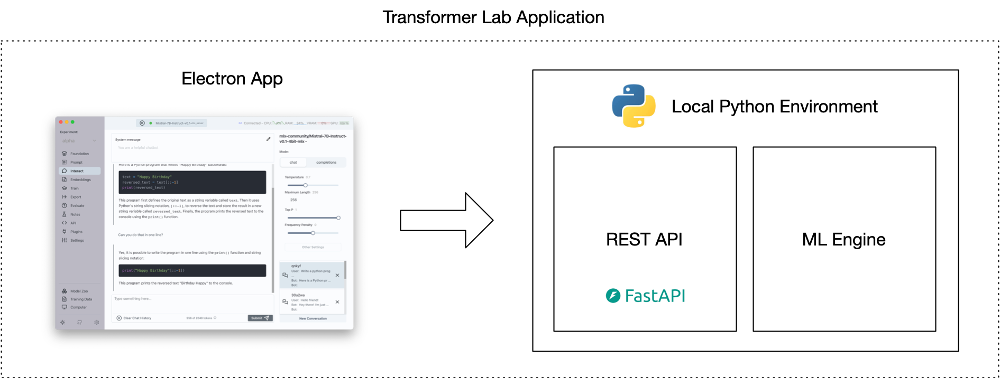

:::note

Since writing this post, we updated our installer to use uv, and it's great. We now use conda to install python then use uv for everything else.

:::

One of our primary goals is to make <a href="//transformerlab.ai">Transformer Lab</a> the most powerful tool available when working with local LLMs. Almost all of the most powerful libraries and tools out there are written in Python. So, we need a way to package Python, PyTorch, and associated tools as part of our application. All of this has to work reliably across multiple operating systems and hardware architectures.

This ended up being **much** harder than we could ever have imagined...

<!--truncate-->

## Introduction

Transformer Lab has two major parts. There is an Electron app built with React+Typescript. This app communicates with an API that handles machine learning tasks on top of our Python Engine.

Ideally we want users to just download one thing and... poof... everything just works.

However, getting Python ML code working reliably across machines is a significant challenge. The biggest issues include:

1. Ensuring the right Python version
2. Setting up CUDA to enable PyTorch to utilize a GPU
3. Managing dependencies and installing specific library versions

We explored various approaches for deploying Python code that would run reliably across different machines.

Here is what we found:

## Things We Looked At

### Use the User’s Own Python

Some operating systems come with Python already installed. This might seem like a good option until you see that the Python that is installed on MacOS, our most common platform, is not up to date. Newer versions of MacOS may not come with Python installed by default.

Even if we could force a consistent version of Python, when it comes to installing libraries, there is a big problem because Python, unlike Node.JS for example, stores packages globally. When we tried using system libraries, we found that our application would frequently break when other applications on the same machine update libraries to a different versions.

If you choose to use the user’s preexisting Python, also note that it can be hard to figure out which Python Executable (many systems will have multiple versions of Python installed in different places) will run when you call python from the command line.

### Using Tools Like [Poetry](https://python-poetry.org/) and [venv](https://docs.python.org/3/library/venv.html)

There are new tools in the Python ecosystem that force Python to use libraries that are stored local to the application. For most, this much better than storing libraries globally.

However, these tools do not make it easier to install CUDA. Secondly, most of these methods require you to **already have Python installed**. For others going down this path, Poetry and venv are great options that should not be dismissed, however we saw that in the ML world, [Conda](https://docs.anaconda.com/miniconda/) was the preferred path for Python environment management and comes with the benefit compartmentalizing both Python **and** Python Libraries for you.

### PyInstaller

What if we could just compile the Python app we built?

[PyInstaller](https://pyinstaller.org/en/stable/) is the most common way to compile a Python application (and its libraries) into an executable. For small Python apps, I recommend this path. However, if your application is complex and depends on Python packages that are themselves reliant on compiled code, well, good luck getting it all to work.

A big reason why this path didn't work for Transformer Lab was that even if we could get everything to compile, Transformer Lab allows users to install **Plugins** that themselves can install arbitrary Python libraries. **So we needed an accessible Python environment that we could modify after it's installed on a user's machine.**

###

### Simon Willison's Approach

We looked to see if others have the problem of shipping a Desktop App that contains Python before. The best information we could find was from [Simon Willison](https://twitter.com/simonw) who had similar goals for his application [Datasette](https://datasette.io/).

[He describes his approach of packaging a Python executable in his app here](https://simonwillison.net/2021/Sep/8/datasette-desktop/).

We found it encouraging to read his blog and hear that he was having many of the same frustrations we were having.

### Docker

**Why not just dockerize it?**

Docker is well suited for the problem of ensuring a consistent environment for a Python project like ours. With Docker, one could standardize on a specific operating system image that is containerized and can then run on any operating system without needing to worry about the underlying system's architecture.

This would have been a great solution for Transformer Lab except that it would add one additional layer for a user to install before being able to use our application.

Another problem with Docker is that [it doesn't support GPU passthrough for Apple Silicon](https://chariotsolutions.com/blog/post/apple-silicon-gpus-docker-and-ollama-pick-two/) -- we use Apple's Python MLX libraries extensively when running on MacOS, so that limitation wouldn't work for us.

In the long run, we plan on offering tools to allow users to run Transformer Lab using Docker, but we don't want to make it a mandatory step.

### Conda

If you play with many of the most common opensource Python ML applications you will see that [Conda / Miniconda](https://docs.anaconda.com/miniconda/) is the most common packaging tool for Python. There is history here but a big reason why it works well is that Conda will install a specific version of Python for you in an environment, and it also makes it easy to install CUDA and CUDA-specific variants of the libraries you need.

Conda comes with a lot of overhead and is cumbersome to use, but it full featured and popular.

**We ended up choosing this path.**

### Mamba

One thing we tested was replacing Conda with [Mamba](https://mamba.readthedocs.io/en/latest/), which is a self-contained tool that does what Conda does. Our experiments showed that while it saved about 10 seconds off of our install times, it wasn’t as easy to use as Conda and a lot of the features of the two tools seem to be merging.

### UV

Recently, Simon Willison posted on his blog about the [uv](https://docs.astral.sh/uv/) project:

https://simonwillison.net/2024/Aug/20/uv-unified-python-packaging/

This looks encouraging but it is brand new. We're going to keep watching as it develops!

## How We Implemented It All

Once we consolidated around using Miniconda as our tool to install Python and Python packages, we started looking into what the easiest ways were to get it working on a user’s machine.

We started by providing a simple [`install.sh`](https://github.com/transformerlab/transformerlab-app/blob/main/api/install.sh) script that we hoped would do all the steps for the user.

But things went bad. 😖

**We have been surprised by all the things that can go wrong:**

- A user might have multiple versions of conda already installed, and there is no way to know where an existing version of conda is stored if it is not “activated”
- They may have installed conda using an admin account, making it impossible for us to create new environments without `sudo`
- Conda is activated in a way I’ve never seen before: it installs itself into the bash / zsh shell, but the script that activates it [can’t be called directly before a separate script](https://github.com/conda/conda/issues/7980#issuecomment-484167955) because of the way bash works with subshells.

For months we kept trying different paths to install Conda and then install Transformer Lab afterwards but users would find issues over and over.

## Where We Finally Landed

After months of different paths, we think we have the most reliable way to install Python via conda through an Electron app. What we did:

- We wrote an `install.sh`. script that separates out each step of the process so each step can be run separately
- In our `install.sh`. script, we wrote checks for each step of the process to see if the previous steps worked, and if not, what might have gone wrong
- In our `install.sh` script we incorporated dozens of hacks to prevent issues we've seen in the field. For example, before we start, we deactivate conda three times (!) just to ensure we're not inside an existing conda when installing our conda https://github.com/transformerlab/transformerlab-app/blob/main/api/install.sh#L89
- Instead of trying to install conda in a common place like the recommended `~/miniconda3/` path we found that this just can not be reliable. So now we install our OWN conda in a Transformer Lab specific path, even if the user already has conda installed.
- We then create a separate Transformer Lab environment and install a specific pinned version of Python to it
- We then use Conda to install CUDA (if possible)
- Then finally we the conda environment’s pip to install requirements using a plain requirements.txt file — we pin ALL package libraries using `piptools` to generate the requirements files.
- Now after everything is installed, we **manually** install the flash_attention2 package because... fun... Flash Attention doesn't work with regular pip install alongside your other dependencies :)

[The contents of our `install.sh` can be seen by clicking here](https://github.com/transformerlab/transformerlab-app/blob/main/api/install.sh)

## What This All Looks Like In the App

At startup, our Electron App pulls our git repo and then spawns the embedded bash file called `install.sh`.

We found that, since many steps in the install can take minutes long, it was helpful to show the full CLI output of the steps as the installer makes its way through the steps. Even though we could run all the steps in one long script, we decided to each step seperately in the UI. This way, if any single step failed, the user would know where in the process things went wrong.

It looks like this:

## Final Comments

The main reason why we built Transformer Lab was because we found it takes too much work to get up and running if you want to do advanced things with LLMs.

I often joke with people that my original plan with Transformer Lab was to spend most of my time working on advanced LLM algorithms, but instead I’ve found I’m spending most of my time just getting Python and CUDA to install properly. My team and I have spent many collective hours banging our heads staring at blocks of Python error output.

When things look bleak, we always come back to telling ourselves that it's our job to hit these issues so that our users don't have to. That's why we built this thing in the first place!

If you get a chance, <a href="https://transformerlab.ai/docs/download">try downloading Transformer Lab</a> and send us feedback on how the install process went for you!
