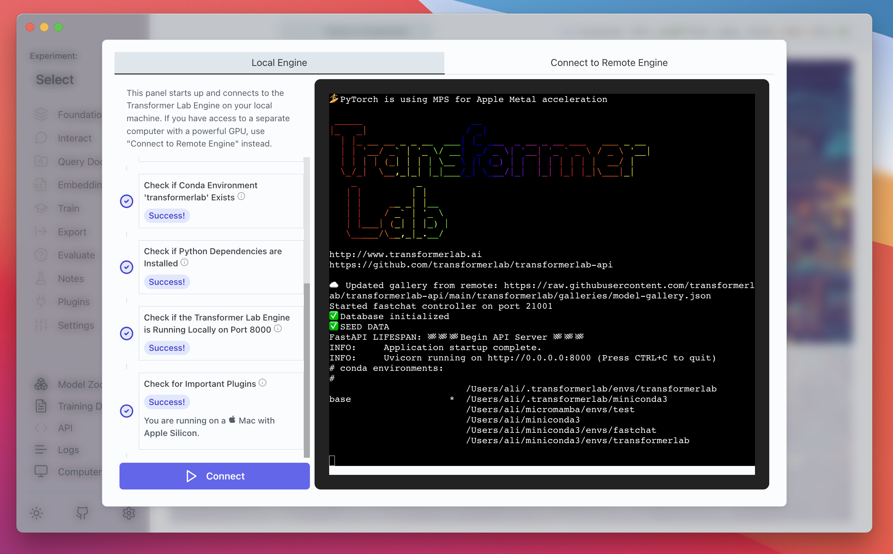
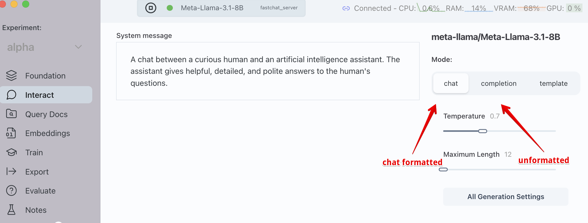
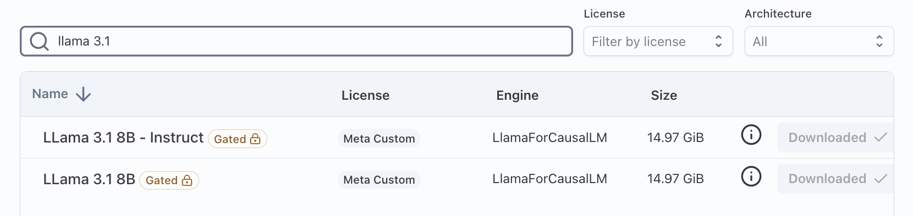
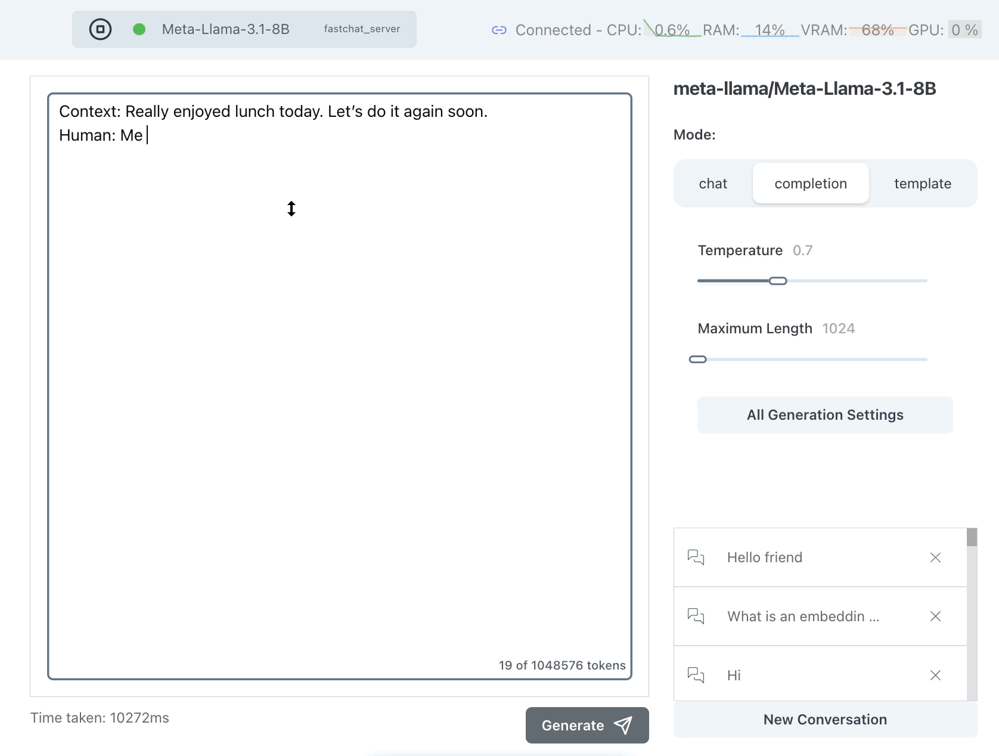
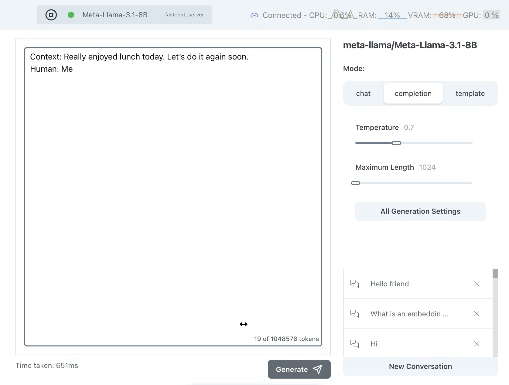
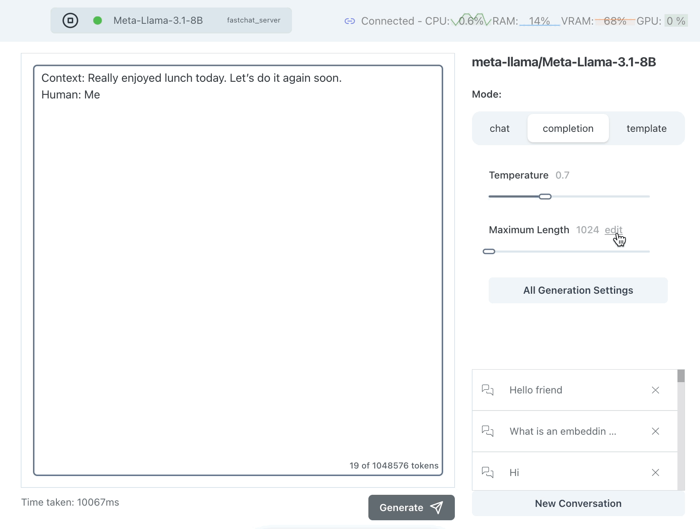
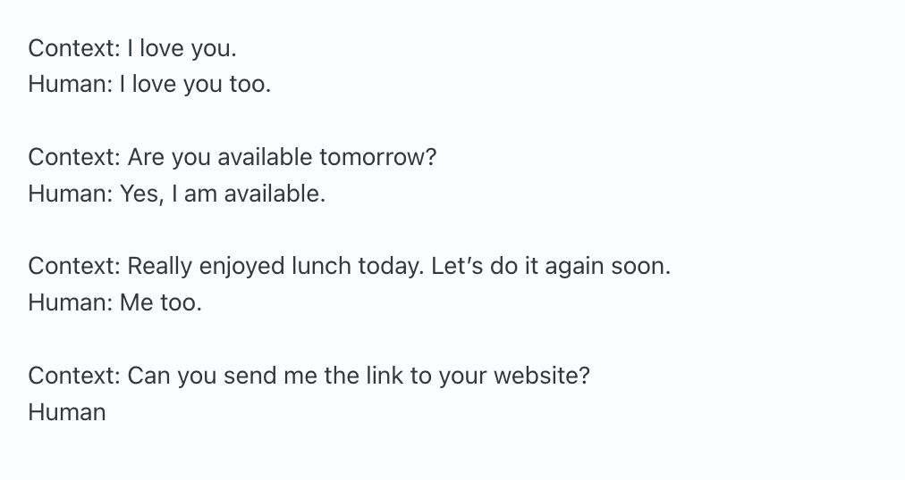
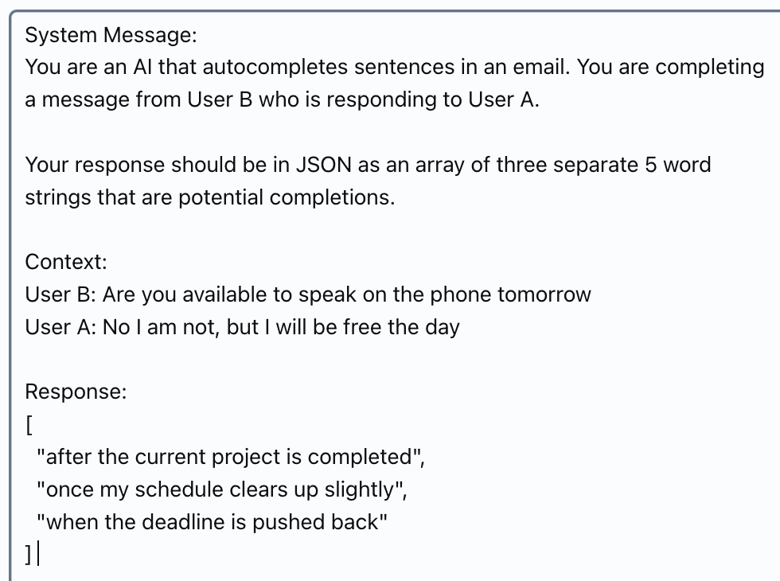

# Building a Local LLM Powered Autocomplete

## Why Autocomplete

Let's add an LLM to our application!

But what is the best first LLM project to try adding to your production application?


When teams brainstorm LLM opportunities in their product products, there is a tendency to focus on overly complex ideas -- but these ideas often come with high risk.

Autocomplete is a great initial application to current applications because it is well defined (LLMs are well suited for autocomplete), and is relatively simple to implement. It's also something LLMs are particularly well suited towards.

In this post we will set up a system to add autocomplete to an existing product, and then we will suggest future opportunities to improve it.

<!--truncate-->

## Getting Started

Let's get started by setting up our computer so we can play with different models and techniques.

I will start by [downloading Transformer Lab](/docs/download) on a Linux box with an NVIDIA GPU but Transformer Lab also works on MacOS and Windows. Once you see a screen that looks like the following, you are ready to get started!



Now that we have a running LLM workspace, create a [new Experiment](/docs/tutorial/experiment) in Transformer Lab and let's begin.

## Using Non-Instruction Tuned vs Instruction Tuned Models

The first question we want to answer is if we should use an instruction-tuned or non-instruction tuned model for our autocomplete project.

There are lots of resources to learn about the difference between instruction-tuned vs non-instruction-tuned models. For our purposes the main difference is that instruction-tuned models are trained to work in a chat format.

Usually, when using instruction tuned models, you should send your queries to the model in a chat template. Transformer Lab will automatically format queries in a chat format if you use the chat section of the Interact tab.



Let's try a few experiments to autocomplete text to see which works better. In these examples we will use an unquantized version of Llama 3.1-8B which is the smallest Llama 3.1 model. We will send queries to the instruction-tuned and non-instruction tuned versions of the same 3.1 8B parameter model to see if we can get a qualitative answer to see which is best.



There are different kinds of autocomplete, for our demo we want one that will take the first few words in a sentence and recommend the rest, keeping responses short.

We'll use three simple examples in our dataset. Normally for an experiment like this you'd want a much larger potential set of test cases.

Our test dataset is:

```
Test 1
Context: Really enjoyed lunch today. Let’s do it again soon.
Human: Me
—
Test 2
Context: Are you available to speak on the phone tomorrow
Human: No I am not, but I will be free the day
—
Test 3
Human: It’s sunny today in Toronto,
```

Let's try Test 1 on Llama 3.1 Non-Instruction Tuned, using the completion endpoint:



That worked sort of well but why is it saying `Me 2` instead of `Me too`? Let's try it again:



Hmm it is still saying `Me 2` instead of `Me too` but this time it generates much too much text. Language models have a token called a "stop token" which tells them to stop generating but we can see here that this model doesn't know that we want a short answer.

## Limiting the Maximum Length

One brute force thing we can do is to limit the maximum length we allow for a response. We only want a few words so we can set this to something like 10-15 tokens. Note that tokens do not map 1:1 with words.



This seems better but it is just clipping the response -- it's not ensuring that the response is limited in a meaningful way, such as at the end of a sentence.

## Few Shot Prompting

One technique we can use to steer our responses is [few-shot prompting](https://www.promptingguide.ai/techniques/fewshot). To do this, we prepend a few examples of the type of responses we want from the model, in the hopes that the previous examples steer the final answer.



Few shot prompting seems to have helped keep the model's responses short and to the point. But the model still has the problem that it keeps rambling after the initial sentence is complete. One could imagine using this solution as is, but removing anything after a period or comma post-generation.

## Instruction Tuned Model with Prompting

Rather than try to steer the model's response using patterns, let's give direct instructions to the model before it answers. For this, we will switch to Llama3.1 8B Instruction Tuned.

Let's use the "System Message" in the Chat tab to tell the bot what we want:

Let's try this prompt:

```
You are an AI that autocompletes sentences.
The user will provide the beginning of a message.
Respond to any query with 5 to 10 words that
could follow the starting message from the user.
```

Sometimes we get a reasonable response like:


But even in this example, the model is suggesting a meeting this weekend -- that's too specific of a response. Let's try adding more in the system message. Let's also ask for the response in a format we can consume by API:

```
You are an AI that autocompletes sentences in an email. You are completing a message from User B who is responding to User A.

Your response should be in JSON as an array of three separate 5 word strings that are potential completions.
```

This works well but we can also try sending the data to the LLM as a completion (not chat formatted) using this pattern:

```
System Message:
You are an AI that autocompletes sentences in an email. You are completing a message from User B who is responding to User A.

Your response should be in JSON as an array of three separate maximum 5 word strings that are potential completions.

User B: Really enjoyed lunch today. Let’s do it again soon.
User A: Me

Response:
```

With this we seem to get reasonable responses, but they are not always great.



The following prompt, that uses a back and forth message format, is one of the best performing templates in my tests:

```text
You are an AI that autocompletes sentences in an email.
You are completing a message from User B who is responding to User A.

Some rules to follow:
1. Do not mention events or information that is not provided by
the context
2. Respond with a JSON array of 3 possible responses to the
query, each containing a string parameter called "text" that
is about 5 words long
### Human: Context information is below.
---------------------
User A: Are you available for a meeting tomorrow at noon?
---------------------
Given the context information and not prior knowledge,
answer the query.
Query: What are possible next words for the sentence
from User B that begins with:
Thank you! Yes
Answer:
### Assistant:
```

## LLM Self-reflection

One trick we could do to improve quality is to have the LLM review its own response. We could have it revise and edit its previous work.

In the following prompt template, simply ask the model to rank it's own responses and we may decide to only show responses of quality 7/10 or greater:

```text
System Message:
Your job is to evaluate the quality of a response for an autocomplete bot. You are provided a conversation between User B and User A, as well as a suggested completion to User A's message. Go through each suggested response (which is in JSON format as an Array) and give a new JSON object with a ranking (from 1-10) for each response.

An example JSON response object would look like:
[
{
response: "thank you very much.",
ranking: "10"
},
...
]

Context:
User B: Are you available to speak on the phone tomorrow
User A: No I am not, but I will be free the day

Original Response:
[
"after tomorrow's meeting",
"on the following Monday",
"next Wednesday morning definitely"
]

Response:

```

## Things We Could Also Try:

- **Different Models:** We limited our tests to Llama 3.1 models. We could try other models like Mistral, Gemma, or others to see how they perform
- **Better Context:** We could provide more information in the context in order to ensure that the model only responds if it has confidence, and it never assumes things outside of the context it sees. We could give more context about the nature of the user and their job so that responses are appropriate for the role.
- **Larger Models:** We could also try larger models -- the Llama 8B parameter model seemed to misunderstand our instructions. Perhaps a larger model would get them better
- **Finetuning:** we are using out of the box open source models. We could easily generate high quality test data from existing emails in our system, training the model on how we expect our autocomplete responses to look
- **Preference Tuning:** we can generate example pairs of our best answers versus less good ones and use those to train the model around what types of answers we prefer
- **Output Formatting:** We could use a tool like [Instructor](https://python.useinstructor.com/) to force the model to respond in a defined JSON format

## What Did We Learn?

This article was written to capture the initial journey a developer may have to go through to develop a first app prototype using LLMs. There are so many things that may feel unusual for a new LLM application developer including:

- How to format queries to the LLM
- How to decide the best LLM and LLM size for a specific problem
- Techniques to use to improve quality
- Ensuring output formats
- Evaluating the quality of a response

At the outset, the biggest challenge is consistently generating high-quality, properly formatted responses that can be used by your downstream application. No single technique solves this issue completely but in this example, a combination of good prompting, some model self-reflection, and potential some fine-tuning/preference training should get us very far.

_Experimentation is required._ We built Transformer Lab as a place to make such experimentation easy: you can easily access hundreds of popular models and structure queries to them without having to know all the internals.

Have you implemented autocomplete in your application using an LLM? What other techniques did you use? Please share your learnings on our Discord.
