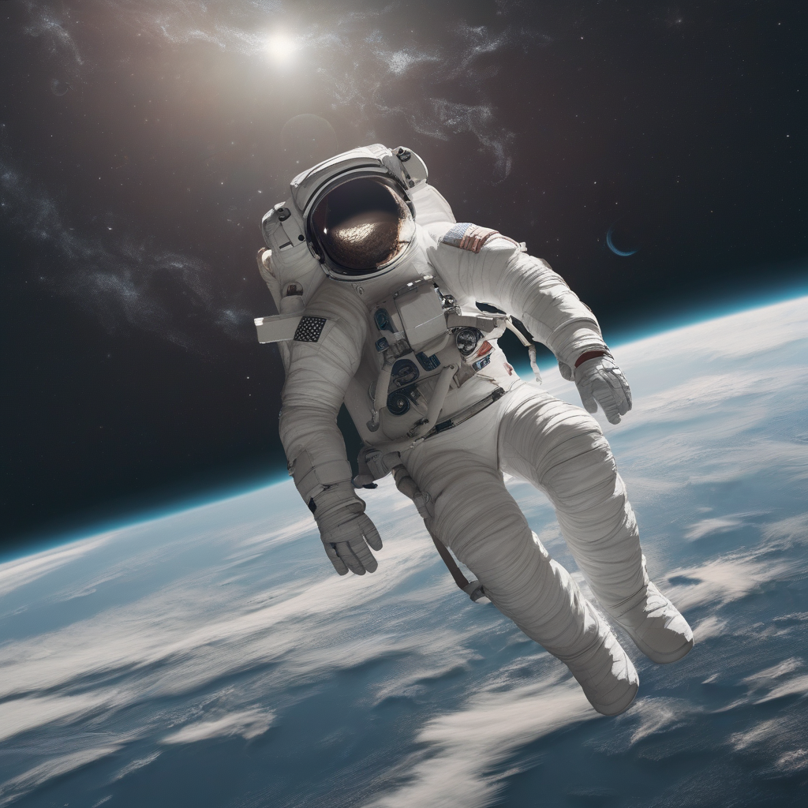
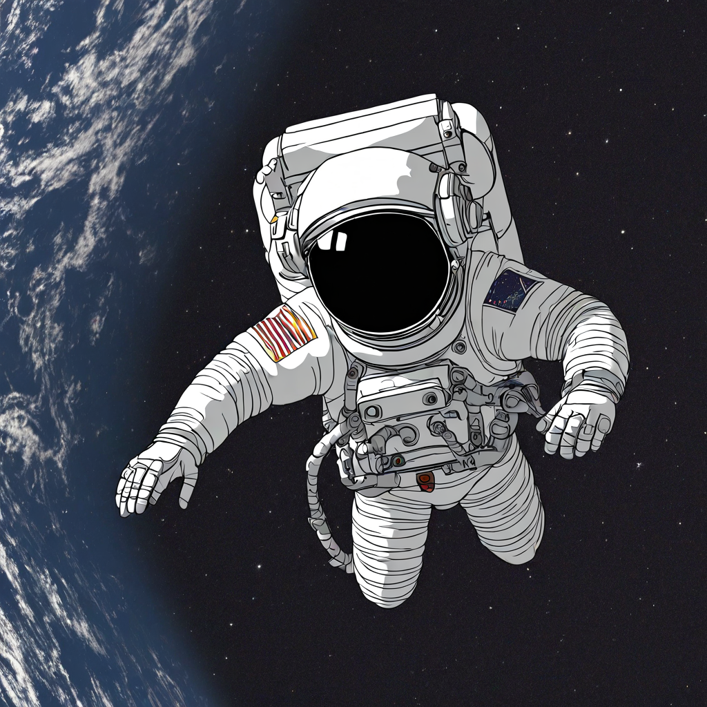
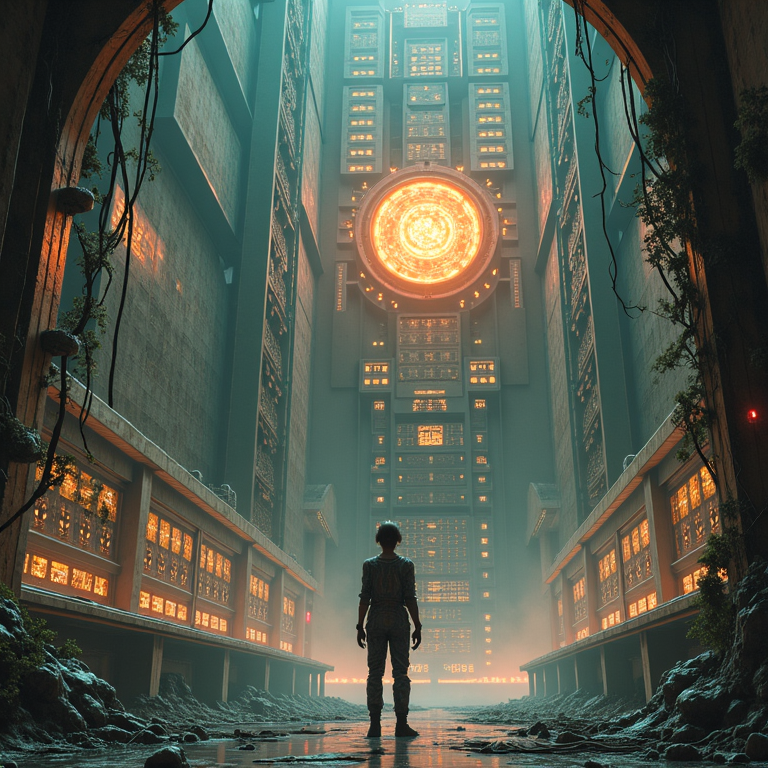

kk, Transformer Lab now supports **Diffusion image generation and training**!

Out of the box we support major open weight base models including:

* Stable Diffusion (1.5, XL, 3)
* Flux
* And a lot more! (see the [full list here](/docs/diffusion/downloading-models))
* (We also support thousands of LoRAs trained on these base models)

What can you do? Well...

<!--truncate-->

## You can generate images

In our GUI, running on your own hardware (locally or in the cloud) you can generate images with prompts like this image we made using the Flux [dev] open model on our dual 3090 NVIDIA machine.

## But you can also do inpainting

Inpainting is a popular technique where you select parts of an existing image you'd like to change and the model only edits those parts. We built a native paint tool inside Transformer Lab so you can mask images like this example where we turned Audrey Hepburn's hair to pink.

## You can also do img2img generation

You can provide an existing image to a model and it will modify it based on your prompt.

So you can convert an existing photo like this one:

Apply a prompt with styling and you can make it look like this:

## Perhaps most importantly, you can train models

Transformer Lab excels at training. Using our entire framework that supports jobs, status tracking, workflows (coming soon) and more, you can now train your own Diffusion LoRAs within our UI.

[We have a doc on how to train Diffusion LoRAs here.](/docs/train/diffusion-trainer)

Here’s a quick comparison for the prompt **"An astronaut floating in space"**:

| Base model result | With Simpsons adaptor |
| ----------------- | --------------------- |
|  |  |

*Comparing base and Simpsons-enabled outputs.*

The Simpsons adaptor is a tiny LoRA add-on trained on cartoon captions. It learns bright colors, simple outlines, and flat shading, so it can turn a realistic astronaut into a fun, colorful scene that feels like Springfield.

## What will you build?

There are so many possibilites when using and training Diffusion Models. And everything you do in Transformer Lab is private. Companies may want to design their own proprietary checkpoints for diffusion models that their teams can use to generate on-brand images. Artists can create their own models that generate in a unique style, never seen before. Researchers can push the limits of what's possible with these models, while also exploring their biases and edge cases.

We're excited to see what you and your teams build using Diffusion Models in Transformer Lab. Join our Discord or tag us on Twitter to show us what you discover!

