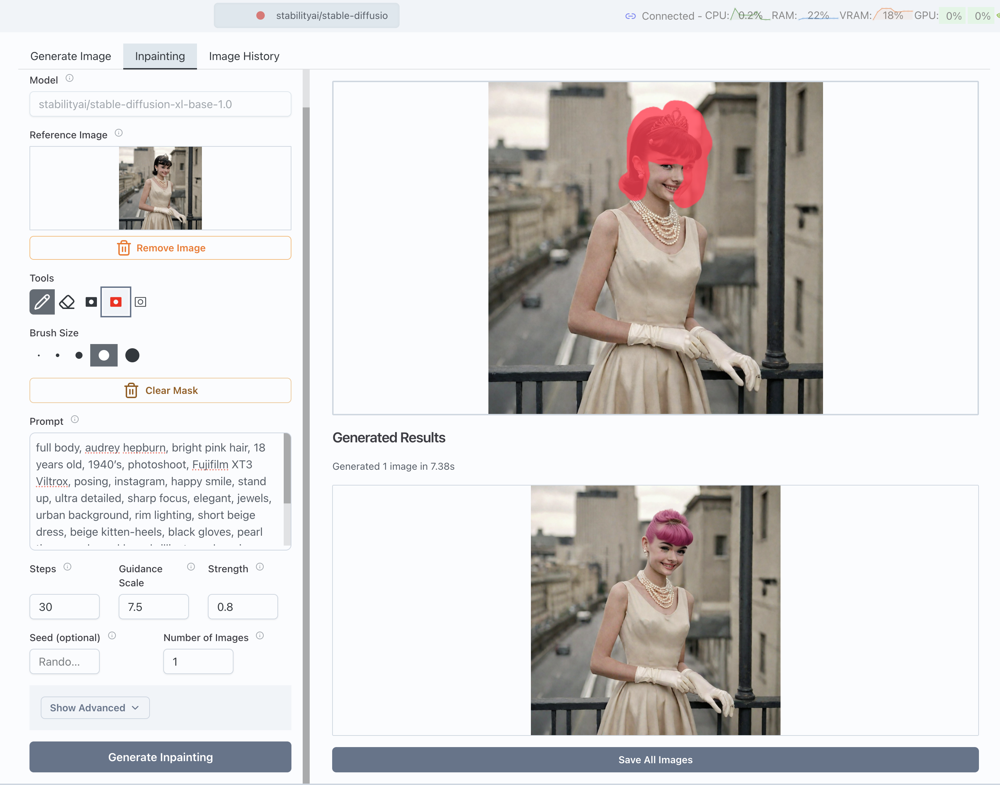

Ok Transformer Lab now supports Diffusion image generation and training!

Out of the box we support major open weight models including:

<!--truncate-->

* Stable Diffusion (1.5, XL, 3)
* Flux
* And a lot more! (see the [full list here](../../docs/diffusion/downloading-models.md))

What can you do? Well...

## You can generate images

In our GUI, running on your own hardware (locally or in the cloud) you can generate images with prompts like this image we made using the Flux [dev] open model on our dual 3090 NVIDIA machine.

## But you can also do inpainting

Inpainting is a popular technique where you select parts of an existing image you'd like to change and the model only edits those parts. We built a native paint tool inside Transformer Lab so you can paint directly on images like this example where we turned Audrey Hepburn's hair to pink.

## You can also do img2img generation

You can provide an existing image to a model and it will modify it based on your prompt.

(examplehere)

## Perhaps most importantly, you can train models

Transformer Lab really shines when it comes to training. Using our entire framework that supports jobs, status tracking, workflows (coming soon) and more, you can now train your own Diffusion LoRAs within our UI.

(examplehere)