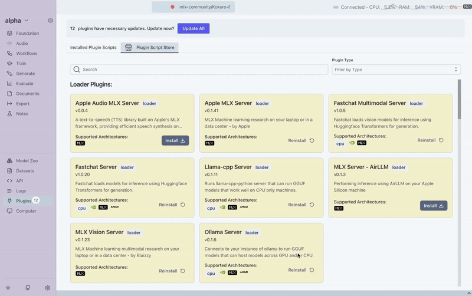
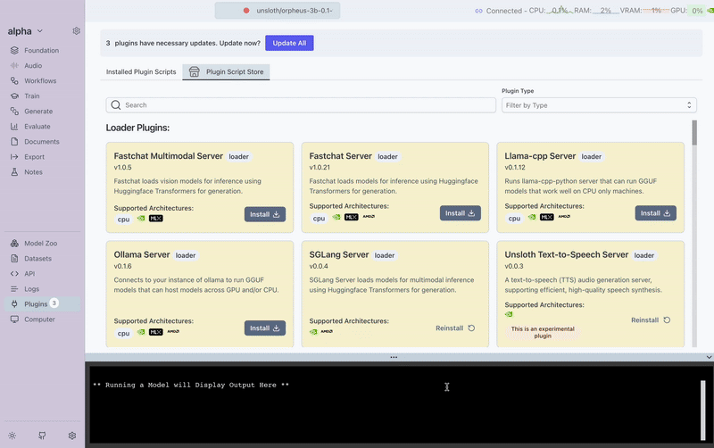
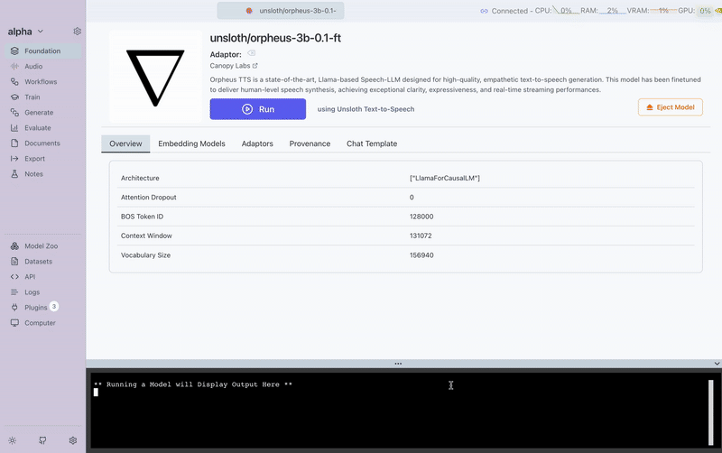

import AudioMLXTTSGeneration from './audio/mlx-tts-generation.wav'
import AudioTTSGeneration from './audio/tts_generation.wav'
import AudioBritishDanielMLX from './audio/british_daniel_mlx.wav'
import AudioCudaAudioCloningDaniel from './audio/cuda_audio_cloning_daniel.wav'
import AudioEmergentTTSEval from './audio/emergentTTS-eval.wav'
import AudioTrainedTTS from './audio/trained_tts.wav'

---
slug: text-to-speech-support
title: Transformer Lab Speaks: TTS, Training & Voice Cloning
authors: mina
tags: [audio, text-to-speech, tts, audio-cloning]
---

🎉 Transformer Lab just got a voice! We’re thrilled to announce **audio modality support**, so you can generate, clone, and train voices directly in Transformer Lab.

---

## What’s included in this release

- 🎙️ **Turn text into speech (TTS)** with CUDA and MLX
- 🛠️ **Train your own TTS models** on CUDA
- 🧬 **Clone a voice in one shot** for lightning-fast replication on CUDA
---

## 🚀 Text-to-Speech on MLX

We’ve added **TTS support to Transformer Lab’s MLX generation plugin**, making it easier than ever to generate natural-sounding audio.

Here’s how you can try it today:

1. Install the **Apple Audio MLX Server** plugin
2. Pick a **supported audio model** in the **Foundation tab**
3. Switch to the **Audio tab**
4. Adjust your **generation settings** and start creating speech instantly!

### 🎧 Supported Model Families

We currently support several powerful TTS model categories. Here are a few examples you can try right now:

- **Kokoro** → [mlx-community/Kokoro-82M-4bit](https://huggingface.co/mlx-community/Kokoro-82M-4bit?utm_source=chatgpt.com)
- **Dia** → [mlx-community/Dia-1.6B](https://huggingface.co/mlx-community/Dia-1.6B?utm_source=chatgpt.com)
- **Spark** → [mlx-community/Spark-TTS-0.5B-bf16](https://huggingface.co/mlx-community/Spark-TTS-0.5B-bf16?utm_source=chatgpt.com)
- **Bark** → [mlx-community/bark-small](https://huggingface.co/mlx-community/bark-small?utm_source=chatgpt.com)
- **CSM** → [mlx-community/csm-1b](https://huggingface.co/mlx-community/csm-1b)

## 👀 Watch It in Action

Here’s a quick demo showing how simple it is to generate speech in Transformer Lab using **Kokoro-82M-4bit**:

In just a few clicks, we went from plain text to lifelike audio. For this example, we used the sentence:

> “Hello! Welcome to Transformer Lab, where we turn text into natural-sounding speech.”
> 

<audio controls>
    <source src={AudioMLXTTSGeneration} type="audio/wav" />
    Your browser does not support the audio element.
</audio>

## 🎛️ MLX Generation Parameters

When you generate audio with the MLX plugin, you’ll see a set of parameters you can adjust to customize the output. Here’s what each one does:

- **text** → The input string you want to convert to speech.
- **Sample Rate** → Number of audio samples per second; higher rates mean clearer, more detailed audio.
- **Temperature** → Controls randomness in speech; lower = consistent, higher = more expressive and varied.
- **Speech Speed** → Adjusts how quickly the text is spoken — slower for clarity, faster for natural pacing.

---

## **⚡ Text-to-Speech & One-Shot Cloning on CUDA**

On CUDA, Transformer Lab unlocks even more power:

- Perform **one-shot audio cloning** — replicate a voice instantly from just one reference sample

Here’s how you can try it today:

1. Install the **Unsloth Text-to-Speech Server** plugin
2. Pick a **supported audio model** in the **Foundation tab**
3. Switch to the **Audio tab**
4. Adjust your **generation settings** and start creating speech instantly!

### 🎧 Supported Model Families

- **Orpheus** → [unsloth/orpheus-3b-0.1-ft](https://huggingface.co/unsloth/orpheus-3b-0.1-ft)
- **CSM** → [unsloth/csm-1b](https://huggingface.co/unsloth/csm-1b)

## 👀 Watch It in Action

Here’s a quick demo showing how simple it is to generate speech in Transformer Lab using unsloth/orpheus-3b-0.1-ft:

First, here’s the model generating speech directly from text:

<audio controls>
    <source src={AudioTTSGeneration} type="audio/wav" />
    Your browser does not support the audio element.
</audio>

Next, we provided a single sample of the target voice we wanted to clone:

<audio controls>
    <source src={AudioBritishDanielMLX} type="audio/wav" />
    Your browser does not support the audio element.
</audio>

Finally, here’s the result — the model speaking the same sentence, but now in the cloned voice:

<audio controls>
    <source src={AudioCudaAudioCloningDaniel} type="audio/wav" />
    Your browser does not support the audio element.
</audio>

---

## 🏗️Training Your Own TTS Model on CUDA

While one-shot cloning is powerful, you can take it even further by **training a model directly on the target voice**. This gives the model more examples to learn from, resulting in more consistent and natural-sounding speech.

For this demo, we used the [bosonai/EmergentTTS-Eval](https://huggingface.co/datasets/bosonai/EmergentTTS-Eval?utm_source=chatgpt.com) dataset and trained a custom TTS model inside Transformer Lab.

### 🎛️ Training Parameters

Here are the key parameters you’ll see in the training configuration tab:

- **Sampling Rate** → Audio sampling frequency
- **Maximum Sequence Length** → Max length of input sequences
- **Batch Size** → Number of sequences per training step
- **Learning Rate Schedule** → Strategy for adjusting learning rate (e.g. linear)
- **Learning Rate** → Base learning rate for optimization
- **Number of Training Epochs** → How many times the dataset is passed through
- **Max Steps** → Maximum training steps (-1 = unlimited)
- **LoRA R** → Rank of LoRA update matrices
- **LoRA Alpha** → LoRA scaling factor
- **LoRA Dropout** → Dropout rate for LoRA layers
- **Max Grad Norm** → Gradient clipping threshold
- **Weight Decay** → Regularization strength
- **Adam Beta 1 / Beta 2 / Epsilon** → Adam optimizer parameters
- **Adapter Name** → Name for the saved adapter model
- **Audio Column Name** → Dataset column containing audio files
- **Text Column Name** → Dataset column containing transcriptions
- **Log to Weights & Biases** → Option to track training metrics with W&B

## 👀 Watch It in Action

To compare, here are three samples:
**Before training** — the model’s default voice generating our sentence:

<audio controls>
    <source src={AudioTTSGeneration} type="audio/wav" />
    Your browser does not support the audio element.
</audio>

**Sample from dataset** — a real voice clip the model trained on:

<audio controls>
    <source src={AudioEmergentTTSEval} type="audio/wav" />
    Your browser does not support the audio element.
</audio>

**After training** — the model reproducing the same sentence in the target voice:

<audio controls>
    <source src={AudioTrainedTTS} type="audio/wav" />
    Your browser does not support the audio element.
</audio>

We’re just getting started with audio support in Transformer Lab, and we want to make sure we’re adding the models that matter most to you. 🎙️

👉 Which **text-to-speech** or **voice cloning** models would you like to see supported next?

Drop your suggestions in our [Discord community](https://discord.com/invite/transformerlab) — we’re always listening and excited to hear your ideas.
