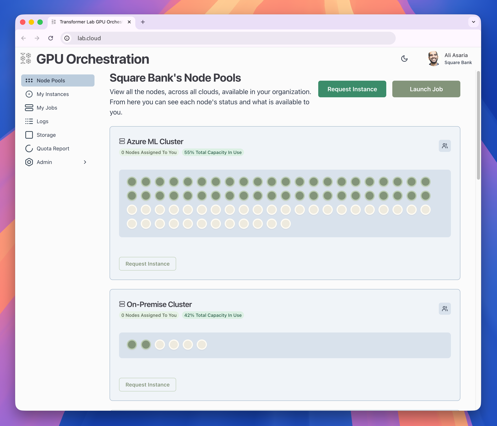
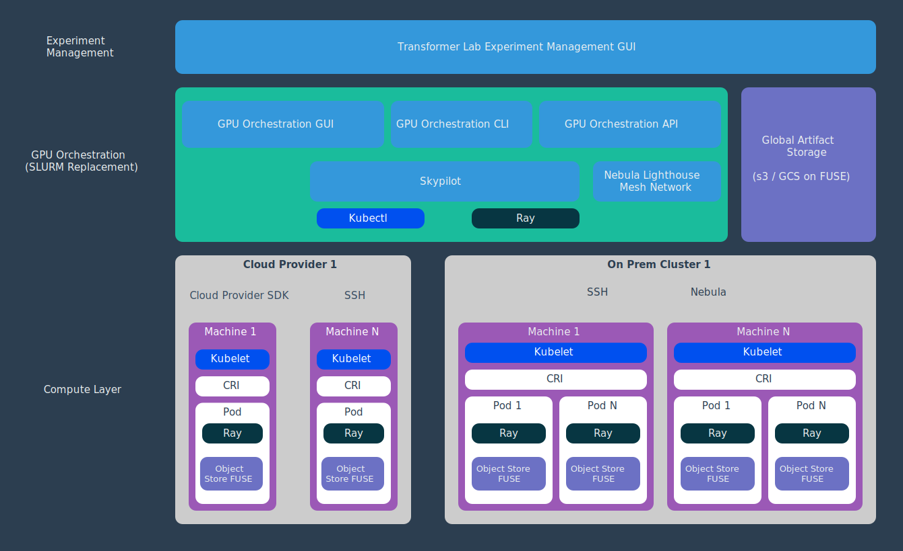

# Announcing Transformer Lab GPU Orchestration: A Modern SLURM Replacement Built on SkyPilot

Today, we’re launching **Transformer Lab GPU Orchestration**, a flexible open-source platform for AI/ML teams to manage large-scale training across clusters of GPUs.

Whether you’re a research lab with racks of GPUs, an enterprise AI team coordinating jobs across on-premise and cloud nodes, or a startup fine-tuning open-source models, you’ve likely run into the same pain points: constant debugging of orchestration scripts, long job queues, and underutilized hardware. In speaking with countless High-Performance Computing admins, we’ve consistently heard that **SLURM's** limitations hinder the effective use of compute resources and throttle research velocity.

Unlike **SLURM**, **Transformer Lab GPU Orchestration** was purpose-built for modern AI/ML workloads. That means researchers can move from a laptop experiment to a thousand-GPU run without rewriting orchestration scripts or hiring a dedicated infrastructure team. There’s advanced built-in support for training and fine-tuning language models, diffusion models, and text-to-speech with integrated checkpointing and experiment tracking. Best of all, it’s open source.

## Why SLURM Isn’t The Path Forward

For the last two decades, the dominant way to schedule AI training workloads has been **SLURM** (Simple Linux Utility for Resource Management). It powers over half the world's Top 500 supercomputers. If you've trained models in academia or at a national lab, you know it well: SSH into a cluster, write bash scripts with `#SBATCH` directives, submit jobs, and wait in a queue.

But **SLURM** was designed for monolithic, static clusters instead of the distributed, hybrid cloud environments common in most modern labs. Bursting to the cloud required custom scripts and manual provisioning. Its model is built for long-running simulations, not the dynamic and iterative nature of modern AI. Interactive development feels clunky. Deploying inference endpoints is unnatural. Jobs that use more memory than requested can take down other users’ jobs, since SLURM’s resource enforcement depends heavily on user discipline. And the user experience itself hasn’t evolved: command-line only, with no standardized UI for managing jobs or monitoring usage.

The result is that teams are significantly underutilizing their compute infrastructure. A recent study by Weights and Biases concluded that for users training on GPUs, nearly a third of their users were averaging less than 15% utilization across all runs. Not to mention the significant resources dedicated to maintaining SLURM environments. You're not just wasting compute, you're throttling research progress.

## The Kubernetes Detour

In recent years, infrastructure teams have argued that **Kubernetes** should replace **SLURM**. **Kubernetes** is cloud-native, elastic, and comes with a thriving ecosystem of extensions. It can scale GPU clusters across providers, unify training and inference services, and integrate cleanly with monitoring stacks.

But **Kubernetes** wasn’t designed for AI training either. Submitting a job requires verbose YAML manifests that are several times longer than a simple SLURM script. Debugging interactively is painful, often involving pod execs, port forwarding, and constant manifest edits. Companies and labs have tried hybrid hacks: Slurm-on-Kubernetes clusters, or extensions like Volcano and Kueue. But these approaches inherit Kubernetes’ complexity and resource overhead without fully solving the problem.

What teams really need is orchestration with the power of **Kubernetes** but the simplicity of **SLURM**.

## Enter Transformer Lab GPU Orchestration

**Transformer Lab GPU Orchestration** abstracts away much of the current infrastructure challenges, while preserving the reliability AI teams expect. Built on the battle-tested foundations of **SkyPilot**, **Ray**, and **Kubernetes**, it combines proven components into a system purpose-built for AI/ML workflows.

With **Transformer Lab**, every GPU resource, whether in your lab or across 20+ cloud providers, appears as part of a single unified pool. Training jobs are automatically routed to the lowest-cost nodes that meet requirements. If your local cluster is full, jobs can burst seamlessly into the cloud. The ease of scaling up and down makes for much more efficient usage.

Distributed training becomes painless. Instead of managing networking, synchronization, checkpointing, and failover across nodes, researchers simply define their training run. **Transformer Lab** orchestrates the rest, handling inter-node communication, retries, and automatic recovery. For labs where multiple researchers compete for resources, administrators get fine-grained control: quotas, priorities, and visibility into who’s running what, with reporting on idle nodes and utilization rates.

## Join the Beta

If you’re a university, research institute, or AI/ML company interested in a better alternative to SLURM, sign up for our beta. It’s easy to pilot alongside your existing SLURM implementation.

**Sign up for the beta:** [https://lab.cloud/beta](https://lab.cloud/beta)

**Explore the open-source repo on GitHub:** [https://github.com/transformerlab/transformerlab-gpu-orchestration](https://github.com/transformerlab/transformerlab-gpu-orchestration)