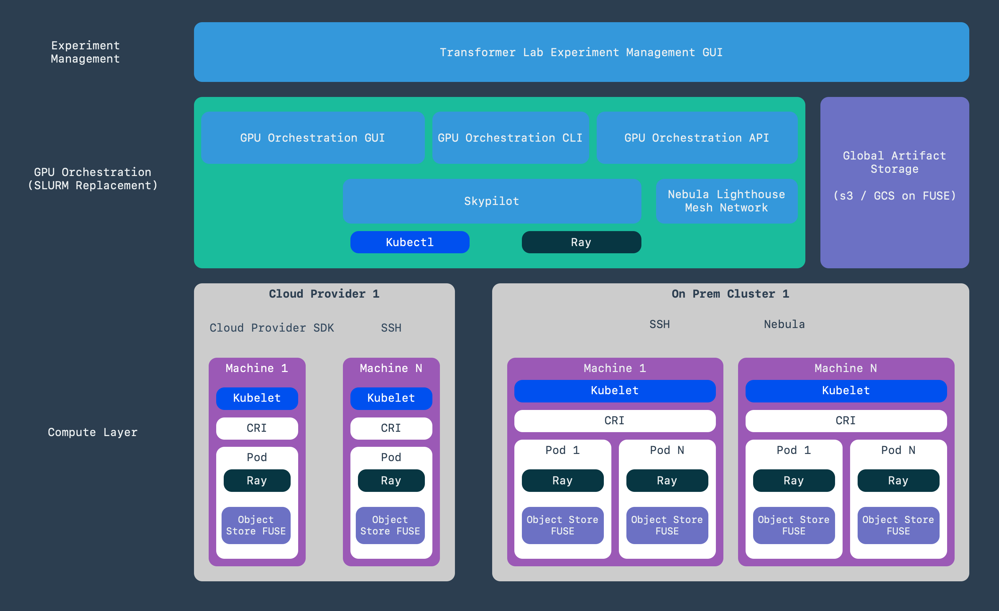
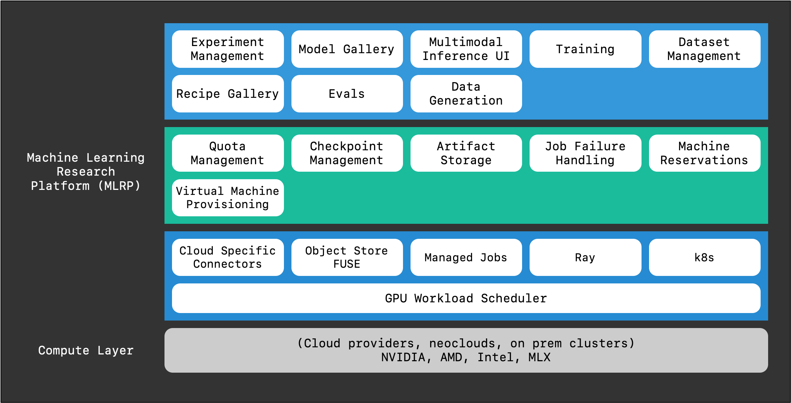

import styles from './style.css';

# Our Vision for an Open Source Machine Learning Research Platform

When our team first started working on machine learning, we hit a wall. CUDA errors, broken Conda environments, and constantly breaking dependencies with PyTorch versions. We spent days just getting code to run, long before we could do anything interesting or innovative. Over time, I've learned this experience is incredibly common. Researchers have ideas but spend huge portions of their time just trying to make their work run.

And then comes the time to scale up. Moving a project to multiple GPUs can feel nearly impossible without an entire infrastructure team to help. This was our experience, and it's the core reason we started building this platform. We wanted to build the tool we wished we'd had from day one.

<!-- truncate -->

## ML Research is Messy

The dream of ML research is simple: **Hypothesis → Experiment → Results**. But the reality is often messier:

- **Getting the machine:** Find the right hardware at the right price.
- **Setting it up:** Provision, configure environments, wrangle CUDA versions.
- **Storing data:** Manage gigabytes of outputs, artifacts, logs, and checkpoints across nodes.
- **Running the job:** Launch training, monitor logs, ensure proper networking.
- **Tracking everything:** Random logs, graphs, and spreadsheets to track runs.
- **Oops, it died:** Debug failures, find checkpoints, restart.

And that's just one run. Then you need to manage experiments, version datasets, compare models, and share findings—without resorting to screenshots on Discord.

## A New Category: Machine Learning Research Platform

Frontier labs like OpenAI have spent years building and maintaining their own tooling and infrastructure. We're aiming to make this category of advanced tooling open and accessible to everyone.  Users have already told us that Transformer Lab is the "essential open source stack for serious ML teams". 

Our goal is to build a unified, open-source platform that handles infrastructure so researchers can focus on research. Better tools accelerate progress for everyone—when the ML community has access to best-in-class platforms, discovery moves faster. For this to work, it must follow core principles that empower researchers, not constrain them.

## Our Guiding Principles:

☁️ Compute Agnostic: You should be able to run your workloads on any cloud, any cluster, or even on-prem hardware without changing your code.

- **🏃‍♂️ Get Out of the Way:** The platform should serve you, not the other way around. You shouldn’t have to learn “our way” of training, the system should be able to run any workload. If you want to use PyTorch, JAX, or your own custom framework, there should be zero barriers.
- **❤️ Open Source:** Foundational tools for science should be open. This fosters trust, encourages community contribution, and prevents vendor lock-in.
- **🧩 Composable:** You shouldn't have to adopt a monolithic, all-or-nothing system. Just need workload orchestration? Use that part. Just want experiment tracking? Great. Use only what you need.
- **😌 A Great Developer Experience:** At the end of the day, it just has to be easy and enjoyable to use. An API that makes sense. A CLI that's intuitive. Documentation that's actually helpful.

## How We're Building It: Standing on the Shoulders of Giants

We're building this platform in layers, leveraging the best open-source tools:

#### Layer 1: Workload Orchestration

We use SkyPilot for GPU and workload orchestration, adding team and user isolation for shared control nodes.

#### Layer 2: Scaffolding (Management & Persistence)

We added team-based features like user/quota management and a unified SDK for consistent artifact, model, and checkpoint storage.

#### Layer 3: User Experience (Experiment Management)

Our Experiment Management layer tracks everything automatically, making models, evaluations, and datasets versioned, shareable, and easy to compare.

## From Frustration to a Framework

We built this platform because we remember losing days to broken environments and CUDA errors. We wanted a tool that lets researchers focus on the exciting "what if" questions, not infrastructure headaches.

Try us out, and give us feedback; or better yet sign your org up to be a design partner.  We'd love to hear about your pain points and build indispensable tools for you and your team.

Let's build something better, together.
