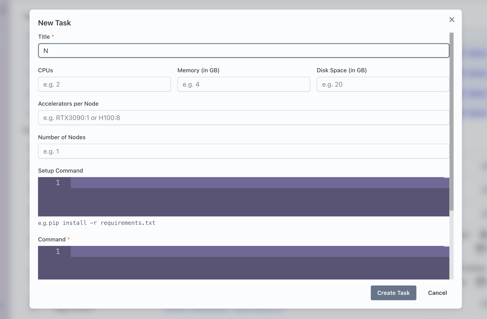
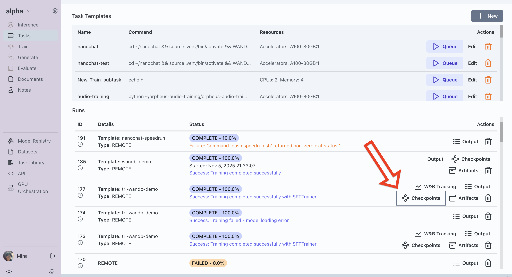
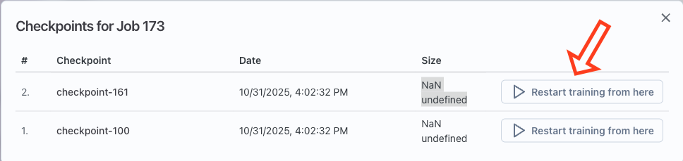

# Never Lose Progress: Resume Training from Any Checkpoint

Training AI models can be unpredictable. Hardware failures or cloud issues can stop your progress. The worst part is starting over from scratch...

We’ve experienced this issue ourselves, so we added a new feature: resume training from any checkpoint. Now, every training job is versioned, and checkpoints are tracked. If training stops, you can resume from any checkpoint with a click. 🚀

## 🚀 How It Works

Starting a training task in Transformer Lab is simple: just click on **Task** in the sidebar, then **New** to set up your experiment. Choose your accelerator, number of nodes, and the command to run your training code. 🖥️



To make checkpoint management seamless, we’ve integrated this feature into the [transformerlab-sdk](https://github.com/transformerlab/transformerlab-sdk). With just a few lines of Python, you can save checkpoints directly from your training script:

```python
from lab import lab

lab.init()
lab.save_checkpoint(source_path, name)
```

After your job runs, you’ll see all your checkpoints and artifacts neatly organized in the UI. 📁



## ✨ Resume Training

Now you can select any checkpoint from your previous runs and restart training from that point—right from the UI. Just click **Restart training from here**. Transformer Lab will launch a new job, using the same task parameters as before, and pick up from your chosen checkpoint. 🔄



Whether your training was interrupted, failed, or you want to continue improving your model from a specific stage, this feature gives you control. No need to start over. Just pick a checkpoint and resume. 🎯

## 💡 Give It a Try

This update makes it easier to experiment, recover from interruptions, and improve your models. It reduces infrastructure problems in ML research.

Try it out and let us know what you think. Which features would you like to see next? Drop your suggestions in our [Discord community](https://discord.com/invite/transformerlab). 🙌