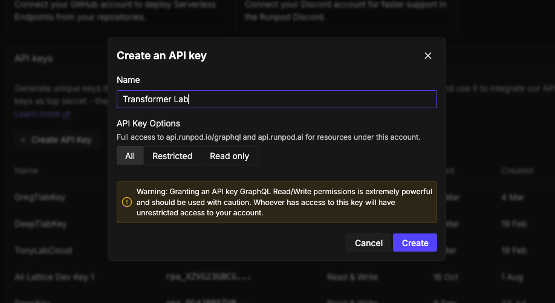
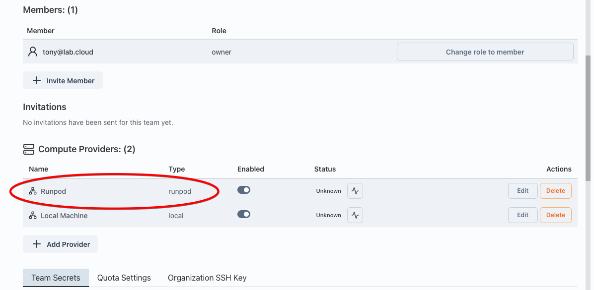
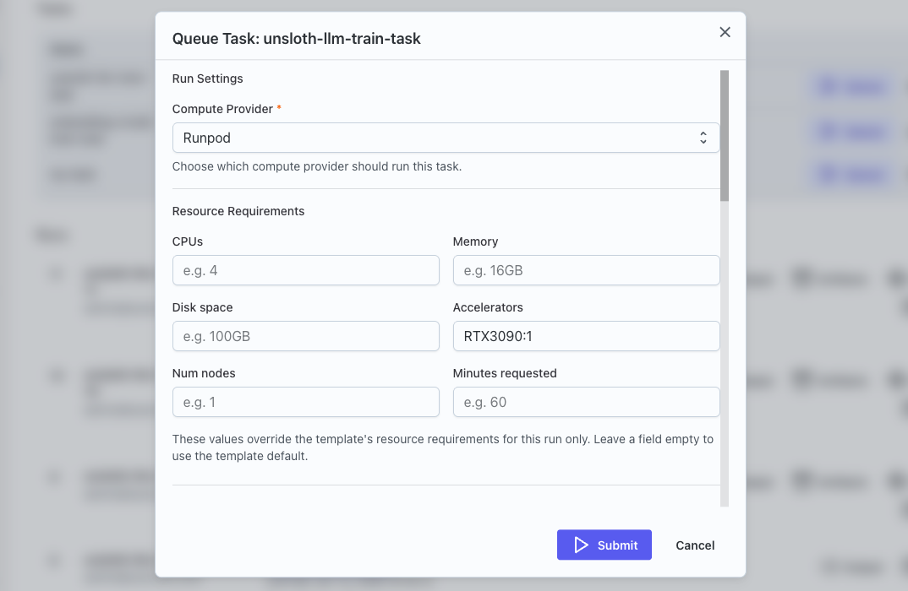
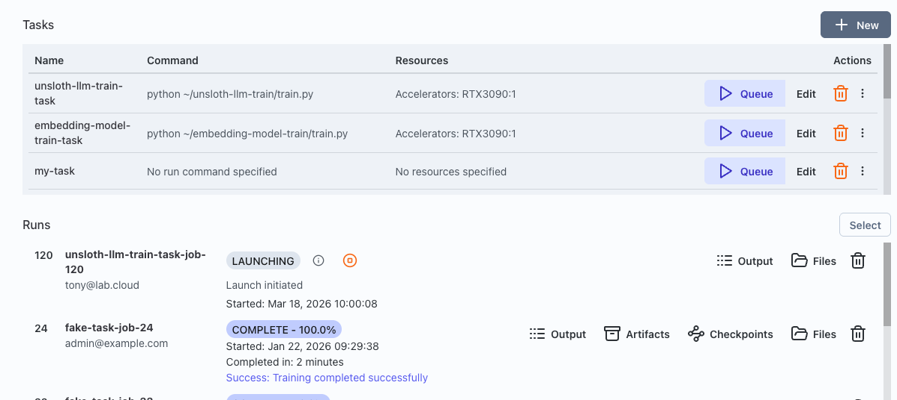

For many looking to experiment with machine learning,
the biggest barrier to entry is access to hardware.
GPUs are expensive, hard to find, and even harder to share across a team. Big cloud hosting providers have complex interfaces, pricing models, and try to lock you into their ecosystem and tooling.

Using Runpod with Transformer Lab changes that. Now you can spin up GPU-backed experiments quickly from the comfort of your own system.

<!--truncate-->

## About Runpod

Runpod is a GPU cloud provider that has become popular in the ML community because it's cost-effective, fast and easy to get started. You pay for what you use, and there are GPUs available on-demand ranging from RTX 4090s all the way up to H100s. For experimentation and one-off fine-tuning runs, it hits a sweet spot.

By connecting Runpod to Transformer Lab you unlock infrastructure managmeent, environment configuration and experiment tracking through a simple, organized UI, so that you can focus on what matters to you.

---

## Step 1: Create a Runpod Account

Head to [runpod.io](https://www.runpod.io) and sign up.
Once you're in, add a payment method and deposit some credits. Runpod works on a prepaid credit system. But since we will only be paying for GPUs while they are being used, even an initial
deposit of $10 will go a long way.

## Step 2: Generate a Runpod API Key

Transformer Lab connects to Runpod through their REST API, so you need an API key.

1. On the sidebar in the Runpod console, go to **Account -> Settings** and scroll down to **API Keys**.
2. Here you can create a new API Key, give it a name (something like `transformerlab`), and hit **Create**.
3. **Copy the key immediately!** You won't be able to see it again after you navigate away.

Keep that key somewhere handy. You'll paste it into Transformer Lab in a minute.

## Step 3: Install Transformer Lab for Teams

Install [Transformer Lab For Teams](https://lab.cloud/for-teams/install) on your local system. If you have your Runpod API key you can skip Step 1, and use it when adding a compute provider in Step 5.

After you are done, you should see Runpod listed as a Cloud Provider:

## Step 4: Pick a Task from the Task Gallery

Now that you've got cloud GPUs connected and a workspace ready, you're ready to run a task!

Transformer Lab has a **Task Gallery** full of pre-built experiments you can run with a click. It's a great way to get your bearings without having to configure everything from scratch.

Open the **Tasks Gallery** from the left sidebar. You'll see a grid of tasks including things like fine-tuning runs, evaluation benchmarks, and dataset generation jobs. For a first run, you can try a smaller job like a fine-tuning task on a small model. A good start is the **Unsloth LLM Fine-tuning** task.

## Step 5: Run your first Task

1. Navigate to **Tasks** on the sidebar.
2. Your new task should be at the top of the Tasks list. The metadata that describes your task is stored in a YAML file you can view by clicking on **Edit**.
3. Click on **Queue** to prepare your task to run.
4. In the task configuration dialog, set the **Compute Provider** to the Runpod provider you setup. You can change Accelerator to the type of GPU required, such as "A40:1" for an affordable NVIDIA A40 card, or "H100:4" for a powerful machine with 4 H100 GPUs.
5. You can also review the hyperparameters to see if there is anything you want to tweak.
6. When you are ready, hit **Submit**. It may take a minute for the dialog to clear while it provisions and sets up the machine.

## Step 6: Watch It Go

After submitting, your task will appear at the top of the **Runs** list where you can watch your job progress in real-time. Transformer Lab spins up a Runpod pod in the background, runs the task, and streams the logs back to you.

When the task finishes, the output artifacts (model checkpoints, machine logs, whatever the task produces) will be accessible in your run history.

## What Just Happened?

To recap: you created a Runpod account, generated an API key, installed Transformer Lab, set up a local workspace, connected Runpod as a compute provider, and ran a real ML experiment from the Task Gallery — all without touching a single line of infrastructure code.

The goal of Transformer Lab is to make the logistics of ML research invisible when you want them to be, and accessible when needed, so you can focus on the actual research.

---

## What's Next?

A few things worth exploring from here:

- **Build a custom task** — Yu can create a new Transformer Lab task from a github repo or a local folder, and run it on Runpod with the same workflow.
- **Set up experiment tracking** — Transformer Lab integrates with trackers like Weights & Biases and trackio, so your runs are automatically logged.
- **Try a hyperparameter sweep** — once you've got one task running, you can run a sweep to find the optimal hyperparameters to use.
