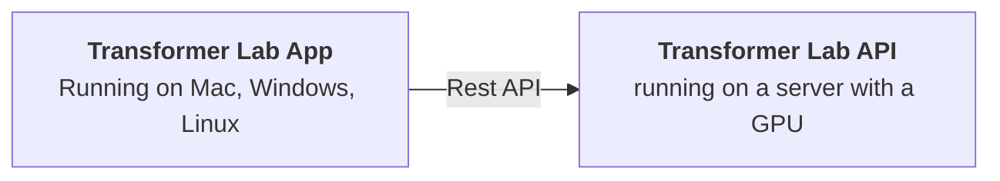

# How It Works

## Application Components

Transformer Lab has two main components:

1. **Transformer Lab App:** a graphical client application.

2. **Transformer Lab API:** an LLM server that is wrapped with an API

## Underlying ML Frameworks

Transformer Lab wraps several popular ML frameworks that do the heavy lifting under the scenes.

Huggingface's [open libraries](https://huggingface.co/docs) are used to fetch, store, and train models using the Huggingface Transformers, Hub, Accelerate, PEFT, and Datasets libraries.

For Inference, Transformer Lab uses [FastChat](https://github.com/lm-sys/FastChat)

Transformer Lab's main plugin for Evaluation calls to Eleuther Lab's [Language Model Evaluation Harness](https://github.com/EleutherAI/lm-evaluation-harness)

## Automatic Server Provisioning

Especially when working with cloud servers, it's common to set up a new server from scratch right before starting to work with it.

Transformer Lab has a feature to autoprovision a server. This makes it easier to get started because you can just download the Client Application and point it at a (cloud or local) server through SSH.
