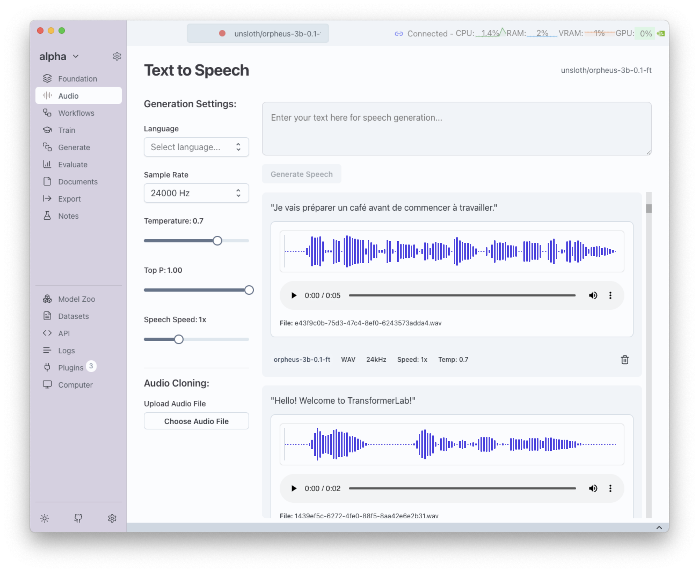

# Text-to-Speech (TTS) Generation

Transformer Lab supports **Text-to-Speech (TTS)** on both **MLX (Apple Silicon)** and **CUDA (NVIDIA GPUs)**. This feature lets you convert plain text into **natural-sounding speech** directly inside Transformer Lab.

---

## How It Works

1. Install the appropriate plugin:
   - **Apple Audio MLX Server** (for MLX)
   - **Unsloth Text-to-Speech Server** (for CUDA)

2. Select a **TTS model** in the **Foundation tab**  
3. Switch to the **Audio tab**  
4. Enter text, adjust generation parameters, and generate audio

## Supported Model Families

You can start generating audio today with the following models:
### MLX (Apple Silicon)

- **Kokoro** → [mlx-community/Kokoro-82M-4bit](https://huggingface.co/mlx-community/Kokoro-82M-4bit)  
- **Dia** → [mlx-community/Dia-1.6B](https://huggingface.co/mlx-community/Dia-1.6B)  
- **Spark** → [mlx-community/Spark-TTS-0.5B-bf16](https://huggingface.co/mlx-community/Spark-TTS-0.5B-bf16)  
- **Bark** → [mlx-community/bark-small](https://huggingface.co/mlx-community/bark-small)  
- **CSM** → [mlx-community/csm-1b](https://huggingface.co/mlx-community/csm-1b)  

### CUDA (NVIDIA GPUs)

- **Orpheus** → [unsloth/orpheus-3b-0.1-ft](https://huggingface.co/unsloth/orpheus-3b-0.1-ft)  
- **CSM** → [unsloth/csm-1b](https://huggingface.co/unsloth/csm-1b)

## Generation Parameters

When generating speech, you’ll see the following parameters:

- **Text** → The input string to convert into speech  
- **Sample Rate** → Number of audio samples per second (higher = clearer audio)  
- **Temperature** → Controls randomness; lower = consistent, higher = expressive  
- **Speech Speed** → Adjusts pacing of speech (slower = clarity, faster = natural flow)  

Some models expose extra controls for more flexibility:

- **Audio Cloning** → Provide a short reference sample to make the output mimic that voice  
- **Language** → Choose the language for generation (if multilingual support is available)  
- **Voice** → Select a specific voice style or speaker profile offered by the model 

---

## TTS Generation Process

Here's a visual guide to the TTS generation process in Transformer Lab:

This demonstrates the complete workflow from model selection to audio output generation.

## Next Steps

Learn how to train your own TTS models:

- [Text-to-Speech Training](./text-to-speech-training.md)

