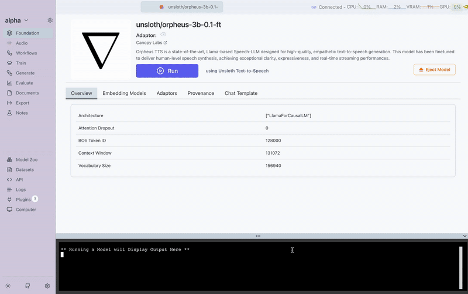
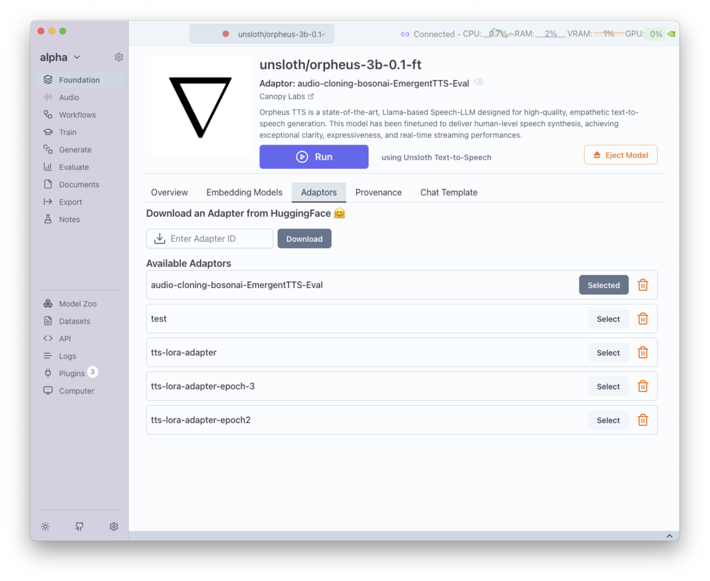

# Training Text-to-Speech Models

Transformer Lab allows you to **train custom Text-to-Speech (TTS) models** on CUDA and AMD. Fine-tune a model on your own dataset to capture a specific **voice, accent, or speaking style**.

## How It Works

1. Install the **Unsloth Text-to-Speech Trainer** plugin  
2. Upload or Download a dataset containing audio + transcripts  
3. Configure your training parameters in the **Train tab**  
4. Start training and track progress 

## Training Process

Here's a visual guide to the TTS training process in Transformer Lab:

This demonstrates the complete workflow from setup to model training completion.

## Training Parameters

You can adjust a wide range of parameters when training:

- **Sampling Rate** → Audio sampling frequency  
- **Maximum Sequence Length** → Max length of input sequences  
- **Batch Size** → Number of sequences per training step  
- **Learning Rate / Schedule** → Step size and scheduling (e.g. linear)  
- **Number of Training Epochs** → How many times the dataset is passed through  
- **Max Steps** → Maximum training steps (-1 = unlimited)  
- **LoRA Parameters (R, Alpha, Dropout)** → LoRA fine-tuning configuration  
- **Max Grad Norm** → Gradient clipping threshold  
- **Weight Decay** → Regularization strength  
- **Adam Optimizer Settings** → Beta 1, Beta 2, Epsilon  
- **Adapter Name** → Name for the saved adapter model  
- **Audio Column Name** → Dataset column containing audio files  
- **Text Column Name** → Dataset column containing transcriptions  
- **Log to Weights & Biases** → Track training metrics in real time  

## Next Steps

Once the training is finished, the LoRA adaptor becomes available for use with TTS models. You can:

*Loading the trained LoRA adaptor in the Foundation tab*
