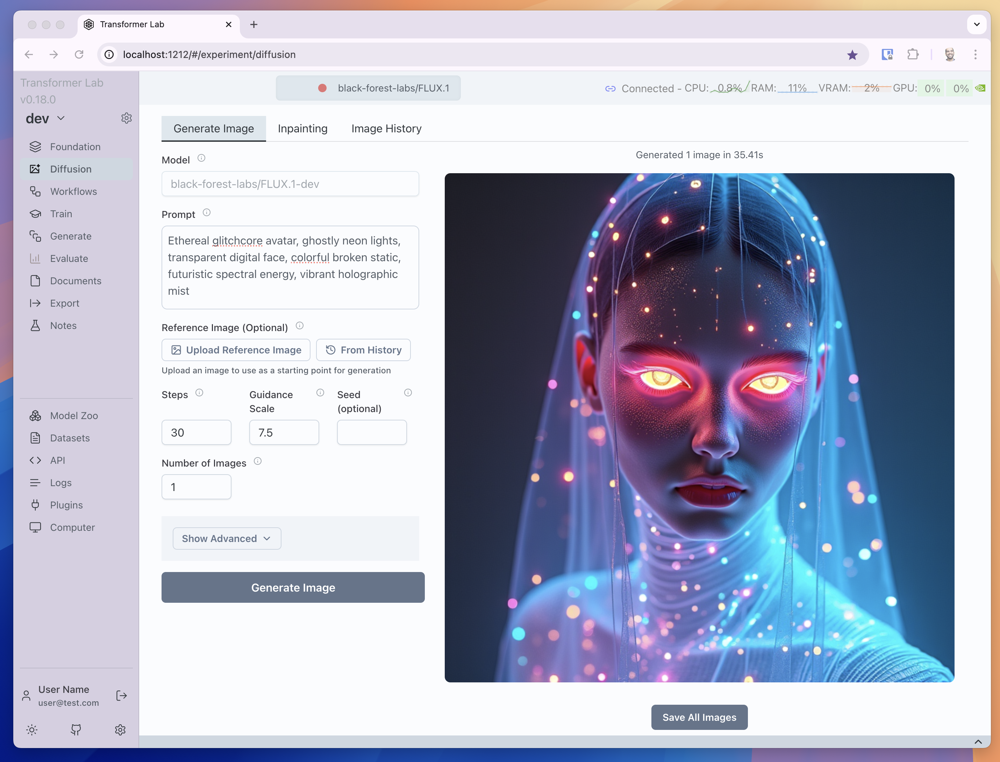

# Text-to-Image Generation

Generate high-quality images from text descriptions using diffusion models in Transformer Lab.



## Overview

Text-to-image generation allows you to create images from natural language descriptions. Transformer Lab provides an intuitive interface for this powerful capability, supporting various diffusion model architectures.

## Getting Started

### Prerequisites

- Downloaded diffusion model (see [Downloading Models](./downloading-models.md))
- NVIDIA or AMD GPU with sufficient GPU memory for inference

### Accessing Text-to-Image Generation

1. **Select a diffusion model** from the **Foundation tab**
2. **Navigate to the Diffusion tab**
4. **Configure generation parameters** and start creating images

## Interface Overview

### Main Generation Controls

The Transformer Lab diffusion interface provides intuitive controls for text-to-image generation:

#### **Prompt**

Describe the image you want to generate. Be specific and detailed for better results.

```text
A serene mountain landscape at sunset, digital art style, detailed clouds, vibrant colors
```

#### **Reference Image** *(Optional)*

This field is used for Image-to-Image generation (see [Image-to-Image Processing](./image-to-image.md) for details).

#### **Steps**

Number of denoising steps. More steps generally produce higher quality images but take longer to generate. Typical values range from 20-50.

#### **Guidance Scale**

Controls how closely the model follows your prompt. Higher values (7-15) follow the prompt more strictly, lower values (1-7) allow more creative interpretation.

#### **Seed**

Random seed for reproducibility. Leave empty for random generation, or use a specific number to generate the same image repeatedly.

#### **Number of Images**

Number of images to generate in parallel. Higher values will take longer but produce more options to choose from.

### Advanced Controls

The advanced menu provides additional fine-tuning options:

#### **Negative Prompt**

Describe what you don't want to see in the generated image. This helps guide the model away from unwanted elements, styles, or features.

```text
blurry, low quality, distorted, watermark, text, signature
```

#### **ETA**

Controls the amount of noise in the denoising process. Higher values add more randomness while lower values make the process more deterministic. Leave at 0.0 for default behavior.

#### **Clip Skip**

Number of CLIP text encoder layers to skip. Higher values may result in more artistic or abstract outputs. Set to 0 for default behavior.

#### **Guidance Rescale**

Rescales the guidance scale to prevent over-saturation. Values between 0.0-1.0 can help balance prompt adherence with image quality. Leave at 0.0 for default behavior.

#### **Image Width**

Set a custom width for the generated image in pixels. Leave at 0 to use the model's default width. Values should be multiples of 8.

#### **Image Height**

Set a custom height for the generated image in pixels. Leave at 0 to use the model's default height. Values should be multiples of 8.

#### **Upscale Image**

Enhance the generated image resolution by upscaling it 2x using an upscaling model. This improves detail and clarity, especially for low-resolution outputs.

## Best Practices

### Prompt Writing Tips

- **Be descriptive and specific**: Include detailed descriptions of subjects, styles, and compositions
- **Use quality modifiers**: Add terms like "high quality", "detailed", "professional"
- **Specify artistic styles**: Mention specific art styles, techniques, or artists
- **Include lighting details**: Describe lighting conditions for better results

### Example Prompts

**Landscape:**

```text
A serene mountain landscape at sunset, digital art style, detailed clouds, vibrant colors, high resolution
```

<div style={{textAlign: 'center'}}>
  
</div>

**Portrait:**

```text
Ethereal glitchcore avatar, ghostly neon lights, transparent digital face, colorful broken static, futuristic spectral energy, vibrant holographic mist
```

<div style={{textAlign: 'center'}}>
  
</div>

### Parameter Optimization

- **Start with defaults**: Begin with standard settings and adjust based on results
- **Experiment with steps**: Try 20-30 steps for faster results, 40-50 for higher quality
- **Adjust guidance scale**: Use 7-10 for balanced results, higher for strict prompt following
- **Use negative prompts**: Always specify what you don't want to avoid common issues
- **Test different seeds**: Generate multiple variations to find the best result

### Performance Considerations

- **Monitor GPU memory**: Reduce image dimensions or number of images if memory is limited
- **Balance quality vs speed**: More steps and higher resolution increase generation time
- **Use upscaling wisely**: Enable upscaling for final images rather than during experimentation
- **Batch generation**: Generate multiple images at once for efficiency

## Saving Generated Images

Once you've generated images, you can easily save them to your local system:

- **Save All Images button**: Located below the generated images, this button allows you to download all generated images at once
- **Convenient batch saving**: No need to save images individually - get all your results in one action as a zip file

This feature is particularly useful when generating multiple images in a batch, allowing you to quickly save all variations for comparison or further use.

## Troubleshooting

### Common Issues

- **Out of memory errors**: Reduce image dimensions, lower number of images, or use smaller models
- **Poor image quality**: Increase steps, adjust guidance scale, or improve prompt details
- **Slow generation times**: Reduce steps, image resolution, or number of images
- **Prompt not being followed**: Increase guidance scale, improve prompt specificity, or add negative prompts
- **Unwanted elements**: Use negative prompts to exclude specific features or styles

### Solutions and Tips

- **Memory optimization**: Use image dimensions that are multiples of 8 for best performance
- **Quality improvement**: Combine detailed prompts with appropriate guidance scale settings
- **Speed optimization**: Use fewer steps during experimentation, more for final generation
- **Consistency**: Use the same seed value to reproduce successful results
