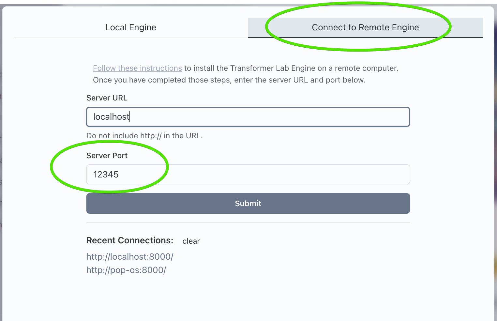

# Default Port 8338

By default, Transformer Lab runs the Transformer Lab Server on port 8338 on your machine. If something else on your computer is holding that port, the local server will fail to load.

## Changing the Default Port

The server can be run on any port by running the server manually by running the API manually and providing a "-p" parameter like the following:

```bash
cd ~/.transformerlab/src
./run.sh -p 12345
```

Where "12345" is any available port on your computer.

You can then connect to the engine by going to Remote Connection at the start of Transformer Lab and providing the port:


