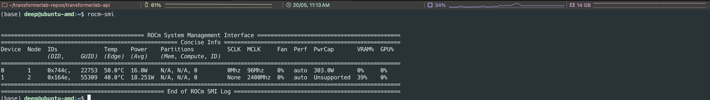

import Button from '@site/src/components/Button';

# Advanced: Setting up an AMD Computer for Machine Learning

## Table of Contents

- [Linux Instructions](#linux-instructions)
- [Windows Instructions](#windows-instructions)

## Linux Instructions

For most situations, you can just download Transformer Lab and it should work as is. But if you are setting up from scratch and haven't installed ROCm drivers (drivers for your AMD GPU), the following instructions will help you set up your AMD GPU computer for machine learning.

### Supported Linux Distributions

You can set up ROCm on many distros of Linux. If you are getting started from scratch, we recommend installing [Ubuntu 24.04 (or 22.04)](https://ubuntu.com/) as they have good support for AMD GPUs and ROCm.

### Step 1 - Ensure ROCm Drivers are Installed

We recommend installing the latest ROCm (6.4) for best compatibility and performance.

You can test that ROCm support is successfully installed by running the following command in a terminal. You should get output similar to what is shown below:

```bash
rocm-smi
```



If this worked, congratulations, ROCm support for your Linux install is working and you can proceed with downloading and installing Transformer Lab.

If you need to install ROCm drivers from scratch, follow the official ROCm installation instructions for your Linux distribution.

Below are the recommended commands for installing ROCm 6.4 on **Ubuntu 24.04**. For other distributions, please refer to the [official ROCm installation guide](https://rocm.docs.amd.com/projects/install-on-linux/en/latest/install/amdgpu-install.html).

```bash
# Update the system and install dependencies
sudo apt update

# Getting the amdgpu-install package
wget https://repo.radeon.com/amdgpu-install/6.4/ubuntu/noble/amdgpu-install_6.4.60400-1_all.deb

# Install the amdgpu-install package
sudo apt install ./amdgpu-install_6.4.60400-1_all.deb

# Update the system again to ensure all dependencies are met
sudo apt update

# Install the ROCm stack
# This will install the ROCm stack and all dependencies
sudo amdgpu-install -y --usecase=rocm --no-dkms

# Providing the user with access to the GPU
sudo usermod -a -G render $USER
sudo usermod -aG video $USER

# Reboot the terminal to apply changes
source ~/.bashrc

# OPTIONAL if git and curl are not installed and needed
sudo apt install curl git
```


### Step 2 - Download and Install Transformer Lab

Now follow the [install instructions](./install.md).


## Windows Instructions

To use Transformer Lab with AMD GPUs on Windows, you will need to set up WSL (Windows Subsystem for Linux) and install the appropriate AMD drivers and ROCm stack.

### Step 1 - Install WSL

First, install WSL (Windows Subsystem for Linux) if you haven't already. Open Windows PowerShell as Administrator and run:

```bash
wsl --install
```

Make sure your default WSL distribution is **Ubuntu**. You can set it with:

```bash
wsl --set-default Ubuntu
```

For more details, see the [official WSL installation guide](https://learn.microsoft.com/en-us/windows/wsl/install).

### Step 2 - Install AMD Adrenalin Driver

To use AMD GPUs with ROCm in WSL, you must install the **Adrenalin v25.3.1** driver from AMD.  
You can download it from the [AMD Drivers & Support page](https://www.amd.com/en/support/download/drivers.html).

### Step 3 - Install ROCm for WSL

Follow the official ROCm installation instructions for WSL at:  
[ROCm for WSL Installation Guide](https://rocm.docs.amd.com/projects/radeon/en/latest/docs/install/wsl/install-radeon.html)

This guide will walk you through the steps to install ROCm and ensure your AMD GPU is available in your WSL environment.

> **Note:** Due to current limitations, you will not be able to track GPU usage when using Transformer Lab on Windows with an AMD GPU. See [AMD's documentation on limitations](https://rocm.docs.amd.com/projects/radeon/en/latest/docs/limitations.html#windows-subsystem-for-linux-wsl) for more details.

### Step 4 - Download and Install Transformer Lab

Once WSL and ROCm are set up, download Transformer Lab for Windows:

<a href="https://transformerlab.ai/docs/download">
    <Button>Download Transformer Lab</Button>
</a>

Double-click the installer and follow the same steps as for Linux. The first time you run it, Windows may show a warning—click "More Info" and then "Run Anyway" to proceed.

---

*If you encounter issues or need more details, refer to the official ROCm and AMD documentation linked above.*
