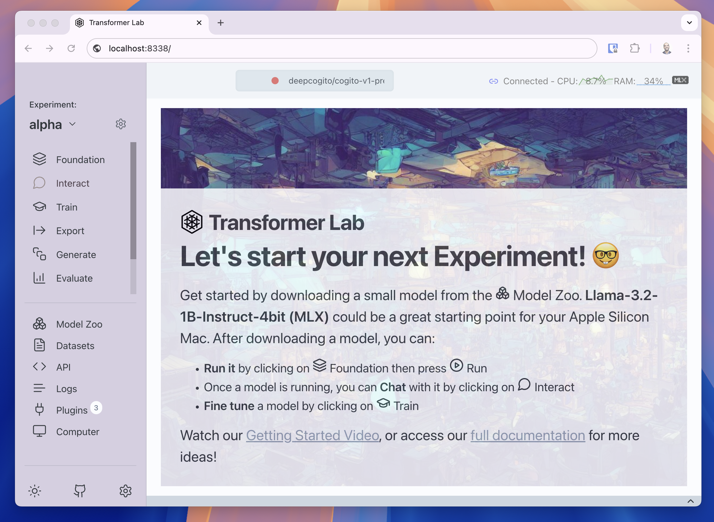
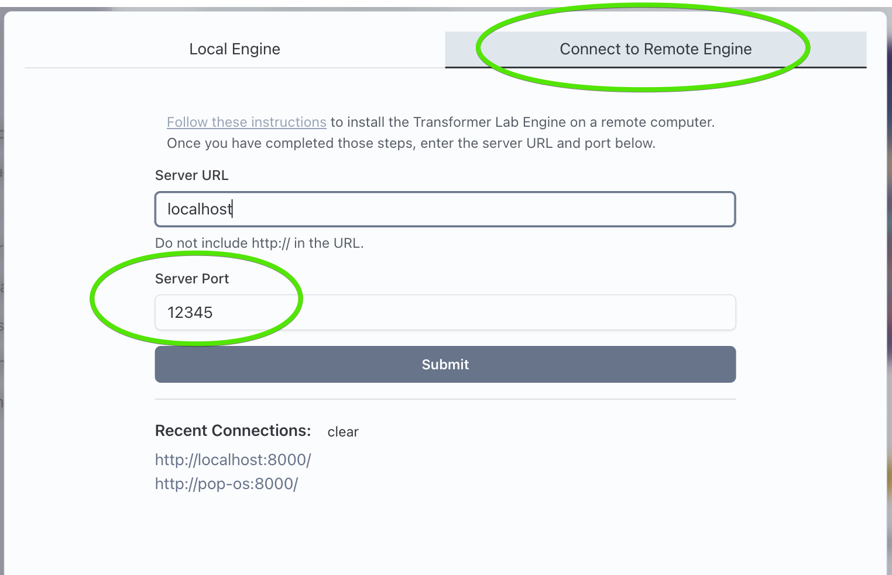

## Installing the Server

To install Transformer Lab as a server, SSH into your network device, or access the terminal, and run the following command:

```bash
curl https://raw.githubusercontent.com/transformerlab/transformerlab-api/main/install.sh | bash
```

This script will attempt to download the project to `~/.transformerlab`, install Miniforge at `~/.transformerlab/miniforge3`, create a Conda environment for Transformer Lab, then finally it will install Python dependencies.

:::info Requirements
The following Linux commands must be installed on your machine for the installer to work:

- curl
- git

:::

## Running the Server

Now you can run the server:

```bash
cd ~/.transformerlab/src
./run.sh
```

## Access the Web UI

You can now go to any modern browser and visit the URL of the server that was run by the previous command. For example if you are running on localhost, open Firefox or Chrome and visit:

`http://localhost:8338`

Here is a screenshot of what you should see:



## Advanced

For more advanced options, [see the advanced install article](./advanced-install.md).

## Changing the Default Port

By default, Transformer Lab runs the Transformer Lab Server on port 8338 on your machine. If something else on your computer is holding that port, the local server will fail to load.

The server can be run on any port by running the server manually by running the API manually and providing a "-p" parameter like the following:

```bash
cd ~/.transformerlab/src
./run.sh -p 12345
```

Where "12345" is any available port on your computer.

You can then connect to the engine by going to Remote Connection at the start of Transformer Lab and providing the port:


