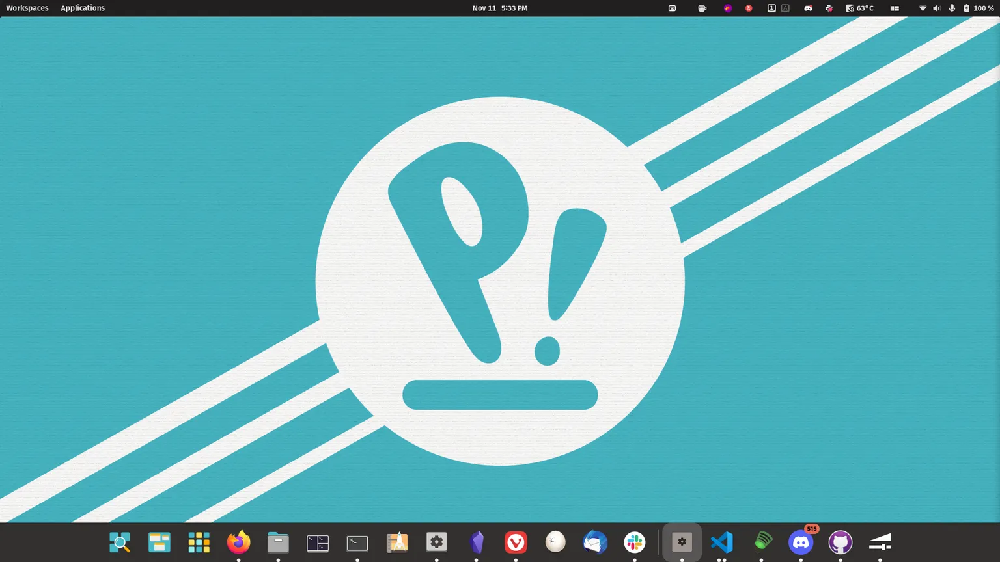
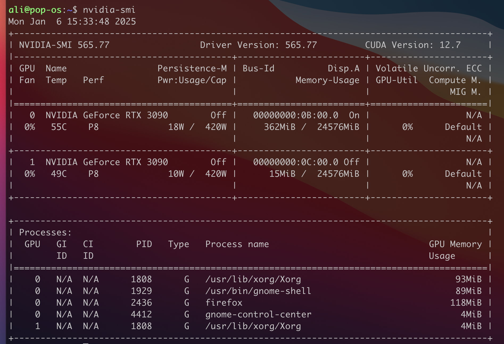
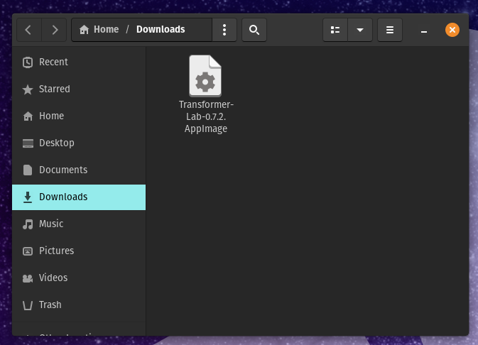
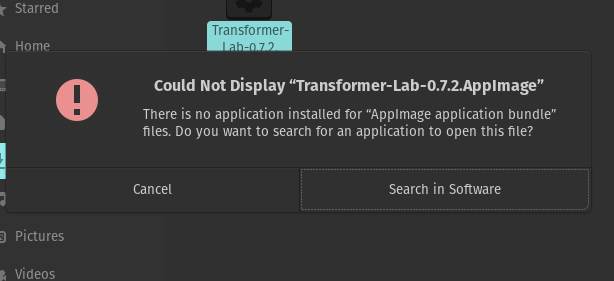
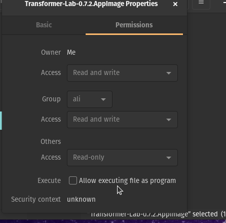

import Button from '@site/src/components/Button';

## What Distro

Transformer Lab should work on most distros of Linux. If you are getting started from scratch, we recommend installing [PopOS](https://pop.system76.com/) because it has great support for automatically installing NVIDIA drivers.



## Step 1 - Ensure NVIDIA Drivers are Installed

If you installed PopOS you will have the option to select an NVIDIA enabled version of PopOS installed by default. You can test that NVIDIA support is successfully installed by running the following command in a command prompt and you should get output similar to what is shown below:

```bash
nvidia-smi
```



If this worked, congratulations, NVIDIA support for your Linux install is working and you can proceed with downloading and installing Tranformer Lab.

If you need to install the nvidia drivers from scratch, there are instructions below for different versions of Linux:

- For PopOS: https://support.system76.com/articles/system76-driver/
- For Ubuntu: https://ubuntu.com/server/docs/nvidia-drivers-installation
- For everything else: https://docs.nvidia.com/datacenter/tesla/driver-installation-guide/index.html

## Step 2 - Download and Install Transformer Lab

Go to the Transformer Lab download page and click on the app image that is appropriate for your computer:

<a href="https://transformerlab.ai/docs/download">
    <Button>Download Transformer Lab</Button>
</a>

## Step 3 - Run the Installer

You can double click on the installer to run Transformer Lab.



If you get an error that says "Could not display..."



You may need to change the permissions of the AppImage.

Right-click on the app then click on Properties -> Permissions -> then check "Allow Executing File as a Program"



Now try running it again. Please be patient on the first install as a number of libraries must installed on the first run. If the install isn't progressing for a few minutes, quit the app and run it again (we are working on a bug that makes the install display freeze sometimes.)
