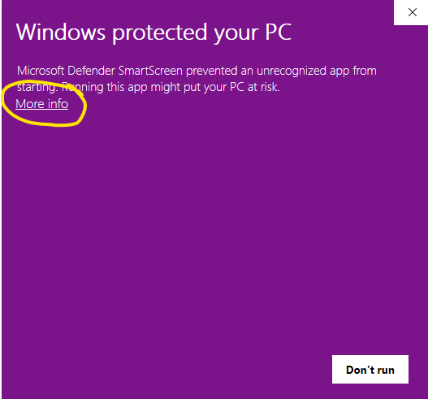

import Button from '@site/src/components/Button';

# Install on Windows

## Step 1 - Install WSL2 and CUDA

CUDA is the toolkit that allows you to connect to NVIDIA GPUs. If you do not have a GPU, Transformer Lab can do basic tasks, but a GPU is needed to unlock advanced LLM work.

To run Transformer Lab, you also need to install WSL2. WSL2 is a full Linux kernel integration in Windows that enables running Linux distributions natively.

Instructions for installing both WSL2 and CUDA are in the following document:

https://learn.microsoft.com/en-us/windows/ai/directml/gpu-cuda-in-wsl

Essentially, you need to install the CUDA toolkit which you can find here:

https://developer.nvidia.com/cuda-downloads

And then you need to install WSL2 on Windows by running the following command in the Windows Powershell (run as administrator).

```bash
wsl --install
```

(Detailed instructions for installing WSL2 are [here](https://learn.microsoft.com/en-us/windows/wsl/install).)

## Step 2 - Download Transformer Lab for Windows

<a href="https://transformerlab.ai/docs/download">
    <Button>Download Transformer Lab</Button>
</a>

## Step 3 - Run the Installer

Double-click on the Application. The first time you run it, Windows may pop up a warning that looks like the following:



If you see that, click on "More Info" and then "Run Anyway" to allow Windows to run the app for the first time.

## Step 4 - Install Dependencies

If you select Local Install, Transformer Lab will go through the steps to install itself locally along with all of the dependencies. This step takes a long time. The app may get to the very last step that reads "Check for Important Plugins" and then stall -- if you see this, close the app and restart it and everything should work from then on.

