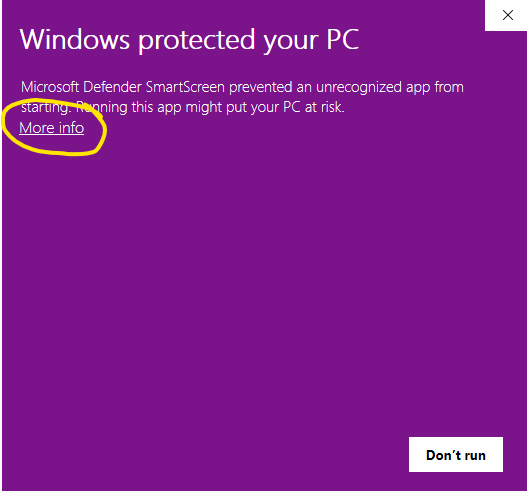

import Button from '@site/src/components/Button';

# Install

## Install on Mac

[Download the app](/docs/download.md) on your Mac (with Apple Silicon) and follow the on-screen instructions.

## Install on Windows

For Windows users, you should be able to download our application from our downloads page and have it work out of the box. But if you haven't installed WSL2 or CUDA drivers before, the following instructions will help you set up your computer to ensure everything works.

### Step 1 - Install WSL2 and CUDA

CUDA is the toolkit that allows you to connect to NVIDIA GPUs. You can skip installing CUDA if you do not have an NVIDIA GPU. Without CUDA, Transformer Lab can do basic tasks, but an NVIDIA GPU is needed to unlock advanced LLM work.

To run Transformer Lab, you also need to install WSL2. WSL2 is a full Linux kernel integration in Windows that enables running Linux distributions natively -- this is where our Transformer Lab's Python Machine Learning workspace will run.

Instructions for installing both WSL2 and CUDA are in the following document:

https://learn.microsoft.com/en-us/windows/ai/directml/gpu-cuda-in-wsl

Essentially, you need to install the CUDA toolkit which you can find here:

https://developer.nvidia.com/cuda-downloads

And then you need to install WSL2 on Windows by running the following command in the Windows Powershell (run as administrator).

```bash
wsl --install
```

(Detailed instructions for installing WSL2 are [here](https://learn.microsoft.com/en-us/windows/wsl/install).)

:::note

For Transformer Lab to work, make sure that your default WSL instance is **Ubuntu**. WSL lets you install multiple distros but you can set the default using the following command:

```
wsl --set-default Ubuntu
```

:::

### Step 2 - Download Transformer Lab for Windows

<a href="https://transformerlab.ai/docs/download">
    <Button>Download Transformer Lab</Button>
</a>

### Step 3 - Run the Installer

Double-click on the Application. The first time you run it, Windows may pop up a warning that looks like the following:



If you see that, click on "More Info" and then "Run Anyway" to allow Windows to run the app for the first time.

### Step 4 - Install Dependencies

If you select Local Install, Transformer Lab will go through the steps to install itself locally along with all of the dependencies. This step takes a long time the very first time you run the app, but will be fast afterwards.

## Install on Linux

### What Distro

Transformer Lab should work on most distros of Linux that support your GPU. If you are getting started from scratch and have an NVIDIA GPU, we recommend installing [PopOS](https://pop.system76.com/) because it has great support for automatically installing NVIDIA drivers.

If you have a machine with an [AMD GPU, follow the instructions here](./install-on-amd.md).


### Step 1 - Ensure NVIDIA Drivers are Installed

If you installed PopOS you will have the option to select an NVIDIA enabled version of PopOS installed by default. You can test that NVIDIA support is successfully installed by running the following command in a command prompt and you should get output similar to what is shown below:

```bash
nvidia-smi
```


If this worked, congratulations, NVIDIA support for your Linux install is working and you can proceed with downloading and installing Transformer Lab.

If you need to install the nvidia drivers from scratch, there are instructions below for different versions of Linux:

- For PopOS: https://support.system76.com/articles/system76-driver/
- For Ubuntu: https://ubuntu.com/server/docs/nvidia-drivers-installation
- For everything else: https://docs.nvidia.com/datacenter/tesla/driver-installation-guide/index.html

### Step 2 - Download and Install Transformer Lab

Now follow the [cloud install instructions](./install-on-cloud.md) to install Transformer Lab as a local web app.


## Uninstall Application

- **MacOS:** Delete the Transformer Lab application from your `/Applications` Folder
- **Windows:** Uninstall the Application
- **Linux:** Delete the App whereever you stored it

### Stored Data

- Transformer Lab stores models and data in your `~/.transformerlab/` folder -- deleting everything there will destroy all your settings and experiments
- On MacOS, there may be a small folder in `~/Library/Logs/transformerlab/`

For MacOS, here is a script you can run in a Terminal that will do all of the above steps:

```bash
rm -rf /Applications/Transformer\ Lab.app/
rm -rf ~/.transformerlab/
rm -rf ~/Library/Logs/transformerlab/
```

This will remove all the packages installed for Transformer Lab, freeing up space.

### Clear Python Cache

Transformer Lab uses `uv` to install Python packages. You may also want to clear the `uv` cache. Instructions are below:

https://docs.astral.sh/uv/concepts/cache/#clearing-the-cache

### Delete Models and Datasets

Most models and datasets that are downloaded in Transformer Lab are downloaded using Hugging Face Hub which stores them at `~/.cache/huggingface/hub`. Delete this directory to remove the large model files, unless you want them available to other applications.
