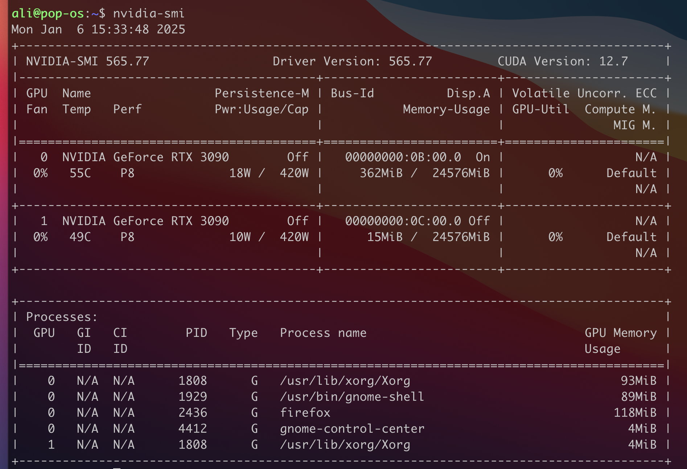

import Button from '@site/src/components/Button';

:::tip

These are instructions to install Transormer Lab as an App. You can also install Transformer Lab as a WebUI locally or in the cloud which will allow you to run Transformer Lab in a web browser [click here to learn more](./install-on-cloud.md).

:::

For most situations, you can just install Transformer Lab and it should work. But if you are setting up from scratch and haven't installed CUDA drivers (drivers for your GPU) the following instructions can help.

## What Distro

Transformer Lab should work on most distros of Linux that support your GPU. If you are getting started from scratch and have an NVIDIA GPU, we recommend installing [PopOS](https://pop.system76.com/) because it has great support for automatically installing NVIDIA drivers.

If you have a machine with an [AMD GPU, follow the instructions here](./install-on-amd.md).


## Step 1 - Ensure NVIDIA Drivers are Installed

If you installed PopOS you will have the option to select an NVIDIA enabled version of PopOS installed by default. You can test that NVIDIA support is successfully installed by running the following command in a command prompt and you should get output similar to what is shown below:

```bash
nvidia-smi
```



If this worked, congratulations, NVIDIA support for your Linux install is working and you can proceed with downloading and installing Transformer Lab.

If you need to install the nvidia drivers from scratch, there are instructions below for different versions of Linux:

- For PopOS: https://support.system76.com/articles/system76-driver/
- For Ubuntu: https://ubuntu.com/server/docs/nvidia-drivers-installation
- For everything else: https://docs.nvidia.com/datacenter/tesla/driver-installation-guide/index.html

## Step 2 - Download and Install Transformer Lab

Now follow the [cloud install instructions](./install-on-cloud.md) to install Transformer Lab as a local web app.