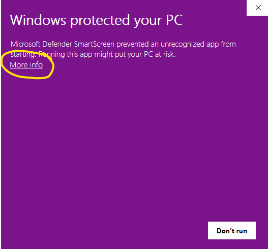

import Button from '@site/src/components/Button';

:::tip

These are instructions to install Transormer Lab as an App. You can also install Transformer Lab as a WebUI locally or in the cloud which will allow you to run Transformer Lab in a web browser [click here to learn more](./install-on-cloud.md).

:::

For Windows users, you should be able to download our application from our downloads page and have it work out of the box. But if you haven't installed WSL2 or CUDA drivers before, the following instructions will help you set up your computer to ensure everything works.

## Step 1 - Install WSL2 and CUDA

CUDA is the toolkit that allows you to connect to NVIDIA GPUs. You can skip installing CUDA if you do not have an NVIDIA GPU. Without CUDA, Transformer Lab can do basic tasks, but an NVIDIA GPU is needed to unlock advanced LLM work.

To run Transformer Lab, you also need to install WSL2. WSL2 is a full Linux kernel integration in Windows that enables running Linux distributions natively -- this is where our Transformer Lab's Python Machine Learning workspace will run.

Instructions for installing both WSL2 and CUDA are in the following document:

https://learn.microsoft.com/en-us/windows/ai/directml/gpu-cuda-in-wsl

Essentially, you need to install the CUDA toolkit which you can find here:

https://developer.nvidia.com/cuda-downloads

And then you need to install WSL2 on Windows by running the following command in the Windows Powershell (run as administrator).

```bash
wsl --install
```

(Detailed instructions for installing WSL2 are [here](https://learn.microsoft.com/en-us/windows/wsl/install).)

:::note

For Transformer Lab to work, make sure that your default WSL instance is **Ubuntu**. WSL lets you install multiple distros but you can set the default using the following command:

```
wsl --set-default Ubuntu
```

:::

## Step 2 - Download Transformer Lab for Windows

<a href="https://transformerlab.ai/docs/download">
    <Button>Download Transformer Lab</Button>
</a>

## Step 3 - Run the Installer

Double-click on the Application. The first time you run it, Windows may pop up a warning that looks like the following:



If you see that, click on "More Info" and then "Run Anyway" to allow Windows to run the app for the first time.

## Step 4 - Install Dependencies

If you select Local Install, Transformer Lab will go through the steps to install itself locally along with all of the dependencies. This step takes a long time the very first time you run the app, but will be fast afterwards.
