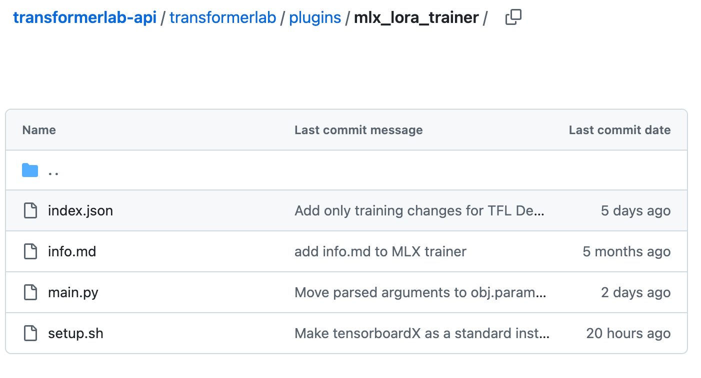

# Introduction to Plugins

## Overview

Transformer Lab's architecture is built around a plugin system that powers all core functionality. Plugins enable:

- Model training
- Inference
- Evaluation
- etc.

Plugins allow anyone to extend the ability of Transformer Lab in a consistent way.

## Plugin Structure

At its core, a Transformer Lab plugin is a directory containing specific files that define its functionality, parameters, and dependencies.

### Example: Apple MLX LoRA Trainer

Let's examine a real-world example: the MLX LoRA Trainer plugin which enables efficient fine-tuning on Apple Silicon.

```
transformerlab/plugins/mlx_lora_trainer/
├── index.json
├── info.md
├── main.py
└── setup.sh
```

<!--  -->

### Key Files

Each plugin consists of four essential files:

| File | Purpose |
|------|---------|
| **index.json** | Defines plugin metadata including name, version, and required parameters |
| **info.md** | Provides user documentation explaining the plugin's functionality and usage |
| **main.py** | Contains the core implementation that executes when the plugin runs |
| **setup.sh** | Installs dependencies and performs one-time setup operations |

## Getting Started

The plugin system makes extending Transformer Lab straightforward. In the following sections, we'll explore how to:

1. Creating a new plugin
2. Formatting the parameters that a plugin can use
3. Using the Plugin SDK to convert an existing script to work inside Transformer Lab