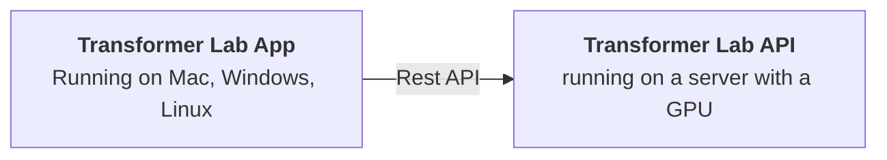

{/* truncate */}
## Application Components

Transformer Lab has two main components:

1. **Transformer Lab App:** a graphical client application.

2. **Transformer Lab API:** an LLM server that is wrapped with an API

## Underlying ML Frameworks

Transformer Lab wraps several popular ML frameworks that do the heavy lifting under the scenes including:
* Huggingface Transformers
* Huggingface Datasets
* Apple MLX
* vLLM
* Huggingface Nanotron
* DeepEval
* Eleuther Labs Eval Harness
* FastChat

and many more