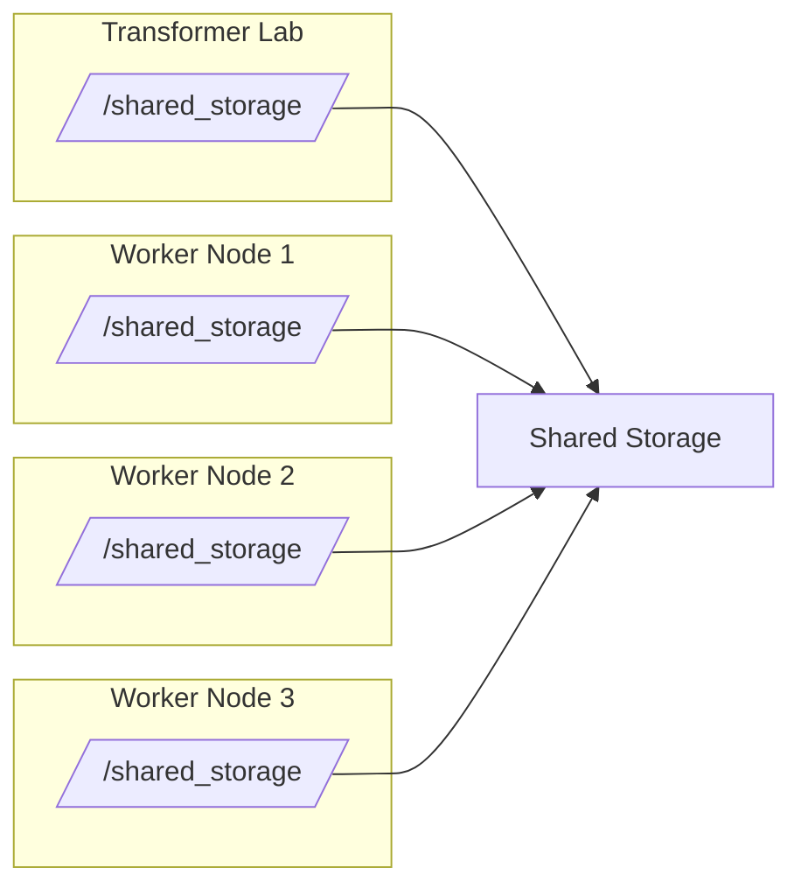

## Where Does Transformer Lab Store Files

Transformer Lab runs as a central "coordinator" node, but dispatches workloads to different "worker" nodes. All of these nodes (workers *and* the coordinator) need to have common view of a shared storage directory. This can be stored in the cloud (usually recommended) but could also be on shared storage that is mounted to all nodes in common path (e.g. using NFS)

If you use our s3 or gcs storage option, Transformer Lab will mount the bucket automatically, you don't have to mount any drives yourself. But if you use our `localfs` storage engine, you map it to a directory that appears like a local path, but is mounted at the operating system level to a shared NFS or other storage engine.




## AWS S3 Storage

To use AWS S3 as remote storage:

1. Set `TFL_REMOTE_STORAGE_ENABLED=true` in your `.env` file.

2. Configure AWS credentials for the `transformerlab-s3` profile.

   #### Using AWS CLI (Recommended)

   If you have the AWS CLI installed, run:

   ```bash
   aws configure --profile transformerlab-s3
   ```

   Enter your AWS Access Key ID, Secret Access Key, default region, and output format when prompted.

   #### Manual Configuration

   Create or edit the AWS credentials file at `~/.aws/credentials` and add:

   ```ini
   [transformerlab-s3]
   aws_access_key_id = YOUR_ACCESS_KEY_ID
   aws_secret_access_key = YOUR_SECRET_ACCESS_KEY
   ```

   Ensure the profile has the necessary permissions to create and manage S3 buckets.

## Google Cloud Storage (GCS)

To use Google Cloud Storage instead of AWS S3:

1. Set `TFL_REMOTE_STORAGE_ENABLED=true` in your `.env` file.

2. Set `REMOTE_WORKSPACE_HOST=gcp` in the same `.env` file.

3. Optionally, set `GCP_PROJECT` to specify the Google Cloud project. If not set, it defaults to `transformerlab-workspace`.

4. Configure Google Cloud credentials:

   #### Using gcloud CLI (Recommended)

   If you have the Google Cloud CLI installed, authenticate and set the project:

   ```bash
   gcloud auth application-default login
   gcloud config set project transformerlab-workspace  # or your project name
   ```

   #### Manual Configuration

   Set the `GOOGLE_APPLICATION_CREDENTIALS` environment variable to the path of your service account key JSON file:

   ```bash
   export GOOGLE_APPLICATION_CREDENTIALS="/path/to/your/service-account-key.json"
   ```

   You can obtain a service account key from the Google Cloud Console under IAM & Admin > Service Accounts.

   Ensure the service account has the necessary permissions for Cloud Storage operations (Storage Admin or equivalent).

## Local Storage

Instructions coming soon