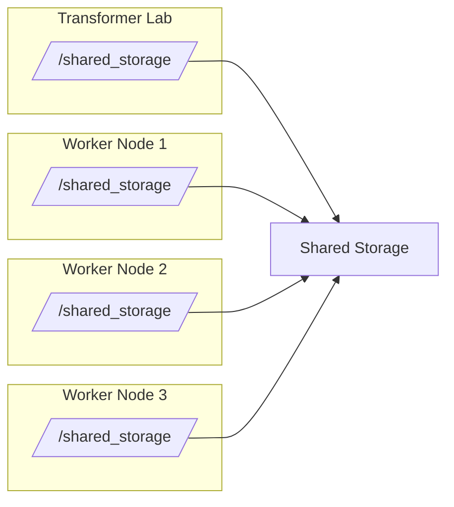

## Where Does Transformer Lab Store Files

Transformer Lab runs as a central "coordinator" node, but dispatches workloads to different "worker" nodes. All of these nodes (workers _and_ the coordinator) need to have common view of a shared storage directory. This can be stored in the cloud (usually recommended) but could also be on shared storage that is mounted to all nodes in common path (e.g. using NFS)

If you use our s3 or gcs storage option, Transformer Lab will mount the bucket automatically, you don't have to mount any drives yourself. But if you use our `localfs` storage engine, you map it to a directory that appears like a local path, but is mounted at the operating system level to a shared NFS or other storage engine.


```mermaid
flowchart LR
   shared[Shared Storage]

   subgraph tlab[Transformer Lab]
      tlab_share[/"/shared_storage"/]
   end

   subgraph w1[Worker Node 1]
      w1_share[/ "/shared_storage"/]
   end

   subgraph w2[Worker Node 2]
      w2_share[/"/shared_storage"/]
   end

   subgraph w3[Worker Node 3]
      w3_share[/"/shared_storage"/]
   end

   tlab_share --> shared
   w1_share --> shared
   w2_share --> shared
   w3_share --> shared
```

## AWS S3 Storage

To use AWS S3 as remote storage:

1. Set `TFL_REMOTE_STORAGE_ENABLED=true` in your `.env` file.

2. Configure AWS credentials for the `transformerlab-s3` profile.

   #### Using AWS CLI (Recommended)

   If you have the AWS CLI installed, run:

   ```bash
   aws configure --profile transformerlab-s3
   ```

   Enter your AWS Access Key ID, Secret Access Key, default region, and output format when prompted.

   #### Manual Configuration

   Create or edit the AWS credentials file at `~/.aws/credentials` and add:

   ```ini
   [transformerlab-s3]
   aws_access_key_id = YOUR_ACCESS_KEY_ID
   aws_secret_access_key = YOUR_SECRET_ACCESS_KEY
   ```

   Ensure the profile has the necessary permissions to create and manage S3 buckets.

## Google Cloud Storage (GCS)

To use Google Cloud Storage instead of AWS S3:

1. Set `TFL_REMOTE_STORAGE_ENABLED=true` in your `.env` file.

2. Set `REMOTE_WORKSPACE_HOST=gcp` in the same `.env` file.

3. Optionally, set `GCP_PROJECT` to specify the Google Cloud project. If not set, it defaults to `transformerlab-workspace`.

4. Configure Google Cloud credentials:

   #### Using gcloud CLI (Recommended)

   If you have the Google Cloud CLI installed, authenticate and set the project:

   ```bash
   gcloud auth application-default login
   gcloud config set project transformerlab-workspace  # or your project name
   ```

   #### Manual Configuration

   Set the `GOOGLE_APPLICATION_CREDENTIALS` environment variable to the path of your service account key JSON file:

   ```bash
   export GOOGLE_APPLICATION_CREDENTIALS="/path/to/your/service-account-key.json"
   ```

   You can obtain a service account key from the Google Cloud Console under IAM & Admin > Service Accounts.

   Ensure the service account has the necessary permissions for Cloud Storage operations (Storage Admin or equivalent).

## Azure Blob Storage

To use Azure Blob Storage instead of AWS S3 or GCS:

1. Set `TFL_REMOTE_STORAGE_ENABLED=true` in your `.env` file.

2. Set `TFL_STORAGE_PROVIDER=azure` in the same `.env` file.

3. Configure Azure credentials using **one** of the following approaches:

   #### Option A: Connection String (Simplest)

   Set the `AZURE_STORAGE_CONNECTION_STRING` environment variable in your `.env` file:

   ```bash
   AZURE_STORAGE_CONNECTION_STRING="DefaultEndpointsProtocol=https;AccountName=your_account;AccountKey=your_key;EndpointSuffix=core.windows.net"
   ```

   You can find your connection string in the Azure Portal under **Storage account → Access keys**.

   #### Option B: Account Name + Key

   Set the storage account name and access key separately:

   ```bash
   AZURE_STORAGE_ACCOUNT="your_account_name"
   AZURE_STORAGE_KEY="your_account_key"
   ```

   #### Option C: Account Name + SAS Token

   If you prefer to use a Shared Access Signature (SAS) token instead of the full account key:

   ```bash
   AZURE_STORAGE_ACCOUNT="your_account_name"
   AZURE_STORAGE_SAS_TOKEN="your_sas_token"
   ```

   Ensure the SAS token has sufficient permissions for read, write, list, and delete operations on containers and blobs.

## Local Storage

Instead of using a cloud provider like AWS or GCS, you can configure Transformer Lab to store all artifacts and job data locally. How you set this up depends on your architecture:

**Single-Node Setup**
If your controller and workers run on the exact same machine, configuration is straightforward. You simply define a local file path, and both components will read and write to that exact same location.

**Multi-Node Setup (Shared Filesystem)**
If your controller and workers run on separate machines, you must use a shared network filesystem (such as NFS). You must mount this shared folder to the **exact same file path** on every single machine. The system expects the `TFL_STORAGE_URI` to be identical across the controller and all workers so they can seamlessly share files.

### Configuration Steps

To enable a local or shared filesystem, update your `.env` file with the following changes:

1.  **Set the storage provider:** Add `TFL_STORAGE_PROVIDER=localfs`
2.  **Define the storage path:** Add `TFL_STORAGE_URI=/path/to/your/shared/folder`
3.  **Disable remote storage:** Delete the line `TFL_REMOTE_STORAGE_ENABLED=true` (if it is present).
4.  **Configure SkyPilot (if applicable):** If you are running tasks with SkyPilot, you must configure `hostPath` volume mounts so your `TFL_STORAGE_URI` is accessible inside the task pods. See [SkyPilot Volume Mounts for localfs](./skypilot-volume-mounts.md) for detailed instructions.