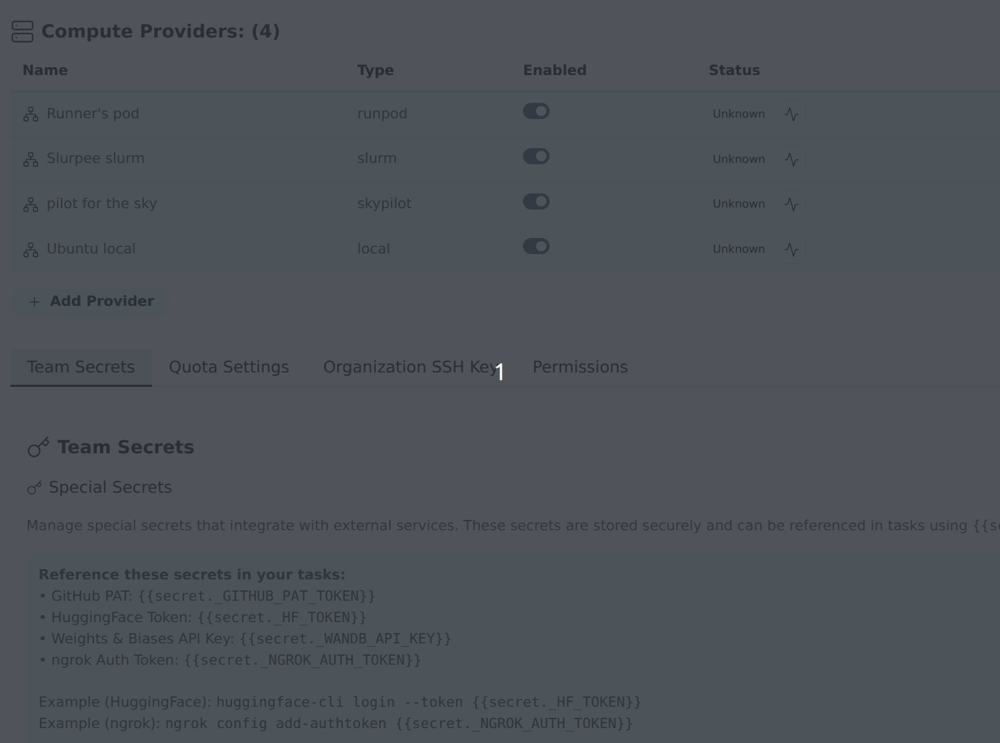

After [installing dstack](../install-gpu-orchestrator/install-dstack.md) and starting Transformer Lab, follow these steps to add it as a compute provider.

## Add dstack in Team Settings

1. Open **Team Settings** by clicking your username in the sidebar.
2. Go to **Compute Providers**.
3. Click **Add Compute Provider**.
4. In the modal:
   - Set **Type** to **dstack (beta)**.
   - Give the provider a name (e.g. `dstack-provider`).
   - Fill in the **Server URL**, **API Token**, and **Project Name** fields.
5. Click **Add Compute Provider**.

> You can also add the provider via the CLI with `lab provider add`.

## Run health check

After the provider is listed in Team Settings:

1. Find your dstack provider in **Compute Providers**.
2. Click the "Check provider status" icon (heartbeat) next to your dstack provider in the status column.
3. Confirm the provider reports as active.

## dstack-specific behavior

- Transformer Lab maps one run/cluster to one dstack run.
- You can target a dstack fleet via `fleet_name` in the yaml resources field.

## Troubleshooting

- **Setting up backends**: To use a specific backend on dstack, see the [dstack backends documentation](https://dstack.ai/docs/concepts/backends/).
- **Provider check fails**: Verify `server_url` reachability from the API host and confirm token validity.
- **Run creation fails**: Check resource availability on your dstack dashboard at `http://<dstack-server-url>/offers`.
- **First launch failure**: When setting up a new dstack server, create a fleet first — otherwise the first run will fail with no hardware offers available. Go to your dstack dashboard, navigate to the **Fleets** tab, and create a fleet with the desired hardware configuration.
