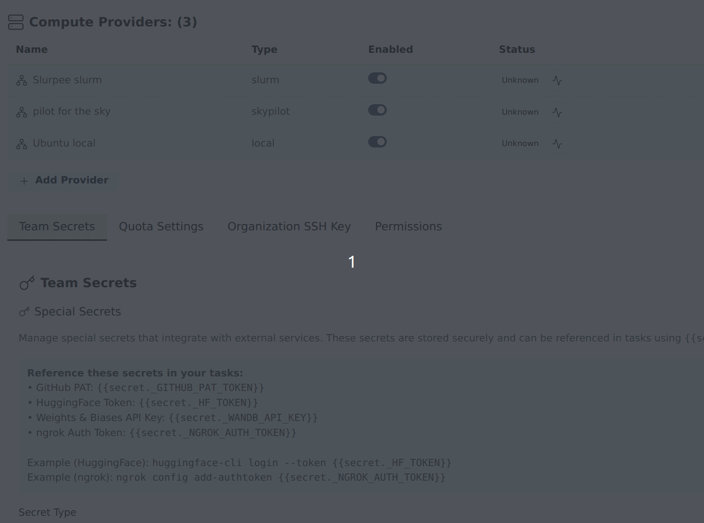

After [setting up a Runpod account and API key](../install-gpu-orchestrator/install-runpod.md) and starting Transformer Lab, follow these steps to add it as a compute provider.

## Add Runpod in Team Settings

1. Open **Team Settings** by clicking your username in the sidebar.
2. Go to **Compute Providers**.
3. Click **Add Compute Provider**.
4. In the modal:
   - Set **Type** to **runpod**.
   - Give the provider a name (e.g. `runpod-prov`).
   - Fill in the **API Key** and **API Base URL** fields.
5. Click **Add Compute Provider**.

> You can also add the provider via the CLI with `lab provider add`.

## Run health check

After the provider is listed in Team Settings:

1. Find your Runpod provider in **Compute Providers**.
2. Click the "Check provider status" icon (heartbeat) next to your Runpod provider in the status column.
3. Confirm the provider reports healthy/connected.
