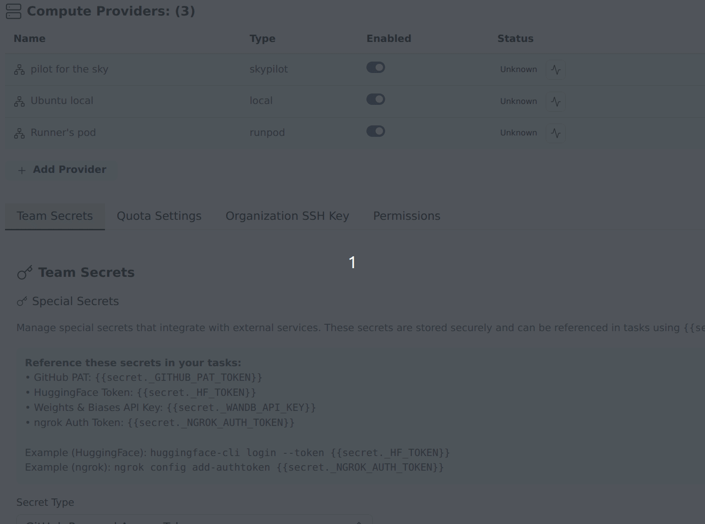

After [installing Slurm](../install-gpu-orchestrator/install-slurm.md) and starting Transformer Lab, follow these steps to add it as a compute provider.



## Add Slurm in Team Settings

1. Open **Team Settings** by clicking your username in the sidebar.
2. Go to **Compute Providers**.
3. Click **Add Compute Provider**.
4. In the modal:
   - Set **Type** to **slurm**.
   - Give the provider a name (e.g. `slurm-prov`).
   - Fill in the **Connection mode**, **SSH Host**, **Slurm User ID**, **SSH Port**, and **SSH Key Path** (optional) fields.
5. Click **Add Compute Provider**.

> You can also add the provider via the CLI with `lab provider add`.

## Run health check

After the provider is listed in Team Settings:

1. Find your Slurm provider in **Compute Providers**.
2. Click the "Check provider status" icon (heartbeat) next to your Slurm provider in the status column.
3. Confirm the provider reports healthy/connected.

## Set up per-user credentials

After the Slurm compute provider is configured, each user needs to set up their individual credentials:

1. Navigate to **User Settings → Provider Settings** and configure your Slurm user ID. This account will be used to submit jobs to the Slurm cluster.
2. If you don't already have an SSH key pair, generate one:
   ```bash
   ssh-keygen -t rsa -b 4096 -C "your_email@example.com"
   ```
3. Add your public key (`~/.ssh/id_rsa.pub`) to `~/.ssh/authorized_keys` on the Slurm login node for your user account.
4. In the Provider Settings dialog, paste the contents of your private key (`~/.ssh/id_rsa`). Transformer Lab will use this key to authenticate and connect to your Slurm account.
