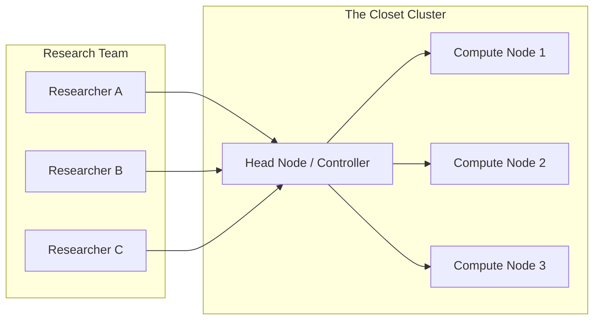

# The "Closet Cluster"

**Setup:** A small collection of 2–5 networked computers (e.g., NVIDIA DGX stations or custom rigs) located in a dedicated room or closet.

**Challenge:** Moving from "SSH and run" to a basic queue system so researchers don't crash nodes or fight over resources, without hiring a full-time sysadmin.

### Path 1: The Traditional Route (Slurm)

If your team is accustomed to academic supercomputing centers, setting up a small Slurm cluster is the most familiar path.

* **Architecture:** Designate one machine as the "Head Node" (running `slurmctld`) and the others as "Compute Nodes" (running `slurmd`).
* **Pros:** Rock-solid stability; standard industry tools.
* **Cons:** Requires Linux sysadmin knowledge to configure users, shared filesystems (NFS), and MUNGE authentication.
* **Interface:** Install **Transformer Lab** on the head node or an external gateway and configure it to submit jobs via the Slurm CLI.

### Path 2: The "Lightweight" Route (SkyPilot SSH)

If you want cloud-like abstraction without installing Kubernetes or Slurm, you can run SkyPilot using its SSH backend.

* **Mechanism:** You install SkyPilot on a designated "Control Node." You then list your other machines in a standard SSH config file. SkyPilot orchestrates jobs by SSHing into the machines and running commands.
* **Warning:** *This is not recommended for critical production workloads.* The SSH backend is less robust than the Kubernetes or Cloud backends and handles node failures less gracefully. Use this primarily for temporary testing or loose clusters of diverse machines.
* **Interface:** Connect **Transformer Lab** to the SkyPilot instance on the control node.

### Path 3: The "Modern" Route (Kubernetes via Rancher)

For a robust, industry-standard stack that supports auto-healing and complex networking, Kubernetes is the answer. To avoid the complexity of vanilla K8s, we recommend **Rancher**.

* **Setup:** Use RKE2 (Rancher Kubernetes Engine) to bind your 2–5 nodes into a single cluster. Rancher provides a web UI to manage the nodes, storage, and health.
* **Guide:** *[See our separate guide on Installing Rancher for ML Clusters]*
* **Interface:** Once the cluster is up, install **Transformer Lab** (via Helm or standard manifests). It will treat the entire cluster as a single pool of GPU resources.

### Path 4: The Developer-First Route (dstack)

If you want the benefits of orchestration but strictly want to avoid Kubernetes, **dstack** is a strong alternative.

* **Mechanism:** dstack is designed to run on top of plain Docker and SSH. You define your "backends" (your servers) in the dstack configuration using their IP addresses and SSH keys.
* **Pros:** It creates a containerized job queue without the overhead of ETCD, Kubelet, or complex networking overlays.
* **Workflow:** Users define jobs in YAML (similar to GitHub Actions), and dstack schedules them onto the available nodes automatically.