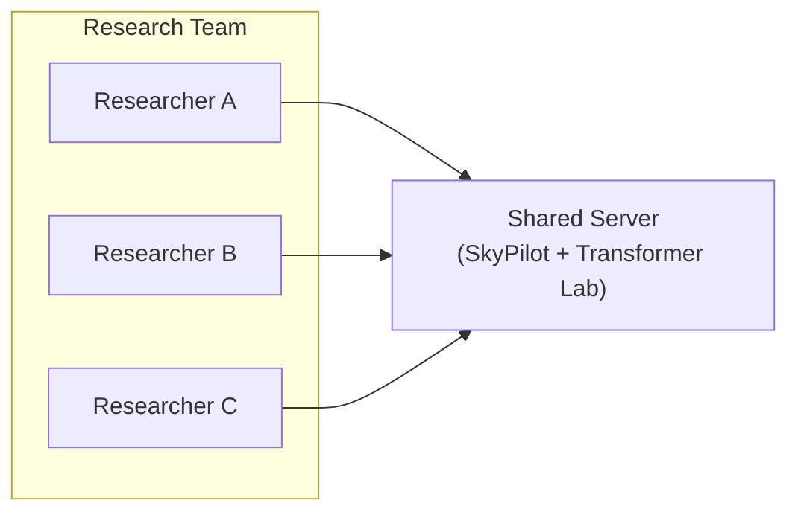

# The "Under-the-Desk" Server

**Setup:** A single multi-GPU workstation shared by a small team.

**Challenge:** Preventing process collisions and OOM errors without significant administrative overhead. Allowing experiments to install or change configuration, without alterting the base system.

### 1. Keep it Simple

You don't need Slurm -- traditional schedulers like Slurm introduce unnecessary complexity for single-node setups. The administrative cost of configuring `munge` and `slurm.conf` outweighs the benefits at this scale.

* *Note:* If want to start playing with Slurm try out [slurm-docker-cluster](https://github.com/giovtorres/slurm-docker-cluster) which will create a containerized slurm installation with several containerized nodes which is great for testing.

### 2. The Foundation: SkyPilot Local

The recommended approach is to use SkyPilot in local mode. This method effectively turns your workstation into a single-node "cloud." While it relies on Kubernetes (Kind) under the hood to manage the GPUs, SkyPilot automates the entire setup, keeping the complexity completely hidden from the user. This provides you with a scalable API-driven foundation that looks and behaves like a cloud region.

* **Installation:** First, install SkyPilot (and the `kubernetes` dependency) by following the [official installation guide](https://docs.skypilot.co/en/stable/getting-started/installation.html).
* **Implementation:** Run `sky local up`.
* **Mechanism:** This command automatically provisions the local cluster and configures the SkyPilot controller. You do not need to write Kubernetes manifests or manage pods manually.

### 3. The Interface: Transformer Lab for Teams

Once SkyPilot is active, install **Transformer Lab for Teams** and point it to your local instance.

* **Workflow:** Researchers interact with the Transformer Lab GUI to launch experiments.
* **Orchestration:** Transformer Lab hands the workload to SkyPilot, which queues and executes the jobs on the local GPUs.
* **Scalability:** This stack is future-proof. When you eventually add more local nodes or burst to the cloud, you simply register the new resources with SkyPilot; the user interface and workflow remain unchanged.