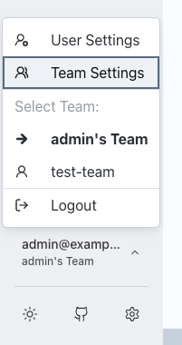
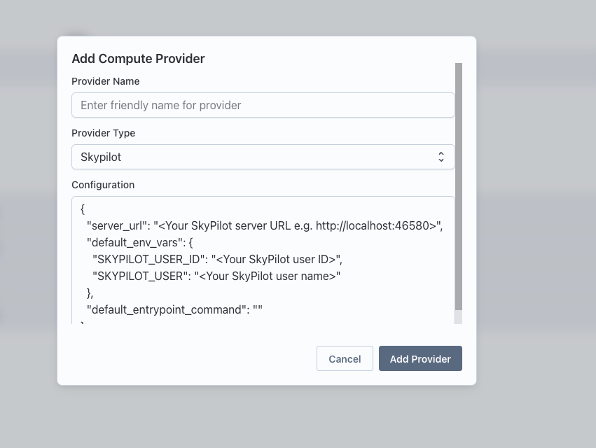

## Prerequisites

Before starting the installation, ensure you have the following:

### Required

- SSH access and administrative (sudo) privileges on the server hosting Transformer Lab
- If using cloud object storage: GCP or AWS account and credentials (for cloud object storage) with permissions to create and manage buckets.
- Bash shell with `curl` installed.

### Feature-Specific

- SkyPilot server running and accessible from the CPU node (e.g., via HTTP).
- Slurm cluster access from the CPU node (e.g., via SSH).

## Step 1 - Set up a Cloud Provider

Transformer Lab executes tasks by sending them to a GPU orchestrator like **Slurm** or **SkyPilot**. So your first step in setting up Transformer Lab is making sure you have a properly configured Slurm or SkyPilot instance.

The following documents offer common install instructions that you can use if you are starting from scratch

[Choosing Between Slurm and SkyPilot -->](./install-gpu-orchestrator/skypilot-vs-slurm.md)

[Instructions for setting up Slurm from scratch -->](./install-gpu-orchestrator/install-slurm.md)

[Instructions for setting up SkyPilot from scratch -->](./install-gpu-orchestrator/install-skypilot.md)

## Step 2 - Install Transformer Lab

Transformer Lab needs a CPU node to run.

SSH into that node and run:

```bash
curl https://lab.cloud/install.sh | bash
```

You need to also install packages necessary for running compute providers like Skypilot or Slurm:

```bash
cd ~/.transformerlab/src
./install.sh multiuser_setup
```

## Step 3 - Configure Team Edition

Now create a file in `~/.transformerlab` called `.env`

And copy and paste the following information (update `localhost` to your server address):

```bash
TL_API_URL="http://localhost:8338/"  # API runs by default on port 8338
MULTIUSER="true" # Set to "true" to enable multi-user features

# In a default setup, the frontend URL will be the same as the API URL set above.
FRONTEND_URL="http://localhost:8338"

# Setting this to true uses the transformerlab-s3 profile in your AWS credentials to create and use a S3 bucket as your remote workspace
TFL_REMOTE_STORAGE_ENABLED=true
```

### Setting up AWS Credentials for S3 Storage

If using S3 as remote storage, you need to configure AWS credentials for the `transformerlab-s3` profile. You can do this in two ways:

#### Using AWS CLI (Recommended)

If you have the AWS CLI installed, run:

```bash
aws configure --profile transformerlab-s3
```

Enter your AWS Access Key ID, Secret Access Key, default region, and output format when prompted.

#### Manual Configuration

Create or edit the AWS credentials file at `~/.aws/credentials` and add:

```ini
[transformerlab-s3]
aws_access_key_id = YOUR_ACCESS_KEY_ID
aws_secret_access_key = YOUR_SECRET_ACCESS_KEY
```

Ensure the profile has the necessary permissions to create and manage S3 buckets.

## Step 4 - Run Transformer Lab and Log in

Run Transformer Lab by running

```bash
cd ~/.transformerlab/src
./run.sh
```

Now you can visit `http://localhost:8338` (or the address of the server you have put this code on) and log in to Transformer Lab.

The first time you log in, you can use the default user:

Login: `admin@example.com`

Password: `admin123`

Please change the password as a first step.

## Step 5 - Configuring a Compute Service

Go to Team Settings by clicking your user name in the sidebar.



In Team Settings, open Compute Providers and click "Add Compute Provider." Name the provider, choose a type (either "skypilot" or "slurm"), and then add the configuration.



### SkyPilot example config

```jsonc showLineNumbers
{
  // Replace with the IP/host of your SkyPilot server reachable by the API server
  "server_url": "http://localhost:46580",
  "default_env_vars": {
    // Obtain from the SkyPilot server at http://<skypilot-host>:46580/users
    "SKYPILOT_USER_ID": "<skypilot user id>",
    "SKYPILOT_USER": "<skypilot username>",
  },
  "default_entrypoint_command": "",
}
```

- Replace `localhost` with the IP/hostname where your SkyPilot server is running and reachable from the API machine.
- Retrieve `SKYPILOT_USER_ID` and `SKYPILOT_USER` from the SkyPilot server at `http://<skypilot-host>:46580/users`.

### Slurm example config

```jsonc showLineNumbers
{
  "ssh_host": "<SLURM_LOGIN_NODE_IP>",
  // Many clusters use the "slurm" user; use the appropriate user for your setup
  "ssh_user": "slurm",
  // Path to your SSH private key
  "ssh_key_path": "~/.ssh/id_rsa",
  "ssh_port": 22,
}
```

- Ensure the API node can SSH to the Slurm login node with the provided user and key.
- Adjust `ssh_user`, `ssh_key_path`, and `ssh_port` to match your cluster configuration.

## Setting up SLURM Provider User Credentials

After configuring the SLURM compute provider, each user needs to set up their individual credentials:

1. Navigate to **User Settings → Provider Settings** and configure your SLURM user ID for the SLURM provider. This user account will be used to submit jobs to the SLURM cluster from Transformer Lab.
2. If you don't already have an SSH key pair, generate one on your local machine:
   ```bash
   ssh-keygen -t rsa -b 4096 -C "your_email@example.com"
   ```
3. Add your public key (located at `~/.ssh/id_rsa.pub`) to the `~/.ssh/authorized_keys` file on the SLURM login node for your user account.
4. In the Provider Settings dialog, paste the contents of your private key (`~/.ssh/id_rsa`) into the private key field. Transformer Lab will use this key to authenticate and connect to your SLURM account.

<p style={{ fontWeight: 'bold', fontSize: '1.5rem', lineHeight: '2rem', paddingTop: '1rem'}}>Congrats, you are up and running. [You can now run a Task -->](./running-a-task.md)</p>
