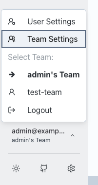
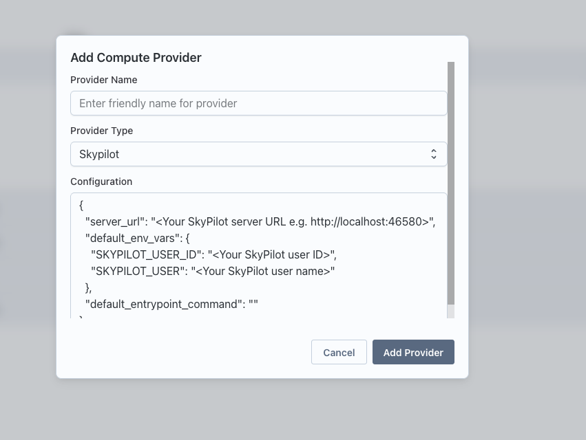

## Prerequisites

Before starting the installation, ensure you have the following:

### Required

- SSH access and administrative (sudo) privileges on the server hosting Transformer Lab
- If using cloud object storage: GCP, AWS, or Azure account and credentials (for cloud object storage) with permissions to create and manage buckets/containers.

### Feature-Specific

- SkyPilot server running and accessible from the CPU node (e.g., via HTTP).
- Slurm cluster access from the CPU node (e.g., via SSH).
- If using AWS S3 as your storage backend, you need to configure AWS credentials for the `transformerlab-s3` profile. See [Setting up AWS Credentials for S3 Storage](#setting-up-aws-credentials-for-s3-storage) below.

## Step 1 - Set up a Cloud Provider

Transformer Lab executes tasks by sending them to a GPU orchestrator like **Slurm** or **SkyPilot**. So your first step in setting up Transformer Lab is making sure you have a properly configured Slurm or SkyPilot instance.

The following documents offer common install instructions that you can use if you are starting from scratch

[Choosing Between Slurm and SkyPilot -->](./install-gpu-orchestrator/skypilot-vs-slurm.md)

[Instructions for setting up Slurm from scratch -->](./install-gpu-orchestrator/install-slurm.md)

[Instructions for setting up SkyPilot from scratch -->](./install-gpu-orchestrator/install-skypilot.md)

[Instructions for setting up Runpod provider -->](./install-gpu-orchestrator/install-runpod.md#create-a-runpod-account-and-api-key)

## Step 2 - Install Transformer Lab Using the CLI

### 2a. Install uv

Transformer Lab's CLI is installed via [uv](https://docs.astral.sh/uv/getting-started/installation/). Install it by running:

```bash
curl -LsSf https://astral.sh/uv/install.sh | sh
```

### 2b. Install the Transformer Lab CLI

```bash
uv tool install transformerlab-cli
```

### 2c. Install the Server

Run the interactive installer:

```bash
lab server install
```

This will walk you through configuring:

1. **Frontend URL** — where users will access the web interface.
2. **Storage Backend** — choose between AWS S3, GCP, Azure, or local filesystem. See [Cloud Storage Options](./advanced-install/cloud-storage.md) for details on configuring each provider.
3. **Admin Account** — a default admin account (`admin@example.com` / `admin123`) is created on first startup. **Change the default password immediately after first login.**
4. **Compute Provider** — optionally configure a default GPU compute provider (you can also add providers later with `lab provider add`).
5. **Email (SMTP)** — optionally configure SMTP for sending user invitations and signup confirmations.
6. **Authentication** — optionally configure additional auth providers (OAuth/OIDC). Email/password is enabled by default.

If you selected an existing configuration, your current values will be shown as defaults — press Enter to keep them.

## Setting up AWS Credentials for S3 Storage

If you chose **AWS S3** as your storage backend during the installer, you need to configure AWS credentials for the `transformerlab-s3` profile before starting the server. You can do this in two ways:

:::tip Different storage engines

Don't want to use S3 as your storage option? [Click here](./advanced-install/cloud-storage.md) to see other supported storage engines.

:::

### Using AWS CLI (Recommended)

```bash
aws configure --profile transformerlab-s3
```

Enter your AWS Access Key ID, Secret Access Key, default region, and output format when prompted.

### Manual Configuration

Create or edit `~/.aws/credentials` and add:

```ini
[transformerlab-s3]
aws_access_key_id = YOUR_ACCESS_KEY_ID
aws_secret_access_key = YOUR_SECRET_ACCESS_KEY
```

Ensure the profile has the necessary permissions to create and manage S3 buckets.

## Step 3 - Run Transformer Lab and Log in

Start the server:

```bash
cd ~/.transformerlab/src && ./run.sh
```

Now visit `http://localhost:8338` (or the address of your server) and log in with the default admin account:

- **Login:** `admin@example.com`
- **Password:** `admin123`

**Change the default password immediately.**

## Step 4 - Configuring a Compute Service

Go to Team Settings by clicking your user name in the sidebar.



In Team Settings, open Compute Providers and click "Add Compute Provider." Name the provider, choose a type ("skypilot", "slurm", or "runpod"), and then add the configuration.



### SkyPilot example config

```jsonc showLineNumbers
{
  // Replace with the IP/host of your SkyPilot server reachable by the API server
  "server_url": "http://localhost:46580",
  "default_env_vars": {
    // Obtain from the SkyPilot server at http://<skypilot-host>:46580/users
    "SKYPILOT_USER_ID": "<skypilot user id>",
    "SKYPILOT_USER": "<skypilot username>",
  },
  "default_entrypoint_command": "",
}
```

- Replace `localhost` with the IP/hostname where your SkyPilot server is running and reachable from the API machine.
- Retrieve `SKYPILOT_USER_ID` and `SKYPILOT_USER` from the SkyPilot server at `http://<skypilot-host>:46580/users`.

### Slurm example config

```jsonc showLineNumbers
{
  "ssh_host": "<SLURM_LOGIN_NODE_IP>",
  // Many clusters use the "slurm" user; use the appropriate user for your setup
  "ssh_user": "slurm",
  // Path to your SSH private key
  "ssh_key_path": "~/.ssh/id_rsa",
  "ssh_port": 22,
}
```

- Ensure the API node can SSH to the Slurm login node with the provided user and key.
- Adjust `ssh_user`, `ssh_key_path`, and `ssh_port` to match your cluster configuration.

### Runpod example config

```jsonc showLineNumbers
{
  "api_key": "<RUNPOD_API_KEY>",
  "api_base_url": "https://rest.runpod.io/v1",
}
```

- Create an API key in your Runpod account settings and paste it here.
- For full provider setup and health check steps, see [Add Runpod in Team Settings -->](./install-gpu-orchestrator/install-runpod.md#add-runpod-in-team-settings).

## Setting up SLURM Provider User Credentials

After configuring the SLURM compute provider, each user needs to set up their individual credentials:

1. Navigate to **User Settings → Provider Settings** and configure your SLURM user ID for the SLURM provider. This user account will be used to submit jobs to the SLURM cluster from Transformer Lab.
2. If you don't already have an SSH key pair, generate one on your local machine:
   ```bash
   ssh-keygen -t rsa -b 4096 -C "your_email@example.com"
   ```
3. Add your public key (located at `~/.ssh/id_rsa.pub`) to the `~/.ssh/authorized_keys` file on the SLURM login node for your user account.
4. In the Provider Settings dialog, paste the contents of your private key (`~/.ssh/id_rsa`) into the private key field. Transformer Lab will use this key to authenticate and connect to your SLURM account.

## Congrats, you are up and running

[You can now run a Task →](/for-teams/running-a-task/task-submission)
