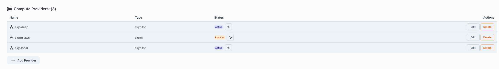
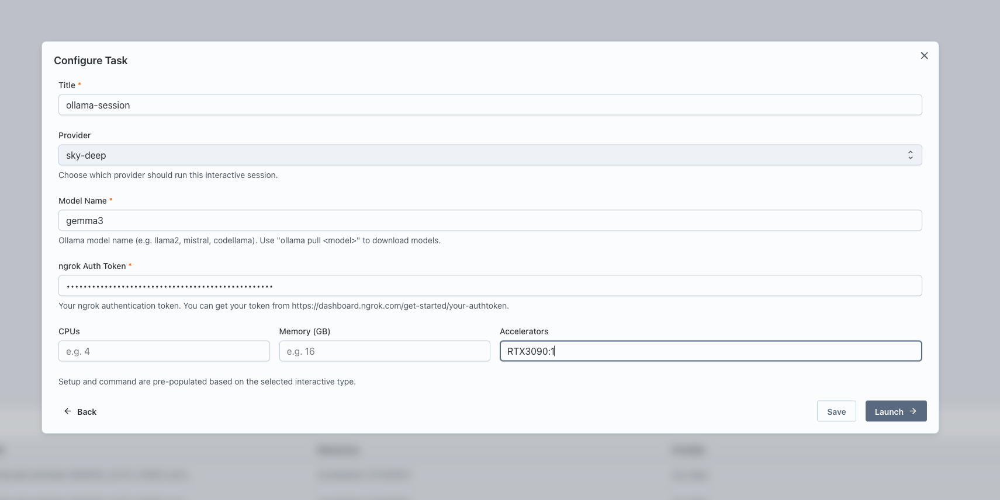
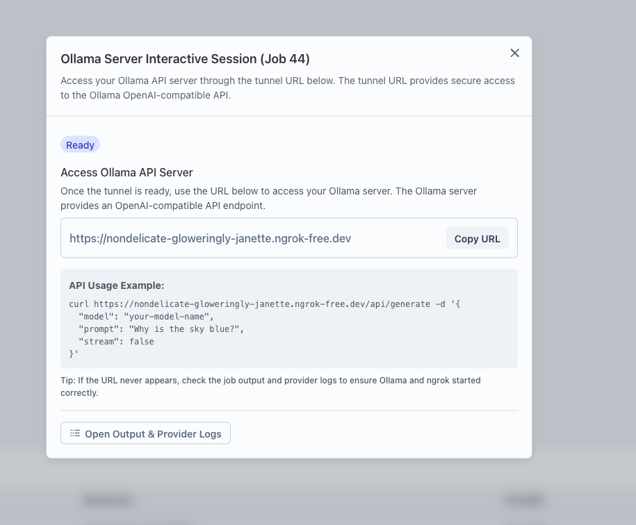

## Running an Ollama Server Service

Interactive services in Transformer Lab allow you to launch an Ollama server on a remote machine to run and interact with models. This guide walks you through running an Ollama Server service.

## Prerequisites

Before running an Ollama Server service, ensure you have a Compute Provider set up and active.

1. Navigate to Team Settings and set up a Compute Provider.
   

2. Make sure the provider is active by clicking on the health button.
   

## Steps to Run an Ollama Server Service

1. Go to the Interact page in Transformer Lab.

2. Click on the "New" button to create a new interactive service.
   

3. Select "Ollama Server" as the type of interactive service to launch.
   

4. Configure the service:
   - Enter a name for the service.
   - Select the Compute Provider to use.
   - Specify the resources: CPU, memory, and GPUs.
   - Provide the model name as per Ollama's model tags.
   - Provide the ngrok auth token for tunneling.
   

5. Click "Launch" to start the Ollama Server service.

6. Once launched, a card will appear for the service. Click the "Interactive Setup" button on the card.
   

7. Follow the provided URL or steps to access and interact with the Ollama server.
   