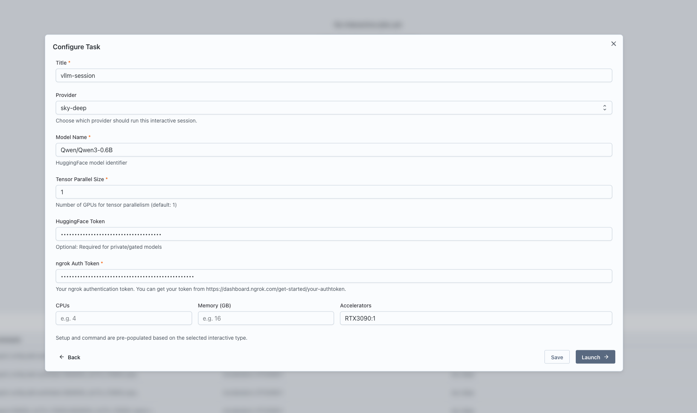
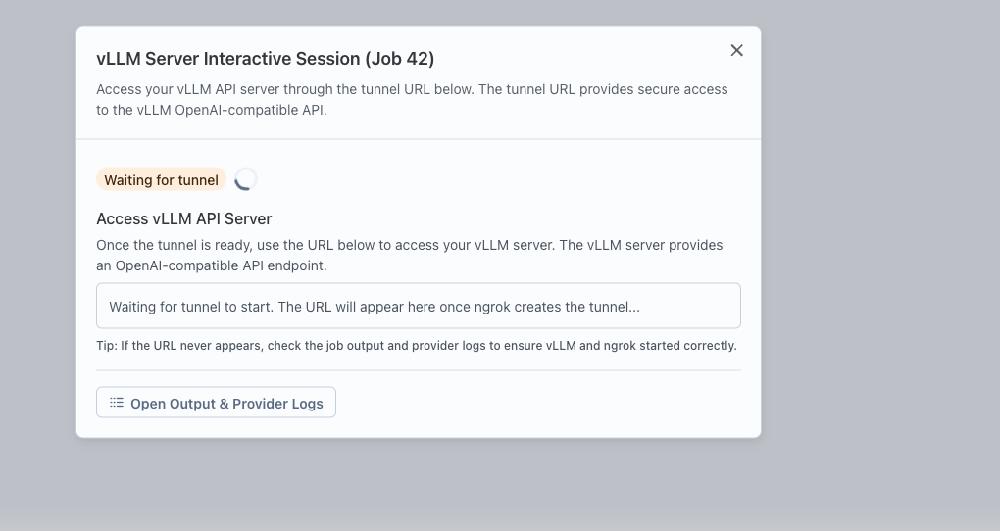
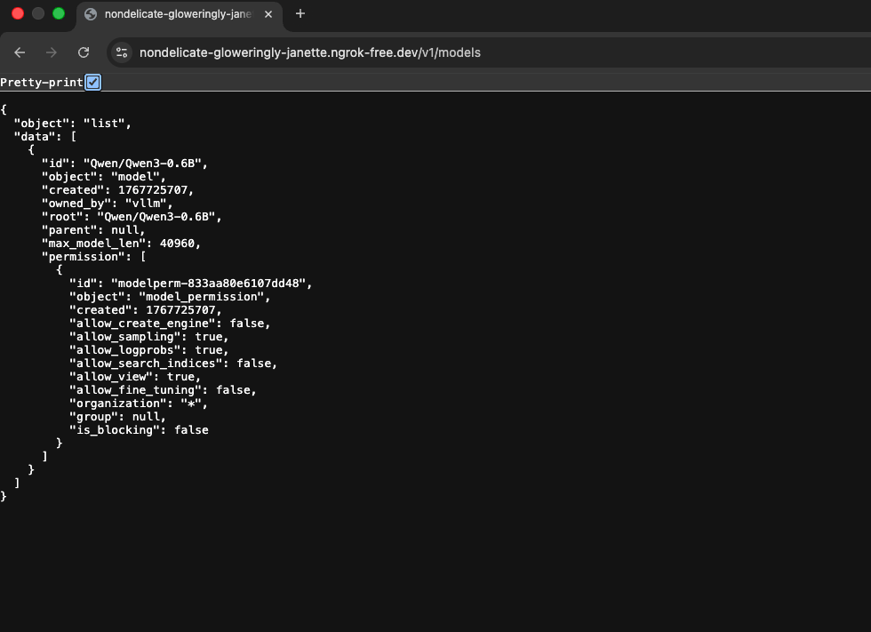

## Running a vLLM Server Service

Interactive services in Transformer Lab allow you to launch environments like vLLM Server to interact with models directly from the interface. This guide walks you through running a vLLM Server service.

## Prerequisites

Before running a vLLM Server service, ensure you have a Compute Provider set up and active.

1. Navigate to Team Settings and set up a Compute Provider.
   

2. Make sure the provider is active by clicking on the health button.
   

## Steps to Run a vLLM Server Service

1. Go to the Interact page in Transformer Lab.

2. Click on the "New" button to create a new interactive service.
   

3. Select "vLLM Server" as the type of interactive service to launch.
   

4. Configure the service:
   - Enter a name for the service.
   - Select the Compute Provider to use.
   - Specify the resources: CPU, memory, and GPUs.
   - Provide the Hugging Face ID of the model to use.
   - Set the Tensor parallel size for the vLLM engine.
   - Provide any additional inputs if required (e.g., ngrok auth token for tunneling).
   

5. Click "Launch" to start the vLLM Server service.

6. Once launched, a card will appear for the service. Click the "Interactive Setup" button on the card.
   

7. Follow the provided URL or steps to access and interact with the model via the vLLM Server.
   