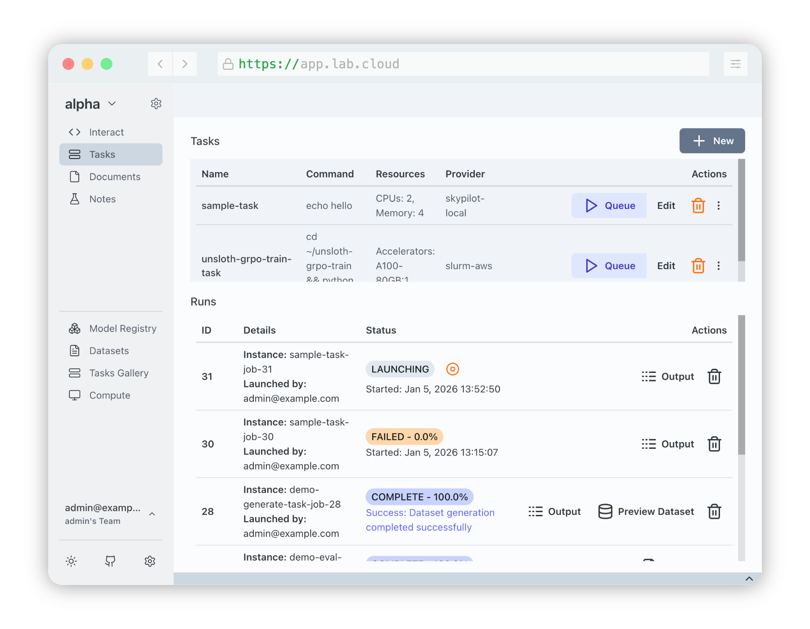

# Transformer Lab Documentation

:::tip

Please contact us on Discord if you need any help :)

:::

## Introduction

Transformer Lab is an open source platform designed to support the needs of ML researchers working individually or collaboratively using clusters of local or cloud compute nodes.

Researchers can use Transformer Lab to request nodes and submit ML tasks, while tracking experiments and job artifacts all in one place.

## Video

The following video is a quick video that shows what is possible with Transformer Lab.

  <iframe
    src="https://www.youtube.com/embed/q2n9luSKN44"
    frameBorder="0"
    allow="accelerometer; autoplay; clipboard-write; encrypted-media; gyroscope; picture-in-picture"
    allowFullScreen
    style={{ position: 'absolute', top: 0, left: 0, width: '100%', height: '100%' }}
  />

