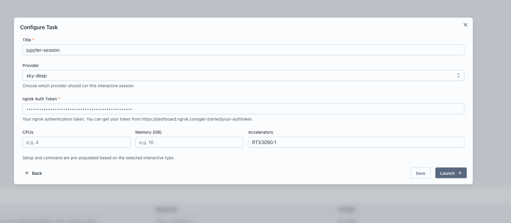
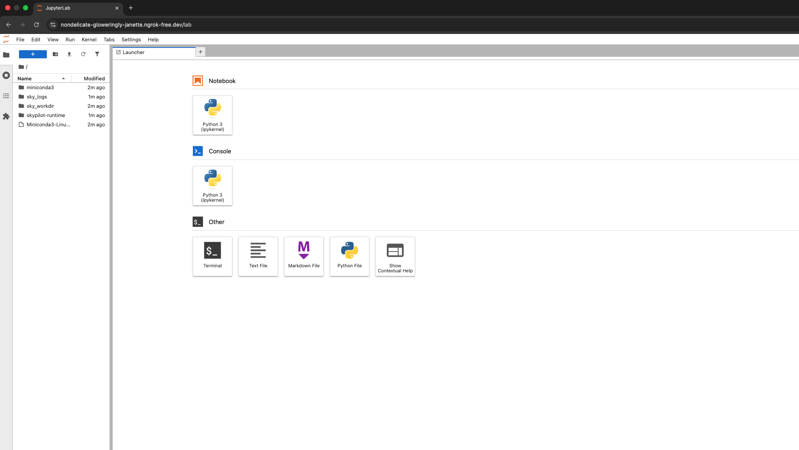

## What is an Interactive Service?

Transformer Lab supports two distinct types of workloads, designed to map to the different ways researchers work: **Tasks** and **Interactive Services**.

### Tasks vs. Interactive Services

* **Tasks (Batch Workloads):** These are jobs that are queued and scheduled to run automatically when the necessary resources become available. They execute a set of instructions and terminate upon completion. A commoon usecase would be for training a model.
* **Interactive Services (On-Demand):** These workloads function like a **reservation**. When you launch an Interactive Service, a specific computer or set of resources is held exclusively for you. It remains active and available until you explicitly release it.

---

## Common Use Cases for Interactive Services

Interactive Services are best suited for workflows that require persistent access or real-time interaction.

### 1. Model Inference
Interactive services are ideal for hosting models that need to stay online to serve requests.
* **Examples:** Running inference servers like **Ollama** or **vLLM** to host a model in the cloud and query it via API.

### 2. Exploratory Research & Development
In the early stages of research, you often need an environment to experiment, debug, and iterate quickly without waiting for a queue.
* **Tools:** Gain direct access to the compute resources via **VSCode**, **Jupyter Notebooks**, or **SSH**.
* **Workflow:** Use an Interactive Service to prototype your code. Once your script is finalized and stable, you can convert it into a **Task** to run large-scale training jobs efficiently.

## Prerequisites

Before running an interactive service, ensure you have a Compute Provider set up and active.

1. Navigate to Team Settings and set up a Compute Provider.
   

2. Make sure the provider is active by clicking on the health button.
   

## Steps to Run an Interactive Service

1. Go to the Interact page in Transformer Lab.

2. Click on the "New" button to create a new interactive service.
   

3. Select the type of interactive service you want to launch: VSCode, Jupyter Notebook, SSH, vLLM Server, or Ollama Server.
   

4. Configure the service:
   - Enter a name for the service.
   - Select the Compute Provider to use.
   - Specify the resources: CPU, memory, and GPUs.
   - For certain services, provide additional inputs such as model_name for vLLM Server or ngrok auth token for services that launch a tunnel.
   

5. Click "Launch" to start the service.

6. Once launched, a card will appear for the service. Click the "Interactive Setup" button on the card.
   

7. Follow the provided URL or steps to access the service.
   
