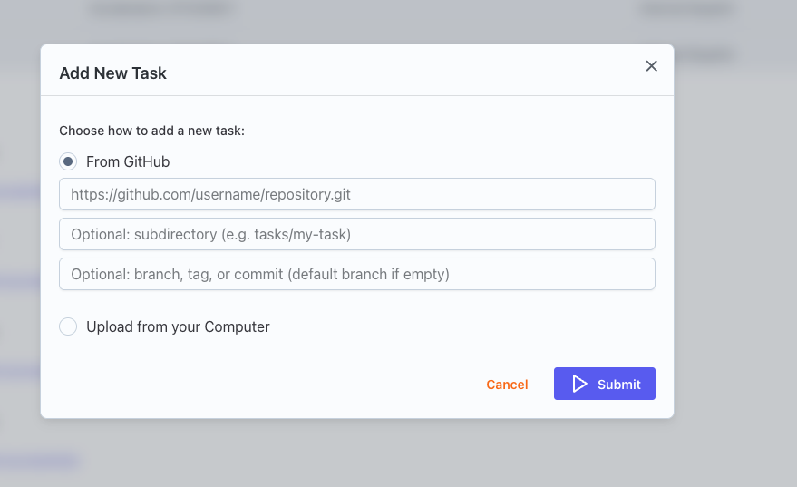
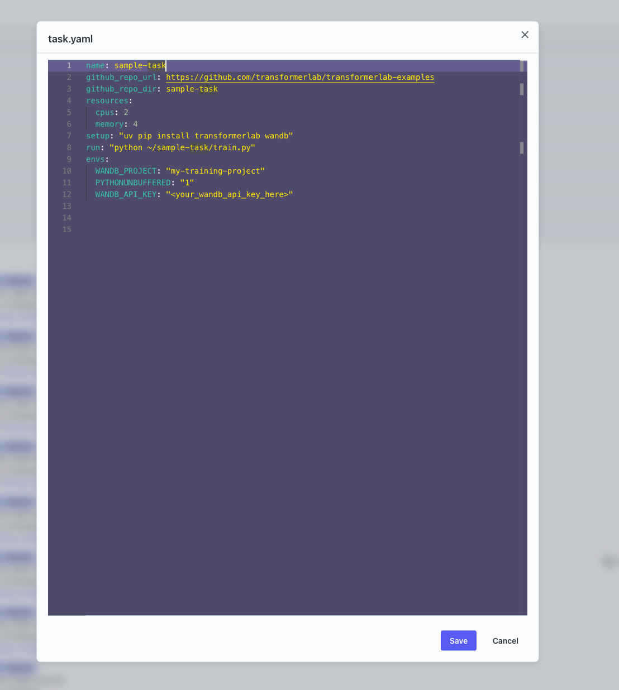
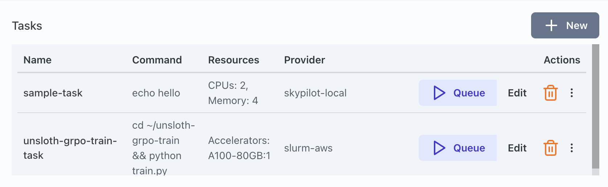

## What is a Task

A **task** is a description of work you want to execute on compute nodes. Researchers can write tasks in any format that runs on a node (typically Python scripts) and submit them as YAML to specify resource requirements and execution instructions.

## Creating a Task

When you create a new task, you have two options:

<figure>

<figcaption>Add New Task Options</figcaption>
</figure>

1. **From GitHub Repository** - Specify a GitHub repository URL, branch, and subdirectory. The system will fetch your code from the specified repository.
2. **From Local Directory** - Upload a local directory containing your task definition.

Both options require your repository subdirectory or local directory to contain a `task.yaml` file that defines the task configuration. 

**If your directory doesn't contain a task.yaml file**, you'll be given the option to define your own task from scratch. This allows you to manually create the task configuration in the GUI.

## Starting a Simple Task

Here is an example of a very simple task:

<figure>

<figcaption>Example Task YAML</figcaption>
</figure>

In this dummy example, the Task is defined in a YAML file that states the following things:

* The helpful name for the task is called "my-task"
* The task requires a single compute node that has 2 CPUs and 4 GB of memory
* Before the task is run, run `pip install wandb` on the machine
* The actual task to run is just a simple "Hello World" example where the bash echo command outputs "hello" to the console

## Queuing a Job

Once you create a new Task, you will see it on your list of Tasks:



You can now press the "Queue" Button to submit it as a Job.

## A more Detailed Task

Here is an example of a more useful task:

```yaml
name: unsloth-grpo-train-task
resources:
  accelerators: "A100-80GB:1"
envs:
  WANDB_PROJECT: unsloth-grpo-training
  PYTHONUNBUFFERED: 1
  HF_TOKEN: ENTER YOUR HF_TOKEN HERE
setup: uv pip install trl==0.15.2 bitsandbytes==0.45.4 unsloth== 2025.12.9 transformerlab datasets jinja2
run: cd ~/unsloth-grpo-train && python train.py
git_repo: "https://github.com/transformerlab/transformerlab-examples"
git_repo_directory: unsloth-grpo-train
```

**Many of these fields are optional. Here is a description of what each field does:**

```yaml
name: unsloth-grpo-train-task
```
Sets a useful name for the task in the GUI

```yaml
resources:
  accelerators: "A100-80GB:1"
```

States that the task would like 1 x A100 with 80GB of VRAM. (You could also request multiple nodes and they will be provisined to work as a cluster)

```yaml
envs:
  WANDB_PROJECT: unsloth-grpo-training
  PYTHONUNBUFFERED: 1
  HF_TOKEN: ENTER YOUR HF_TOKEN HERE
```

Will set some environment variables in the machine before the task is run

```yaml
setup: uv pip install trl==0.15.2 bitsandbytes==0.45.4 unsloth== 2025.12.9 transformerlab datasets jinja2
run: cd ~/unsloth-grpo-train && python train.py
git_repo: "https://github.com/transformerlab/transformerlab-examples"
git_repo_directory: unsloth-grpo-train
```

These commands are the core of the task. They tell the executing node to first fetch the git repo at the path given (and here we provide an optional subdirectory into the repo). Then the `setup` defines the command to set up the machine, and afterwards the actual task is defined in the `run` field.

For [a full description of all the fields you can add to the Task YAML see this link.](/for-teams/task-yaml/task-structure.md)


