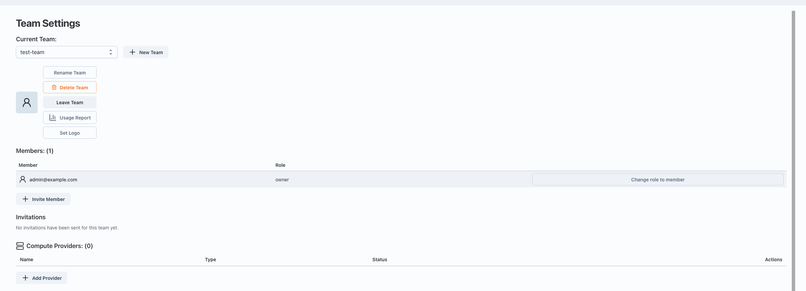
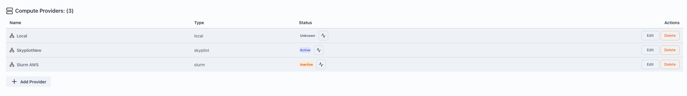
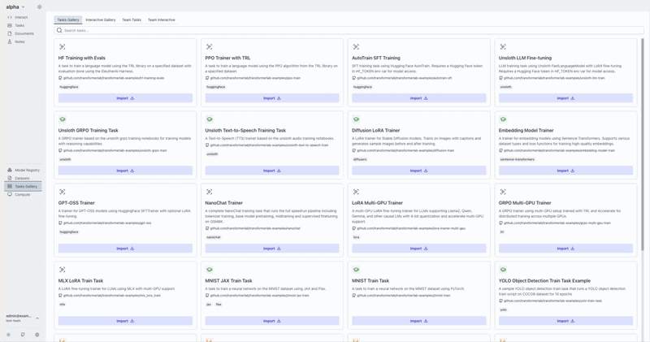
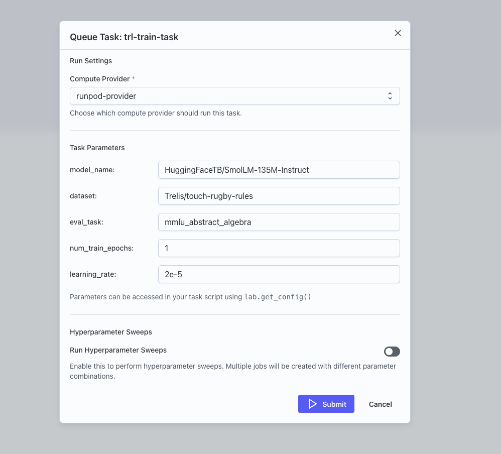

This quick start helps a new Teams user go from login to running their first task.

## 1. Open Team Settings

1. Log in to Transformer Lab Teams.
2. Open **Team Settings** from the sidebar.
3. Go to **Compute Providers**.
4. Click **Add Compute Provider**.

::note:: You can only add new compute providers if you're an admin. If you don't have permissions, ask your admin to add a provider for you.

## 2. Add a Compute Provider

When adding a provider, choose one of:

- **SkyPilot**
- **SLURM**
- **Runpod**
- **Local** (only for running locally)

Fill in the provider configuration and save.

> For more info on how to setup a provider, see [Installation Guide](../install.md#step-5---configuring-a-compute-service).

## 3. Verify Provider Health

1. In **Compute Providers**, click the **Health** button for your provider.
2. Confirm the provider shows as connected/healthy.
3. If health checks fail, fix credentials/network settings and run Health again.

## 4. Import a Task from Tasks Gallery

1. Open the **Tasks Gallery**.
2. Import a task into your experiment.

## 5. Queue the Task

1. In your experiment’s task list, click **Queue** on the imported task.
2. Select the compute provider you configured.
3. Set parameters if needed, then submit.

After submission, the task becomes a job and runs on your selected provider.

For deeper details, continue with [Task Submission Overview](task-submission.md).
