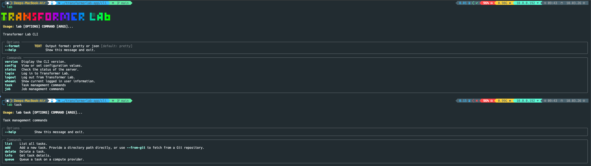

Transformer Lab provides a CLI called `lab` for managing tasks and jobs from the terminal.

This guide covers:

- Listing tasks for an experiment.
- Creating a new task from a local directory with `task.yaml`.
- (Optionally) creating a task directly from a Git repository.



---

## Prerequisites

Before using the CLI:

- The `lab` CLI is installed and on your `PATH`.
- You can authenticate with your Transformer Lab instance (for example, using `lab login`).
- You have a **current experiment** configured (or know how to set one).

To verify:

```bash
lab --help
lab version
```

If these commands work, you’re ready to proceed.


## 1. Set your current experiment

Most CLI commands operate on a “current experiment” value stored in the CLI config.

To set it:

```bash
lab config current_experiment my-experiment-name
```

To confirm:

```bash
lab config
```

If no experiment is set, some commands (like `lab task list`) will warn you and ask you to configure it first.


## 2. List existing tasks

To see tasks associated with your current experiment:

```bash
lab task list
```

You should see a table of tasks including:

- `id`
- `name`
- `type`
- creation and update timestamps

This is a good way to confirm that your CLI is correctly talking to the Transformer Lab API.

---

## 3. Create a task from a local directory

The recommended way to define a task for the CLI is to create a directory containing a `task.yaml` file and any associated code or configuration.

### 3.1. Prepare `task.yaml`

In a local directory (for example, `my-task/`), create a file called `task.yaml` with at least the required fields:

```yaml
name: my-first-cli-task
type: REMOTE
# ...additional configuration fields as needed...
```

> The exact schema for `task.yaml` depends on your version of Transformer Lab and the kind of task you are creating. Use existing tasks or templates as references when possible.

### 3.2. Add the task with `lab task add`

From the directory **above** `my-task/`, run:

```bash
lab task add my-task
```

The CLI will:

- Validate that `my-task/` exists.
- Confirm that `task.yaml` is present and readable.
- Show you a preview of the configuration.
- Upload the directory contents to the server and register a new task attached to your current experiment.

On success, you should see a message similar to:

> Task created with ID: `<task-id>`

You can then run `lab task list` again to see it in the table.


## 4. Create a task from a Git repository

Instead of a local directory, you can create a task directly from a Git repository.

Use:

```bash
lab task add --from-git https://github.com/your-org/your-task-repo.git
```

The CLI will:

- Ask the API to create a task from the specified Git URL.
- Register it under your current experiment.

> This is handy for sharing reusable tasks across teams or maintaining them in a separate repo.

## 5. Queue a task on a compute provider

Defining a task only registers it with your experiment. To actually run it on a compute provider from the CLI, use:

```bash
lab task queue <task-id>
```

In **interactive** mode (default), the CLI will:

- Fetch the task definition and available compute providers.
- Prompt you to pick a provider.
- If the task has `parameters` defined (the same ones used by the GUI), prompt you for values, showing defaults from the schema.
- Build a launch payload and call the provider API to create a job.

For **non-interactive** usage with defaults:

```bash
lab task queue <task-id> --no-interactive
```

In this mode the CLI:

- Chooses the provider stored on the task (falling back to the first available provider if needed).
- Uses parameter defaults from the task’s `parameters` block without prompting.

You can then use `lab job list`, `lab job info`, and other job commands, or the GUI, to monitor the resulting jobs.

---

## 6. Inspecting and managing tasks

Once a task exists:

- **Get task info**

  ```bash
  lab task info <task-id>
  ```

- **Delete a task**

  ```bash
  lab task delete <task-id>
  ```

Tasks defined via the CLI can be launched and monitored from the GUI as well. For more on running tasks visually, see [this link](task-submission-gui.md).


## Where to go next

- To adapt an existing training script to integrate with Transformer Lab’s logging and job tracking, see [this link](task-submission-existing-scripts.md).
- To learn about parameterization and sweeps (running many configurations and comparing results), check [this out](task-submission-advanced.md).

