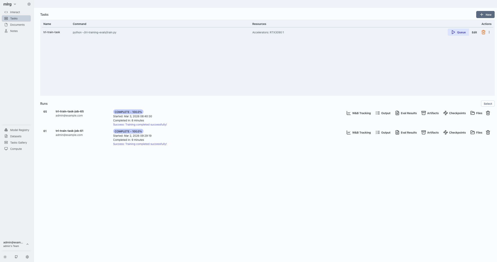
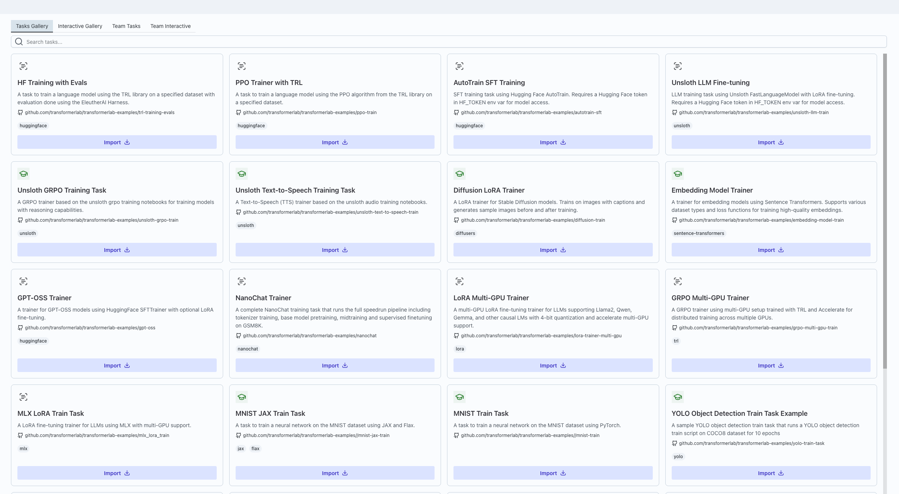
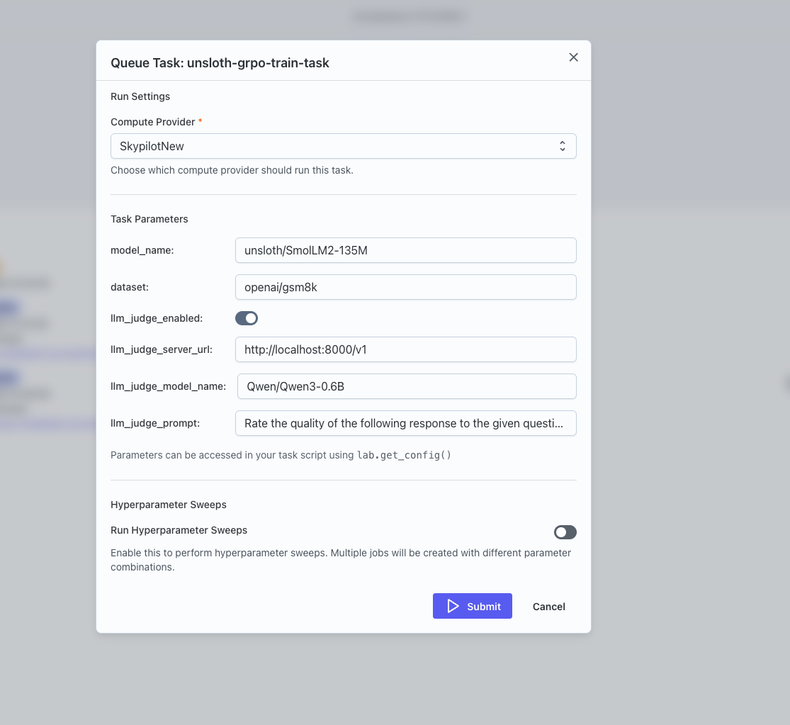
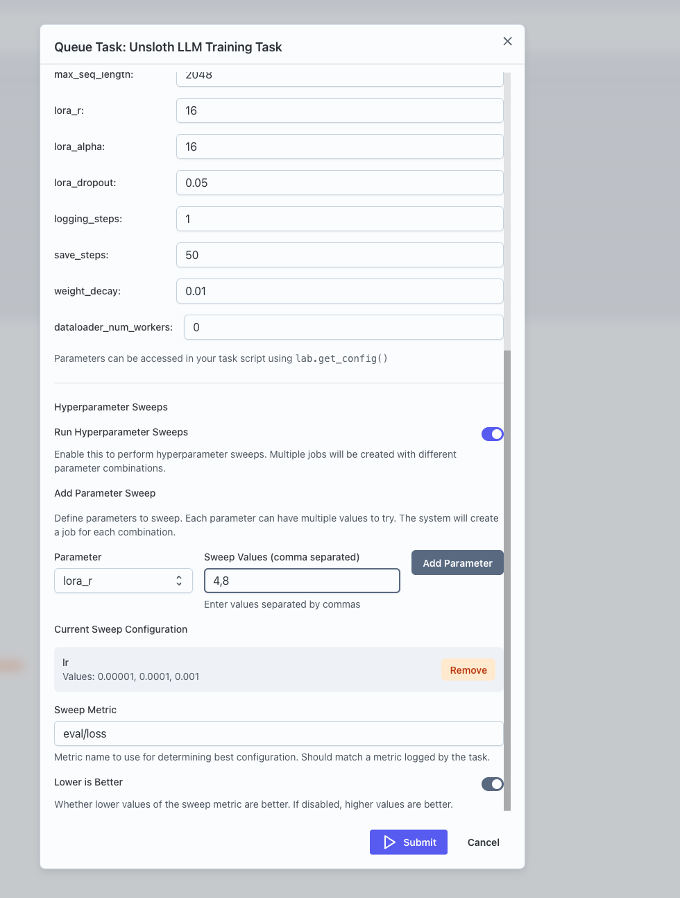
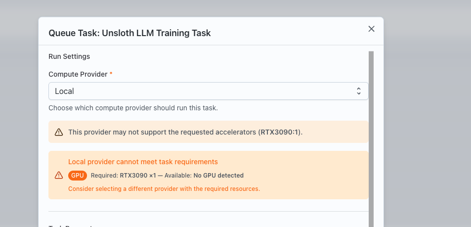
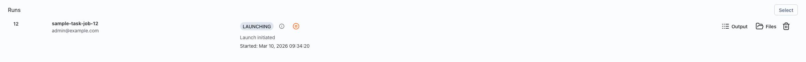

This guide shows how to submit tasks from the Transformer Lab user interface, using the same building blocks you see in the app:

- Import or create a task.
- View it under an experiment.
- Use the **Queue** action to configure parameters, sweeps, and provider.
- Submit the task and monitor the resulting jobs.

## 1. Import a task from the Tasks Gallery

Tasks in experiments are usually derived from reusable templates stored in the **Tasks Gallery**.

1. Open the global **Tasks Gallery** from the sidebar (top‑level navigation item labeled “Tasks Gallery”).
2. In the gallery, choose the tab that matches what you’re looking for:
   - **Tasks Gallery** (global tasks),
   - **Interactive Gallery**,
   - **Team Tasks**, or
   - **Team Interactive**.
3. Browse these tabs to find a task that matches what you want (for example, a training or evaluation template set by your own team).
4. Use the import/clone action in the gallery to attach that task to your experiment.
5. Open the **Tasks** tab:
   - You should now see the imported task in the list for that experiment.

## 2. Open the Queue Task dialog

From the experiment’s **Tasks** tab:

1. In your experiment’s **Tasks** tab, locate the task you want to run in the table.
2. Click the **Queue** (play) button for that task to open the **Queue Task** dialog.
3. The dialog:
   - Loads the task’s saved configuration, including any parameters and sweep settings.
   - Fetches available models, datasets, and providers for your team.

## 3. How parameters map from `task.yaml` to the UI

The **Parameters** section is driven by its **Parameters** section from the `parameters:` block in the task’s metadata:

The schema keys the UI uses are:

- `type` (`int`, `integer`, `float`, `number`, `bool`, `boolean`, `enum`, `string`).
- `default` (used as the initial value).
- `min`, `max`, `step` (numeric constraints).
- `options` / `enum` (discrete choices).
- `ui_widget` (controls which widget is rendered).
- `title` (used as the label).

The UI chooses the right control for each parameter:

- **Model selection** (`ui_widget: lab_model_select`)
  - A dropdown of models from your registry, with an option to type a custom model ID.
  - Option to type a custom value instead of picking from the list (“Enter any string”).

- **Dataset selection** (`ui_widget: lab_dataset_select`)
  - A dropdown of datasets from your registry, with an option to type a custom dataset ID.

- **Numeric sliders** (`type` numeric + `ui_widget: slider` / `range`)
  - A slider plus numeric input, respecting min, max, and step.

- **Booleans** (`type: bool` / `boolean`)
  - A switch.

- **Enums / options** (`type: enum` or `options` / `enum` present)
  - Radio buttons or a dropdown.

- **Fallbacks**
  - Values that are arrays or objects (and don’t have a specific widget) are treated as JSON‑like inputs.
  - Plain text input, or JSON-style input for arrays/objects.

If **no parameters** are defined, the dialog shows a clear message and lets you submit as-is:

- It checks `parameter count` and renders a “This task has no parameters defined. Click Submit to queue…” text path.

## 4. Configure sweeps in the GUI

The Queue Task dialog lets you define hyperparameter sweeps interactively. When you enable sweeps:

- You see a **Run Hyperparameter Sweeps** switch.
- You can pick one of the existing parameters to sweep and specify a comma‑separated list of values.
- You can review and remove sweep parameters.
- You can set:
  - **Sweep Metric** (e.g. `eval/loss` or `eval/accuracy`).
  - **Lower is Better** (whether lower metric values are better).

When you submit with sweeps enabled, the dialog sends your sweep configuration (which parameters to vary, which metric to optimize, and whether lower or higher is better) to the compute provider. Transformer Lab then:

- Expand `sweep_config` into a full grid of parameter combinations.
- Track `sweep_total`, `sweep_current`, and best metric as jobs complete.

## 5. Choose a compute provider

The Queue Task dialog fetches your team's compute providers.

- When the dialog opens:
  - It tries to use the task’s stored `provider_id` (if present and in the current list).
  - Otherwise, it defaults to the first provider in the list.

The UI:

- Exposes a provider selection drop-down
- For local providers:
  - It fetches cluster snapshots and validates resources (task requirements against available resources).
  - Shows warnings/errors when requested GPUs exceed what’s available.
- For SLURM providers:
  - It optionally pulls per‑user `SBATCH flags` and lets you override them per job.

## 6. Submit and monitor the job

When you click **Submit**:

- The dialog validates that a provider is selected, parameter ranges are valid, and (if sweeps are enabled) at least one sweep parameter is defined.
- It sends your parameter values, provider choice, optional SLURM flags, and optional sweep config to create a job (or a sweep parent job).

Back in the experiment:

- The job list refreshes automatically.
- The new job(s) appear with statuses such as:
  - `LAUNCHING`, `RUNNING`, `COMPLETED`, `FAILED`.
- Clicking a job opens its details, where you can:
  - Inspect logs.
  - Inspect metrics (including the sweep metric, if configured).
  - Inspect artifacts.

## Where to go next

- For the CLI view of the same concepts (defining `task.yaml`, registering tasks, and queuing jobs interactively or non‑interactively), see [this link](task-submission-cli.md).
- For details on adding minimal lab SDK calls inside your own training scripts so they log into the jobs created by these tasks, check [this link](task-submission-existing-scripts.md).
- For concrete sweep examples, check [this](task-submission-advanced.md).

