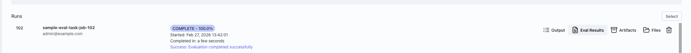
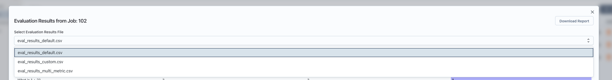
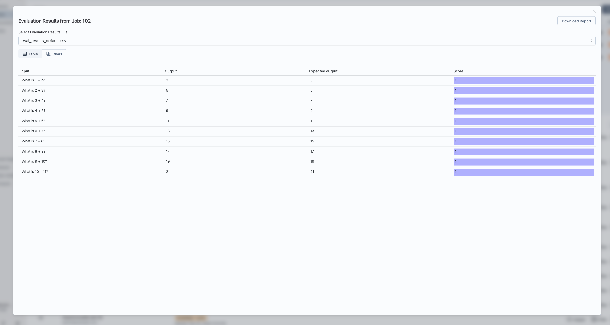
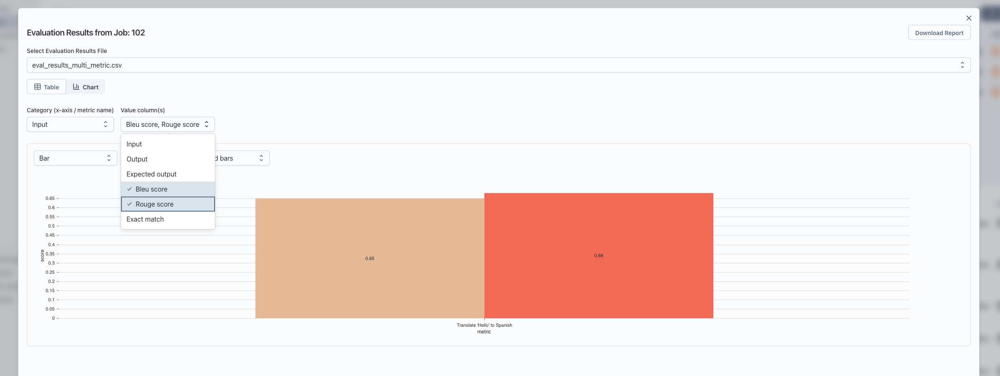
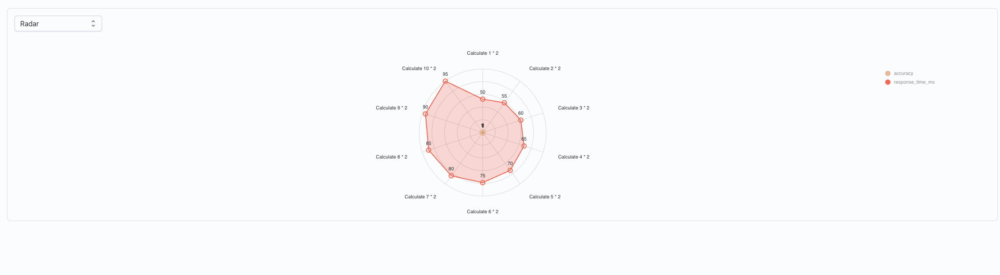
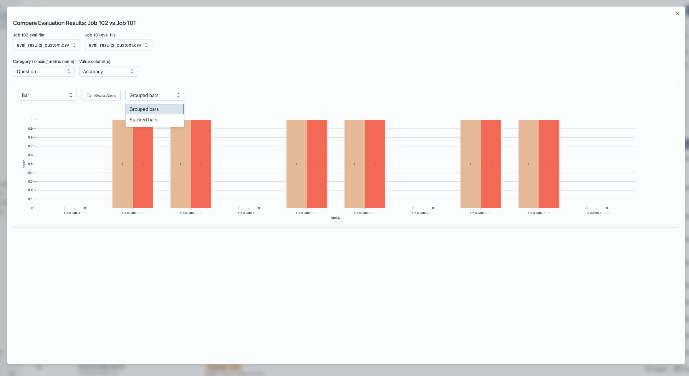

This guide assumes you’ve already run a task that produced evaluation results.

## Where to Find Evaluation Results

1. **Open your experiment**
   - Go to the experiment where you ran your evaluation task.
   - Open the `Tasks` tab.

2. **Go to the Runs list**
   - Scroll down to the **Runs** section.
   - You’ll see a table of your jobs (runs).

3. **Open the eval results for a run**
   - Find a row where the job finished and has evaluations.
   - On the right side of that row, click **Eval Results**.
   - This opens the **Evaluation Results from Job: &lt;job id&gt;** window.

## Picking Which Eval Results File to View

Some jobs can produce **multiple eval result files** (for example, different evaluators or different slices).

- **If there’s only one file**: the window shows it automatically.
- **If there are multiple files**:
  - Use the **Select Evaluation Results File** dropdown near the top of the window.
  - Pick the file name you want to inspect.

## Table Mode (Default View)

When you first open the window, it shows **Table** view.

- **Headers**: The top row is the column headers (things like test case id, metric name, score, etc.).
- **Rows**: Each row is one evaluation record.
- **Scrolling**: You can scroll horizontally and vertically; headers stay visible at the top.
- **Score highlighting**:
  - If there’s a column named `score`, its cells are shown with a colored background.
  - Higher or lower values are visually distinguishable, making it easy to spot trends.

### Downloading the Raw Results

- In the top-right of the window, click **Download Report**.
- This downloads a CSV file of the currently selected eval results file.
- You can open the CSV in Excel, Sheets, or any spreadsheet tool for deeper analysis.

## Switching to Chart Mode

To visualize the results as charts:

1. At the top of the window, you’ll see two buttons:
   - **Table**
   - **Chart**
2. Click **Chart** to switch to chart mode.

## Configuring Chart Mode

Once you’re in **Chart** mode, you’ll see:

- A **Category (x-axis / metric name)** dropdown.
- A **Value column(s)** dropdown (multi-select).
- A chart area below these controls.

### Automatic Setup When There Is a `score` Column

If your eval file has a column named `score`:

- The app **automatically**:
  - Uses the first column as the category (x-axis).
  - Uses the `score` column as the value.
- You’ll immediately see a chart without extra configuration.

You can still change:

- **Category**: for example, switch from `test_case_id` to `metric_name`.
- **Value column(s)**: include additional numeric columns to plot.

### Manual Mapping When There’s No `score` Column

If there is **no** column named `score`, you’ll see a note like:

> This file doesn’t have a column named `score`. Choose which column is the category (e.g. metric name) and which is the value to chart.

In that case:

1. **Category (x-axis / metric name)**
   - Choose the column to use as the **x-axis labels**.
   - Examples: `metric_name`, `test_case_id`, `dataset_split`.

2. **Value column(s)**
   - Choose one or more **numeric columns** to plot as values (y-axis).
   - You can select multiple; each becomes a separate series in the chart.

Only after you select at least one value column will the chart appear.

---

## Understanding What the Chart Shows

For each category (x-axis value):

- The app groups all rows with that category value.
- For each selected value column, it computes the **average score** across those rows.
- The chart displays:
  - **X-axis**: your chosen category (for example, each metric name).
  - **Y-axis**: the average of the selected value column(s) for that category.
  - **Series**: one series for each selected value column (for example, different metrics or different score columns).

This helps you quickly compare metrics or scores across test cases, datasets, or any other dimension you choose as the category.

---

## Chart Types and Controls

Inside the chart area, you have several controls:

- **Chart type selector**:
  - **Bar** (default): shows bars per metric/category.
  - **Line**: great for trends across ordered categories.
  - **Radar**: good for comparing multiple metrics in a “spider” chart.

- **Swap Axes** (for Bar and Line charts):
  - Flips which dimension is on the x-axis:
    - Normal: x-axis = category (for example, metric), series = value columns.
    - Swapped: x-axis = series (value columns), lines/bars per category.
  - This is useful when you want to answer “How does each metric compare across runs?” versus “How do runs compare on each metric?”

- **Grouped vs Stacked bars** (Bar charts only):
  - **Grouped**: bars for different series are side by side for each category.
  - **Stacked**: bars for different series are stacked on top of each other.

If there is nothing to show (for example, no numeric value columns selected), you’ll see a message like:

> No data to chart. Add at least one row and select a value column.

---

## Comparing Evaluation Results Across Two Runs (Optional)

You can also chart **two runs side by side**:

1. In the **Runs** section:
   - Click **Select** (top-right of the Runs header).
   - Check the boxes next to two jobs that have eval results.
2. Click **Compare selected evals**.
3. A **Compare Evaluation Results** window opens:
   - Choose which eval file to use from **Job A** and **Job B** (if each job has multiple files).
   - Configure **Category** and **Value column(s)** just like chart mode.
   - The chart shows both jobs as separate series so you can visually compare them.

Notes:

- Comparison only works when the two eval files have the **same columns** in the same order. If they don’t, you’ll see a message saying they can’t be compared.
- In the chart legend, each series name includes both the job and metric, so you can see which line or bar belongs to which run.

---

## Troubleshooting

- **“No evaluation results found”**
  - The job didn’t produce eval result files.
  - Check that your task or evaluator is configured to write eval results.

- **“Invalid data format”**
  - The server returned data that doesn’t look like a table with `header` and `body`.
  - This usually means the eval output isn’t in the expected structure; check the job’s raw output or logs.

- **Chart view shows “No data to chart”**
  - Make sure:
    - You’ve selected a **Category** column.
    - You’ve chosen at least one **Value column** that is numeric.

- **Compare view says columns differ**
  - The two eval files must have the **same header columns in the same order**.
  - Re-run evals with consistent output formats, then try comparing again.