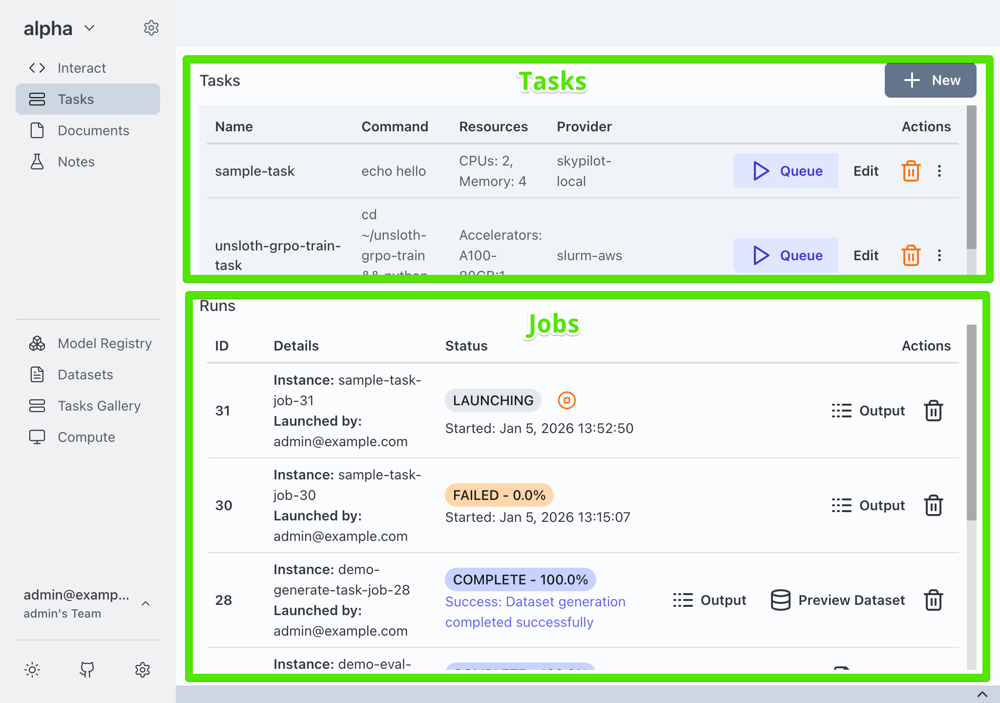
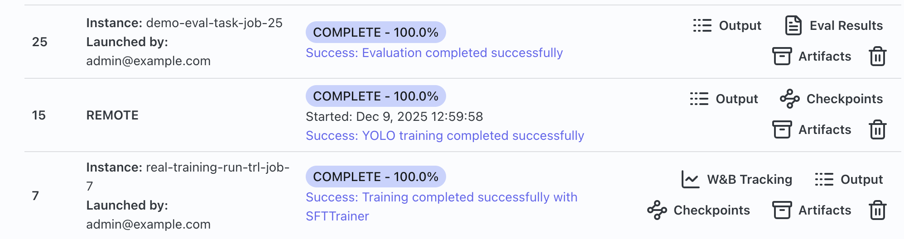

## What is a Job

The **Tasks** pane in Transformer Lab is divided in two sections. On the top you can view a list of Tasks which contain instructions (like a template) for one or more nodes to execute. On the bottom is a list of Jobs.

A **Job** is a task that has been or scheduled to be executed.

## Interacting With Jobs

Once a Job is running, you can click on the **stop** button to cancel it and terminate the associated instances.

## Viewing Job Artifacts

Once a Job goes from the state of **Launching** to **In Progress** to **Complete** you can view the Job's artifacts. Artifacts are outputs in the form of files generated by a job, for example if you fine tune a new model, the new model's safetensors will be saved as an artifact. If you perform an eval, you can save the results of the eval as an artifact.

Click on the **Artifacts** button to see all artifacts generated by the job. You can also see specific artifacts like evals or dataset previews by clicking on those buttons.
