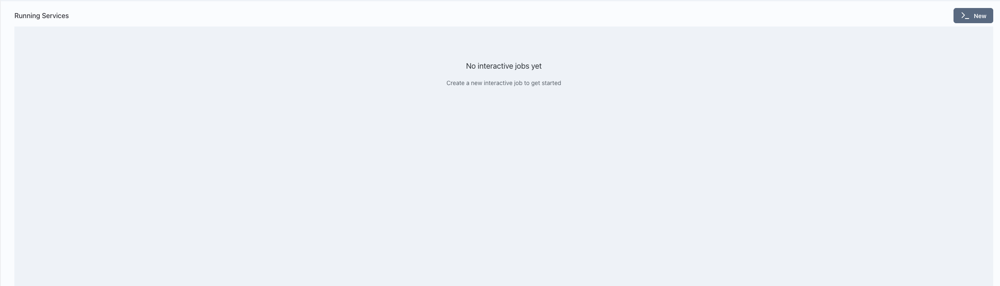
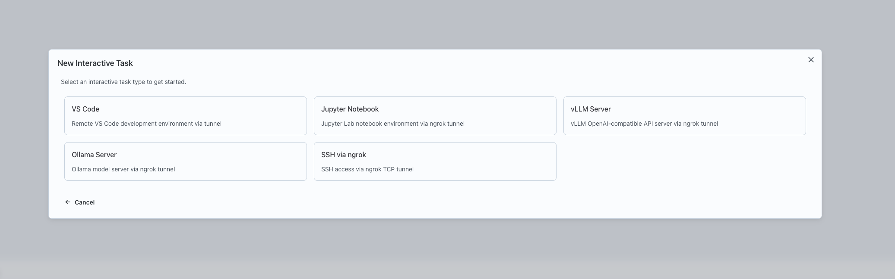
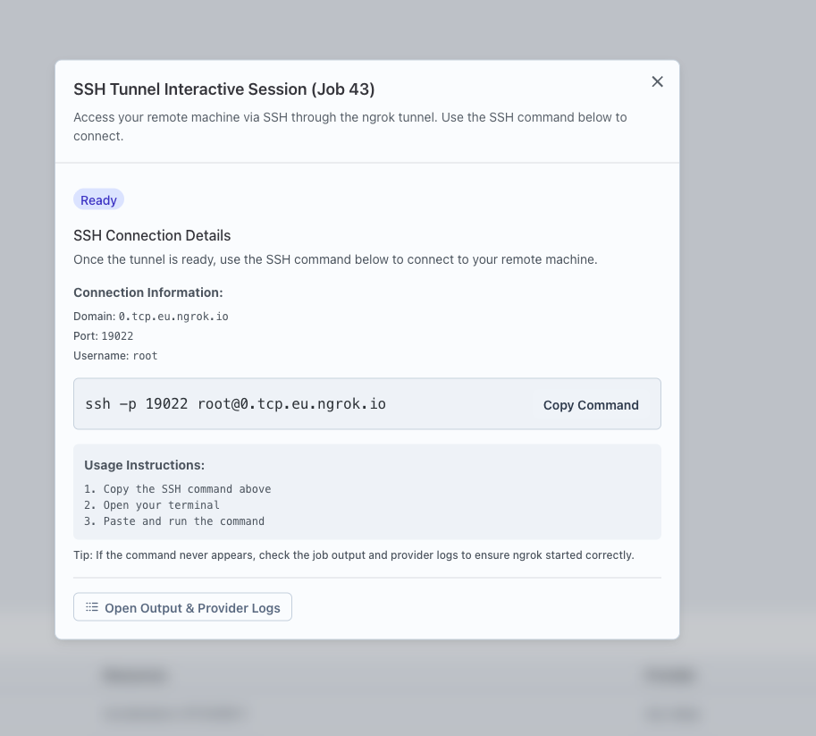

## Running an SSH Service

Interactive services in Nexus allow you to get direct SSH access to a remote node. This guide walks you through running an SSH service.

## Prerequisites

Before running an SSH service, ensure you have a Compute Provider set up and active.

1. Navigate to Team Settings and set up a Compute Provider.
   

2. Make sure the provider is active by clicking on the health button.
   

## Steps to Run an SSH Service

1. Go to the Interact page in Nexus.

2. Click on the "New" button to create a new interactive service.
   

3. Select "SSH" as the type of interactive service to launch.
   

4. Configure the service:
   - Enter a name for the service.
   - Select the Compute Provider to use.
   - Specify the resources: CPU, memory, and GPUs.
   - Provide the ngrok auth token for tunneling.
   

5. Click "Launch" to start the SSH service.

6. Once launched, a card will appear for the service. Click the "Interactive Setup" button on the card.
   

7. Follow the provided command to SSH into the remote server from any machine.
   

   **Warning:** Do not share this SSH command or access details with untrusted individuals, as it provides direct access to the remote node.
