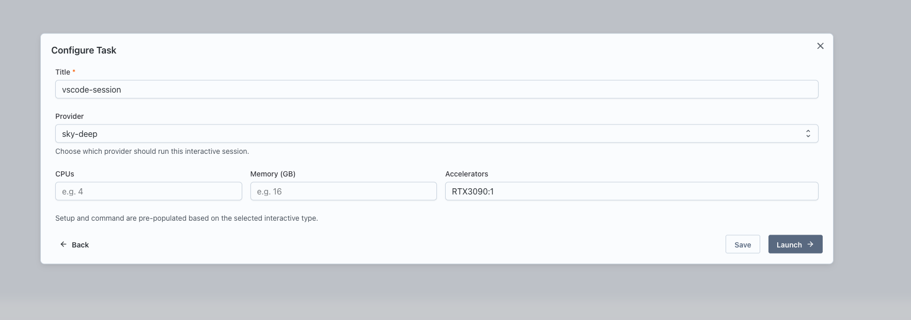

## Running a VSCode Service

Interactive services in Nexus allow you to run VSCode on a remote machine using the official VSCode tunnels implementation. This guide walks you through running a VSCode service.

## Prerequisites

Before running a VSCode service, ensure you have a Compute Provider set up and active.

1. Navigate to Team Settings and set up a Compute Provider.
   

2. Make sure the provider is active by clicking on the health button.
   

## Steps to Run a VSCode Service

1. Go to the Interact page in Nexus.

2. Click on the "New" button to create a new interactive service.
   

3. Select "VSCode" as the type of interactive service to launch.
   

4. Configure the service:
   - Enter a name for the service.
   - Select the Compute Provider to use.
   - Specify the resources: CPU, memory, and GPUs.
   

5. Click "Launch" to start the VSCode service.

6. Once launched, a card will appear for the service. Click the "Interactive Setup" button on the card.

7. The setup involves a two-step process:
   - **Step 1:** A code will be displayed. Go to [github.com/login/device](https://github.com/login/device) to authenticate and tie the tunnel to your GitHub account.
     
   - **Step 2:** After authentication, reopen the card to see the URL for accessing VSCode running on the remote machine.
     

8. Follow the provided URL to access VSCode in your browser and start coding on the remote machine.
    