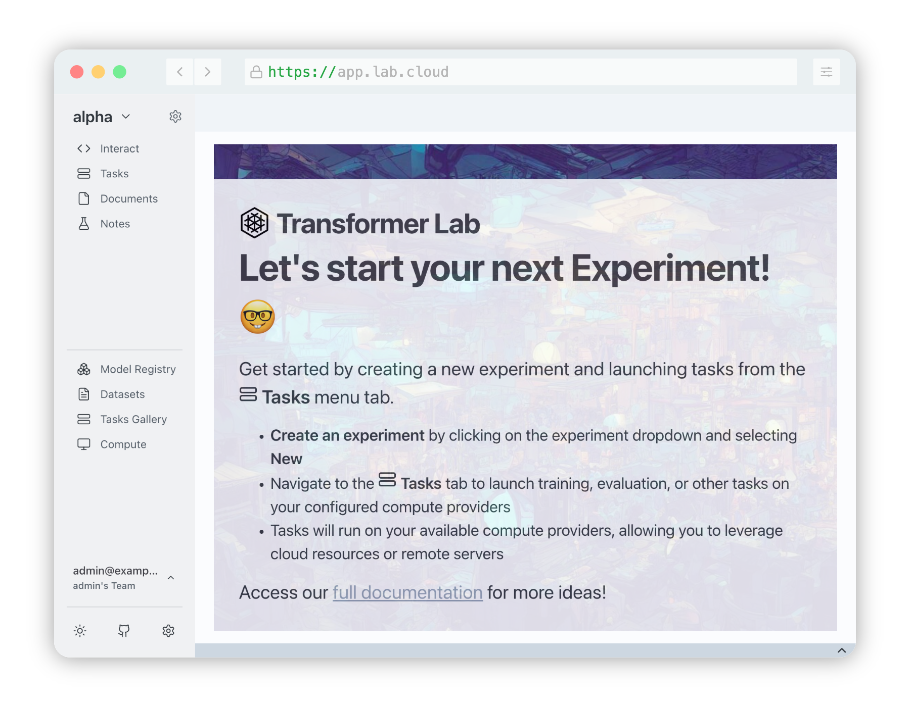

# Transformer Lab Super-Duper Team Edition

:::note

You are currently reading our unreleased documentation for Transformer Lab designed for Research Labs. Stay tuned for our official launch in the upcoming weeks...

:::

## Introduction

Transformer Lab Super-Duper Team Edition is an open source platform designed to support the needs of ML researchers working collaboratively using clusters of local or cloud compute/GPU nodes.

A team can use Transformer Lab to request nodes and submit ML tasks, while tracking experiments and their artifacts all in one place.

## Video

The following video (coming soon) demonstrates what is possible with Transformer Lab Super-Duper Team Edition.
